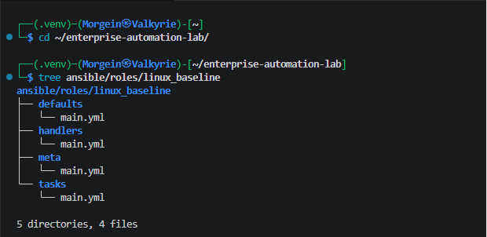
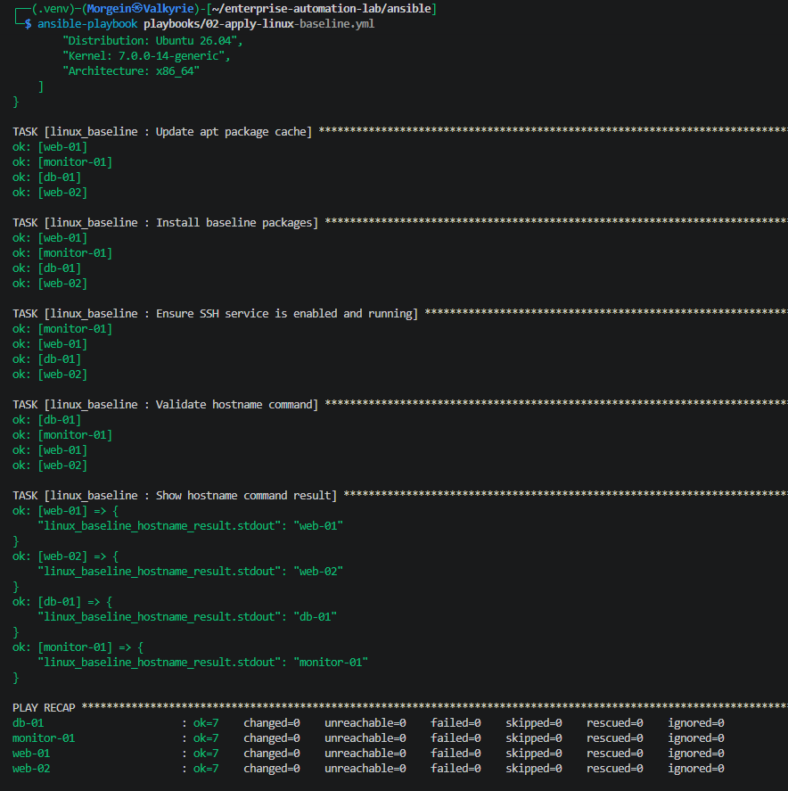
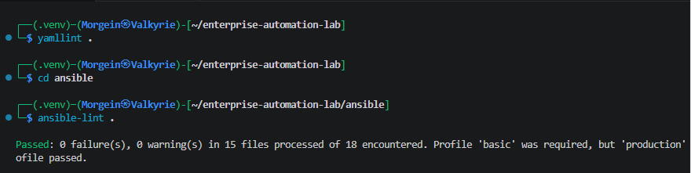
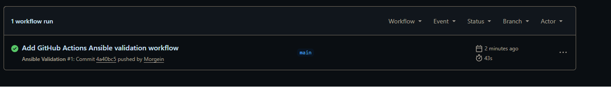

# Stage 1.3 - First Reusable Ansible Role

## 1. Purpose

This document describes Stage 1.3 of the Enterprise Automation Lab.

The goal of this stage is to move from a playbook-only Ansible structure to a reusable role-based structure.

In previous stages, baseline Linux configuration tasks were stored directly inside a playbook.

In this stage, those tasks were moved into a reusable Ansible role:

```text
ansible/roles/linux_baseline/
```

This is an important step toward cleaner, reusable and more maintainable Ansible architecture.

---

## 2. Why Roles Are Important

A playbook is useful for defining which automation should be applied to which hosts.

A role is useful for organizing reusable automation logic.

A clean Ansible design separates responsibilities:

```text
Playbook  = orchestration
Role      = reusable configuration logic
Variables = environment-specific data
```

Instead of writing all tasks directly inside a playbook, tasks are grouped into roles.

This makes automation easier to:

- reuse
- maintain
- extend
- test
- document
- apply to multiple environments

---

## 3. Role Created in This Stage

The role created in this stage is:

```text
linux_baseline
```

Role path:

```text
ansible/roles/linux_baseline/
```

Purpose:

```text
Apply baseline Linux configuration to managed nodes.
```

The role currently performs:

- basic host information output
- APT package cache update
- baseline package installation
- SSH service validation
- hostname command validation

---

## 4. Role Directory Structure

Final structure:

```text
ansible/roles/linux_baseline/
├── defaults/
│   └── main.yml
├── handlers/
│   └── main.yml
├── meta/
│   └── main.yml
└── tasks/
    └── main.yml
```

### Directory Purpose

| Directory | Purpose |
|---|---|
| `tasks/` | Main automation tasks executed by the role |
| `defaults/` | Default role variables |
| `handlers/` | Event-driven tasks such as service restarts |
| `meta/` | Role metadata and dependency information |

---

## 5. Role Tasks

File:

```text
ansible/roles/linux_baseline/tasks/main.yml
```

Content:

```yaml
---
- name: Show basic host information
  ansible.builtin.debug:
    msg:
      - "Inventory hostname: {{ inventory_hostname }}"
      - "System hostname: {{ ansible_facts['hostname'] }}"
      - "Distribution: {{ ansible_facts['distribution'] }} {{ ansible_facts['distribution_version'] }}"
      - "Kernel: {{ ansible_facts['kernel'] }}"
      - "Architecture: {{ ansible_facts['architecture'] }}"

- name: Update apt package cache
  ansible.builtin.apt:
    update_cache: true
    cache_valid_time: "{{ linux_baseline_apt_cache_valid_time }}"

- name: Install baseline packages
  ansible.builtin.apt:
    name: "{{ linux_baseline_packages }}"
    state: present

- name: Ensure SSH service is enabled and running
  ansible.builtin.service:
    name: "{{ linux_baseline_ssh_service_name }}"
    state: started
    enabled: true

- name: Validate hostname command
  ansible.builtin.command: hostname
  register: linux_baseline_hostname_result
  changed_when: false

- name: Show hostname command result
  ansible.builtin.debug:
    var: linux_baseline_hostname_result.stdout
```

---

## 6. Task Explanation

### Show basic host information

This task prints useful information about the managed node.

It uses Ansible facts:

```yaml
ansible_facts['hostname']
ansible_facts['distribution']
ansible_facts['distribution_version']
ansible_facts['kernel']
ansible_facts['architecture']
```

These facts are collected because the playbook uses:

```yaml
gather_facts: true
```

This task is useful for validation and learning because it shows what system Ansible is managing.

---

### Update apt package cache

```yaml
ansible.builtin.apt:
  update_cache: true
  cache_valid_time: "{{ linux_baseline_apt_cache_valid_time }}"
```

This updates the APT package cache.

The cache validity time is controlled by a variable:

```yaml
linux_baseline_apt_cache_valid_time
```

This prevents unnecessary repeated cache updates.

---

### Install baseline packages

```yaml
ansible.builtin.apt:
  name: "{{ linux_baseline_packages }}"
  state: present
```

This installs the baseline package list.

`state: present` means:

```text
If the package is missing, install it.
If the package is already installed, do nothing.
```

This is idempotent behavior.

---

### Ensure SSH service is enabled and running

```yaml
ansible.builtin.service:
  name: "{{ linux_baseline_ssh_service_name }}"
  state: started
  enabled: true
```

This ensures that SSH is running now and will start after reboot.

SSH is required because Ansible connects to Linux managed nodes over SSH.

---

### Validate hostname command

```yaml
ansible.builtin.command: hostname
register: linux_baseline_hostname_result
changed_when: false
```

This runs the `hostname` command on the managed node.

The result is stored in:

```yaml
linux_baseline_hostname_result
```

`changed_when: false` is used because the command only reads information and does not modify the system.

---

## 7. Role Defaults

File:

```text
ansible/roles/linux_baseline/defaults/main.yml
```

Content:

```yaml
---
# Default variables for the linux_baseline role.
# These values can be overridden by inventory group_vars or host_vars.

linux_baseline_packages:
  - curl
  - wget
  - vim
  - nano
  - htop
  - net-tools
  - unzip
  - git
  - python3
  - python3-pip
  - openssh-server

linux_baseline_ssh_service_name: ssh

linux_baseline_apt_cache_valid_time: 3600
```

Role defaults provide fallback values.

These values can be overridden by inventory variables, for example:

```text
ansible/inventories/dev/group_vars/linux.yml
```

---

## 8. Variable Precedence

Ansible variables have precedence.

In this project, the important order is:

```text
role defaults < inventory group_vars < host_vars < extra vars
```

This means values from:

```text
ansible/inventories/dev/group_vars/linux.yml
```

override values from:

```text
ansible/roles/linux_baseline/defaults/main.yml
```

This is useful because the role has safe defaults, while each environment can still define its own values.

---

## 9. Role Handler

File:

```text
ansible/roles/linux_baseline/handlers/main.yml
```

Content:

```yaml
---
- name: Restart SSH service
  ansible.builtin.service:
    name: "{{ linux_baseline_ssh_service_name }}"
    state: restarted
```

The handler is prepared for future stages where SSH configuration may be managed by Ansible.

A handler runs only when it is notified by a changed task.

Example future usage:

```yaml
notify: Restart SSH service
```

---

## 10. Role Metadata

File:

```text
ansible/roles/linux_baseline/meta/main.yml
```

Content:

```yaml
---
galaxy_info:
  author: Morgein
  description: Baseline Linux configuration role for the Enterprise Automation Lab
  company: Personal Lab
  license: MIT
  min_ansible_version: "2.15"

  platforms:
    - name: Ubuntu
      versions:
        - noble
        - jammy

  galaxy_tags:
    - linux
    - baseline
    - automation
    - ansible
    - infrastructure

dependencies: []
```

This file documents role metadata.

It also makes the role structure closer to standard Ansible role conventions.

---

## 11. Role-Based Playbook

A role-based playbook was created:

```text
ansible/playbooks/02-apply-linux-baseline.yml
```

Content at this stage:

```yaml
---
- name: Apply Linux baseline configuration
  hosts: web-01
  become: true
  gather_facts: true

  roles:
    - linux_baseline
```

This playbook is intentionally short.

It delegates the actual configuration logic to the role.

---

## 12. Why This Playbook Is Cleaner

Previous style:

```text
playbook contains all tasks directly
```

New style:

```text
playbook selects hosts and applies roles
```

This is cleaner because the playbook becomes orchestration-focused.

The role contains reusable implementation details.

---

## 13. Validation Commands

Run from the Ansible directory:

```bash
cd ~/enterprise-automation-lab/ansible
```

Check role-based playbook syntax:

```bash
ansible-playbook playbooks/02-apply-linux-baseline.yml --syntax-check
```

Expected result:

```text
playbook: playbooks/02-apply-linux-baseline.yml
```

Run role-based playbook:

```bash
ansible-playbook playbooks/02-apply-linux-baseline.yml
```

Expected result:

```text
unreachable=0
failed=0
```

Run it again for idempotency validation:

```bash
ansible-playbook playbooks/02-apply-linux-baseline.yml
```

Expected result:

```text
changed=0
```

or fewer changes than the first run.

---

## 14. Post-Run Validation

Check package installation:

```bash
ansible web-01 -m command -a "which htop"
```

Expected result:

```text
/usr/bin/htop
```

Check SSH service enabled state:

```bash
ansible web-01 -m command -a "systemctl is-enabled ssh"
```

Expected result:

```text
enabled
```

Check SSH service active state:

```bash
ansible web-01 -m command -a "systemctl is-active ssh"
```

Expected result:

```text
active
```

---

## 15. Important Concept: Reusability

The role can later be applied to more hosts.

At first, the playbook targeted:

```yaml
hosts: web-01
```

Later, after all Linux VMs exist, the same role can be applied to:

```yaml
hosts: linux
```

That applies the baseline configuration to:

```text
web-01
web-02
db-01
monitor-01
```

This is the main value of roles: one implementation, many targets.

---

## 16. Important Concept: Maintainability

Without roles, an Ansible project can become messy:

```text
large playbooks
duplicated tasks
hardcoded values
difficult troubleshooting
```

With roles, the structure becomes clearer:

```text
roles/linux_baseline/tasks/main.yml
roles/linux_baseline/defaults/main.yml
roles/linux_baseline/handlers/main.yml
roles/linux_baseline/meta/main.yml
```

Each part has a clear responsibility.

This is a major step from beginner Ansible toward production-style Ansible.

---

## 17. Troubleshooting

### Role Not Found

Error example:

```text
ERROR! the role 'linux_baseline' was not found
```

Possible causes:

- role directory name is wrong
- command was not executed from the Ansible project directory
- `roles_path` is wrong in `ansible.cfg`

Check:

```bash
cd ~/enterprise-automation-lab/ansible
ansible --version
```

Expected config:

```text
config file = /home/Morgein/enterprise-automation-lab/ansible/ansible.cfg
```

Check role path:

```bash
tree roles/linux_baseline
```

Check `ansible.cfg`:

```ini
roles_path = roles
```

---

### Variable Is Undefined

Error example:

```text
'linux_baseline_packages' is undefined
```

Possible causes:

- defaults file missing
- group_vars file missing
- YAML syntax error
- wrong variable name

Check:

```bash
cat roles/linux_baseline/defaults/main.yml
cat inventories/dev/group_vars/linux.yml
ansible-inventory --host web-01
```

---

### Playbook Targets Non-Existing Hosts

At this stage, only `web-01` existed.

Because of this, the role-based playbook originally targeted:

```yaml
hosts: web-01
```

It should only be changed to:

```yaml
hosts: linux
```

after all planned Linux VMs are created.

---

## 18. Commands Used in This Stage

Create role directories:

```bash
mkdir -p ansible/roles/linux_baseline/tasks
mkdir -p ansible/roles/linux_baseline/defaults
mkdir -p ansible/roles/linux_baseline/handlers
mkdir -p ansible/roles/linux_baseline/meta
```

Create role files:

```bash
nano ansible/roles/linux_baseline/tasks/main.yml
nano ansible/roles/linux_baseline/defaults/main.yml
nano ansible/roles/linux_baseline/handlers/main.yml
nano ansible/roles/linux_baseline/meta/main.yml
```

Create role-based playbook:

```bash
nano ansible/playbooks/02-apply-linux-baseline.yml
```

Validate syntax:

```bash
cd ~/enterprise-automation-lab/ansible
ansible-playbook playbooks/02-apply-linux-baseline.yml --syntax-check
```

Run playbook:

```bash
ansible-playbook playbooks/02-apply-linux-baseline.yml
```

Run idempotency check:

```bash
ansible-playbook playbooks/02-apply-linux-baseline.yml
```

---

## 19. Validation Evidence

The following screenshots provide evidence that the first reusable Ansible role was created, validated and executed successfully.

### Linux Baseline Role Structure

The screenshot shows the final structure of the `linux_baseline` role, including `defaults`, `handlers`, `meta` and `tasks`.



### Linux Baseline Role Idempotency

The screenshot shows a repeated execution of the role-based baseline playbook.

The result confirms that the playbook completed successfully with:

```text
failed=0
unreachable=0
changed=0
```



### Lint Validation

The screenshot shows successful YAML and Ansible lint validation.

This confirms that the Ansible structure follows the current linting rules used in the project.



### GitHub Actions Validation

The screenshot shows the GitHub Actions validation workflow passing successfully.

This confirms that the repository is automatically validated after changes are pushed.



---

## 20. Stage Result

At the end of this stage, the project has:

```text
First reusable Ansible role created
Linux baseline tasks moved into a role
Role defaults added
Role handler structure prepared
Role metadata added
Role-based playbook created
Syntax check passed
Role playbook executed successfully
Idempotency validated
```

---

## 21. Current Status

Current project status:

```text
Stage 1.3 - First Reusable Ansible Role completed
```

Next planned stage:

```text
Stage 1.4 - Ansible linting and code quality
```

The next stage introduces basic Ansible code quality checks using `ansible-lint` and `yamllint`.
