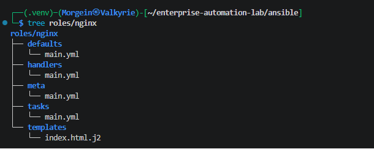
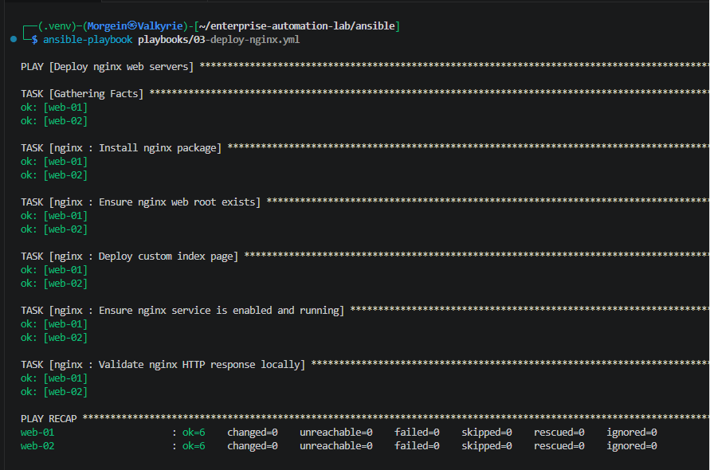
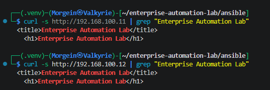
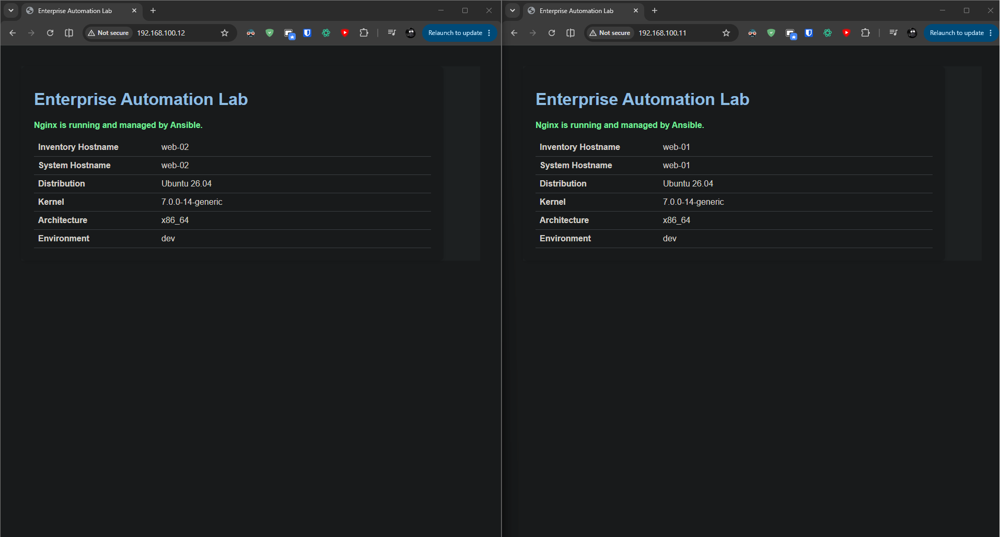

# Stage 2.3 - Nginx Role for Web Servers

## 1. Purpose

This document describes Stage 2.3 of the Enterprise Automation Lab.

The goal of this stage is to create a dedicated Ansible role for deploying and managing Nginx on the web server group.

Before this stage, the project had:

- a working multi-node Hyper-V lab
- four managed Linux nodes
- a reusable `linux_baseline` role
- GitHub Actions validation
- successful Ansible linting and YAML linting

In this stage, the project introduces the first service-specific role:

```text
ansible/roles/nginx/
```

This role is applied only to the `web` inventory group.

---

## 2. Target Hosts

The Nginx role is applied to the `web` group.

Inventory group:

```ini
[web]
web-01 ansible_host=192.168.100.11
web-02 ansible_host=192.168.100.12
```

Target web servers:

| Hostname | IP Address | Purpose |
|---|---:|---|
| web-01 | 192.168.100.11 | First Nginx web server |
| web-02 | 192.168.100.12 | Second Nginx web server |

The role is not applied to:

```text
db-01
monitor-01
```

This is intentional because database and monitoring nodes should not run web server services unless explicitly required.

---

## 3. Why This Stage Is Important

This stage introduces a common real-world automation pattern:

```text
general baseline role -> all Linux servers
service-specific role -> selected server group
```

The project now has:

```text
linux_baseline role -> linux group
nginx role          -> web group
```

This separation is important because different server types should receive different configurations.

Examples:

| Role | Target Group | Purpose |
|---|---|---|
| `linux_baseline` | `linux` | Common Linux baseline |
| `nginx` | `web` | Web server configuration |
| future `postgresql` | `database` | Database server configuration |
| future `monitoring` | `monitoring` | Monitoring stack configuration |

This is closer to real infrastructure automation.

---

## 4. Role Directory Structure

The Nginx role was created under:

```text
ansible/roles/nginx/
```

Final structure:

```text
ansible/roles/nginx/
├── defaults/
│   └── main.yml
├── handlers/
│   └── main.yml
├── meta/
│   └── main.yml
├── tasks/
│   └── main.yml
└── templates/
    └── index.html.j2
```

### Directory Purpose

| Directory | Purpose |
|---|---|
| `tasks/` | Main automation tasks |
| `defaults/` | Default role variables |
| `handlers/` | Event-driven tasks such as service restart |
| `templates/` | Jinja2 templates rendered on managed nodes |
| `meta/` | Role metadata |

---

## 5. Role Defaults

File:

```text
ansible/roles/nginx/defaults/main.yml
```

Content:

```yaml
---
# Default variables for the nginx role.
# These values can be overridden by inventory group_vars or host_vars.

nginx_package_name: nginx

nginx_service_name: nginx

nginx_web_root: /var/www/html

nginx_index_file: index.html

nginx_environment_name: dev

nginx_managed_by: Ansible
```

---

## 6. Defaults Explanation

### nginx_package_name

```yaml
nginx_package_name: nginx
```

This variable defines the package name to install.

On Ubuntu, the package is called:

```text
nginx
```

The task later uses this variable with the `ansible.builtin.apt` module.

---

### nginx_service_name

```yaml
nginx_service_name: nginx
```

This variable defines the systemd service name.

On Ubuntu, the service is also called:

```text
nginx
```

Using a variable makes the role easier to adapt later.

---

### nginx_web_root

```yaml
nginx_web_root: /var/www/html
```

This is the default web root directory used by Nginx on Ubuntu.

The custom index page is deployed into this directory.

---

### nginx_index_file

```yaml
nginx_index_file: index.html
```

This defines the name of the main HTML file.

Final path:

```text
/var/www/html/index.html
```

---

### nginx_environment_name

```yaml
nginx_environment_name: dev
```

This defines the environment name displayed on the generated HTML page.

Current environment:

```text
dev
```

Later, this value can be overridden for other environments.

---

### nginx_managed_by

```yaml
nginx_managed_by: Ansible
```

This value is displayed on the web page to show that the content is managed by Ansible.

---

## 7. Role Handler

File:

```text
ansible/roles/nginx/handlers/main.yml
```

Content:

```yaml
---
- name: Restart nginx
  ansible.builtin.service:
    name: "{{ nginx_service_name }}"
    state: restarted
```

---

## 8. Handler Explanation

### Handler Name

```yaml
- name: Restart nginx
```

This is the handler name.

It must match the `notify` value used in tasks.

Example:

```yaml
notify: Restart nginx
```

---

### Service Module

```yaml
ansible.builtin.service:
```

This module manages system services.

It works with systemd on Ubuntu.

---

### Service Name

```yaml
name: "{{ nginx_service_name }}"
```

The service name is loaded from the role defaults.

Current value:

```text
nginx
```

---

### Restart State

```yaml
state: restarted
```

This restarts the service when the handler is triggered.

The handler does not run on every playbook execution.

It runs only if a task that notifies it reports a change.

This helps keep the role idempotent.

---

## 9. Jinja2 Template

File:

```text
ansible/roles/nginx/templates/index.html.j2
```

Content:

```html
<!DOCTYPE html>
<html lang="en">
<head>
  <meta charset="UTF-8">
  <title>Enterprise Automation Lab</title>
  <style>
    body {
      font-family: Arial, sans-serif;
      margin: 40px;
      background-color: #f4f6f8;
      color: #222;
    }

    .card {
      background: white;
      border-radius: 8px;
      padding: 24px;
      max-width: 760px;
      box-shadow: 0 2px 8px rgba(0, 0, 0, 0.12);
    }

    h1 {
      color: #1f4e79;
    }

    table {
      border-collapse: collapse;
      width: 100%;
      margin-top: 16px;
    }

    td {
      border-bottom: 1px solid #ddd;
      padding: 8px;
    }

    td:first-child {
      font-weight: bold;
      width: 220px;
    }

    .status {
      color: #128a36;
      font-weight: bold;
    }
  </style>
</head>
<body>
  <div class="card">
    <h1>Enterprise Automation Lab</h1>
    <p class="status">Nginx is running and managed by {{ nginx_managed_by }}.</p>

    <table>
      <tr>
        <td>Inventory Hostname</td>
        <td>{{ inventory_hostname }}</td>
      </tr>
      <tr>
        <td>System Hostname</td>
        <td>{{ ansible_facts['hostname'] }}</td>
      </tr>
      <tr>
        <td>Distribution</td>
        <td>{{ ansible_facts['distribution'] }} {{ ansible_facts['distribution_version'] }}</td>
      </tr>
      <tr>
        <td>Kernel</td>
        <td>{{ ansible_facts['kernel'] }}</td>
      </tr>
      <tr>
        <td>Architecture</td>
        <td>{{ ansible_facts['architecture'] }}</td>
      </tr>
      <tr>
        <td>Environment</td>
        <td>{{ nginx_environment_name }}</td>
      </tr>
    </table>
  </div>
</body>
</html>
```

---

## 10. Template Explanation

The file has the `.j2` extension because it is a Jinja2 template.

Ansible renders this template on each managed host and replaces variables with real values.

Example variables:

```text
{{ inventory_hostname }}
{{ ansible_facts['hostname'] }}
{{ ansible_facts['distribution'] }}
{{ nginx_environment_name }}
{{ nginx_managed_by }}
```

This means the same template produces different output on different servers.

For example, on `web-01`:

```text
Inventory Hostname: web-01
```

On `web-02`:

```text
Inventory Hostname: web-02
```

This is one of the main benefits of templates.

---

## 11. Role Tasks

File:

```text
ansible/roles/nginx/tasks/main.yml
```

Content:

```yaml
---
- name: Install nginx package
  ansible.builtin.apt:
    name: "{{ nginx_package_name }}"
    state: present
    update_cache: true

- name: Ensure nginx web root exists
  ansible.builtin.file:
    path: "{{ nginx_web_root }}"
    state: directory
    owner: root
    group: root
    mode: "0755"

- name: Deploy custom index page
  ansible.builtin.template:
    src: index.html.j2
    dest: "{{ nginx_web_root }}/{{ nginx_index_file }}"
    owner: root
    group: root
    mode: "0644"
  notify: Restart nginx

- name: Ensure nginx service is enabled and running
  ansible.builtin.service:
    name: "{{ nginx_service_name }}"
    state: started
    enabled: true

- name: Validate nginx HTTP response locally
  ansible.builtin.uri:
    url: "http://127.0.0.1"
    status_code: 200
  changed_when: false
```

---

## 12. Task Explanation

### Install nginx package

```yaml
- name: Install nginx package
```

This task installs the Nginx package.

```yaml
ansible.builtin.apt:
```

The `apt` module is used because the managed nodes run Ubuntu.

```yaml
name: "{{ nginx_package_name }}"
```

The package name is loaded from the role variable.

```yaml
state: present
```

This means the package must be installed.

If the package already exists, Ansible does not reinstall it.

```yaml
update_cache: true
```

This updates the APT package cache before installing.

---

### Ensure nginx web root exists

```yaml
ansible.builtin.file:
```

The `file` module manages files, directories and permissions.

```yaml
path: "{{ nginx_web_root }}"
```

The directory path is loaded from the variable:

```text
/var/www/html
```

```yaml
state: directory
```

This ensures the path exists as a directory.

```yaml
owner: root
group: root
mode: "0755"
```

This sets ownership and permissions.

The mode is quoted to avoid YAML interpreting it as a number.

---

### Deploy custom index page

```yaml
ansible.builtin.template:
```

The `template` module renders a Jinja2 template.

```yaml
src: index.html.j2
```

Source template file.

```yaml
dest: "{{ nginx_web_root }}/{{ nginx_index_file }}"
```

Destination file path.

Final destination:

```text
/var/www/html/index.html
```

```yaml
owner: root
group: root
mode: "0644"
```

The file is owned by root and readable by everyone.

```yaml
notify: Restart nginx
```

If the template changes, Ansible notifies the handler.

The handler restarts Nginx only when required.

---

### Ensure nginx service is enabled and running

```yaml
ansible.builtin.service:
```

The `service` module manages system services.

```yaml
state: started
enabled: true
```

This means:

```text
Nginx is running now.
Nginx starts automatically after reboot.
```

---

### Validate nginx HTTP response locally

```yaml
ansible.builtin.uri:
```

The `uri` module sends HTTP requests.

```yaml
url: "http://127.0.0.1"
```

This tests Nginx locally from the managed node.

```yaml
status_code: 200
```

Expected HTTP response is:

```text
200 OK
```

```yaml
changed_when: false
```

This task is only a validation check.

It does not modify the system, so it should not be marked as changed.

---

## 13. Role Metadata

File:

```text
ansible/roles/nginx/meta/main.yml
```

Content:

```yaml
---
galaxy_info:
  author: Morgein
  description: Nginx web server role for the Enterprise Automation Lab
  company: Personal Lab
  license: MIT
  min_ansible_version: "2.15"

  platforms:
    - name: Ubuntu
      versions:
        - noble
        - jammy

  galaxy_tags:
    - nginx
    - web
    - automation
    - ansible
    - infrastructure

dependencies: []
```

This file documents role metadata.

It also makes the role structure closer to standard Ansible role conventions.

---

## 14. Nginx Playbook

File:

```text
ansible/playbooks/03-deploy-nginx.yml
```

Content:

```yaml
---
- name: Deploy nginx web servers
  hosts: web
  become: true
  gather_facts: true

  roles:
    - nginx
```

---

## 15. Playbook Explanation

### Play name

```yaml
- name: Deploy nginx web servers
```

This is the human-readable name of the play.

---

### Target group

```yaml
hosts: web
```

This targets only the `web` group.

The `web` group contains:

```text
web-01
web-02
```

This prevents Nginx from being installed on database or monitoring nodes.

---

### Privilege escalation

```yaml
become: true
```

Nginx installation and service management require root privileges.

This tells Ansible to use `sudo`.

---

### Fact gathering

```yaml
gather_facts: true
```

The template uses system facts such as:

```text
ansible_facts['hostname']
ansible_facts['distribution']
ansible_facts['kernel']
ansible_facts['architecture']
```

Therefore, fact gathering is required.

---

### Role application

```yaml
roles:
  - nginx
```

This applies the Nginx role to each host in the `web` group.

---

## 16. Validation Commands

Run from the Ansible directory:

```bash
cd ~/enterprise-automation-lab/ansible
```

Check role structure:

```bash
tree roles/nginx
```

Check syntax:

```bash
ansible-playbook playbooks/03-deploy-nginx.yml --syntax-check
```

Run playbook:

```bash
ansible-playbook playbooks/03-deploy-nginx.yml
```

Run again for idempotency:

```bash
ansible-playbook playbooks/03-deploy-nginx.yml
```

Expected result on repeated run:

```text
web-01 changed=0 failed=0 unreachable=0
web-02 changed=0 failed=0 unreachable=0
```

---

## 17. HTTP Validation From Kali WSL

Validate web servers from Kali WSL:

```bash
curl http://192.168.100.11
curl http://192.168.100.12
```

A shorter validation command:

```bash
curl -s http://192.168.100.11 | grep "Enterprise Automation Lab"
curl -s http://192.168.100.12 | grep "Enterprise Automation Lab"
```

Expected output:

```html
<title>Enterprise Automation Lab</title>
<h1>Enterprise Automation Lab</h1>
```

This confirms that Nginx is running and serving the Ansible-managed page.

---

## 18. Service Validation

Check Nginx service on web servers:

```bash
ansible web -m command -a "systemctl is-active nginx"
```

Expected result:

```text
web-01 active
web-02 active
```

Check that Nginx is enabled:

```bash
ansible web -m command -a "systemctl is-enabled nginx"
```

Expected result:

```text
web-01 enabled
web-02 enabled
```

---

## 19. Linting

Run from the repository root:

```bash
cd ~/enterprise-automation-lab
yamllint .
```

Run from the Ansible directory:

```bash
cd ~/enterprise-automation-lab/ansible
ansible-lint .
```

Expected result:

```text
Passed: 0 failure(s), 0 warning(s)
```

This confirms that the Nginx role follows the current linting profile.

---

## 20. GitHub Actions Validation

After pushing the role to GitHub, the validation workflow should pass.

Current validation includes:

- `yamllint`
- `ansible-lint`
- Ansible syntax checks

The workflow includes syntax validation for:

```text
ansible/playbooks/03-deploy-nginx.yml
```

---

## 21. Validation Evidence

The following screenshots provide evidence that the Nginx role was created, executed and validated successfully.

### Nginx Role Structure

The screenshot shows the final Nginx role structure, including `defaults`, `handlers`, `meta`, `tasks` and `templates`.



### Nginx Role Idempotency

The screenshot shows a repeated execution of the Nginx deployment playbook.

The result confirms that both web servers completed successfully with:

```text
failed=0
unreachable=0
changed=0
```



### Nginx Curl Validation

The screenshot shows HTTP validation from Kali WSL using `curl`.

Both web servers return the Ansible-managed page containing:

```text
Enterprise Automation Lab
```



### Nginx Browser Validation

The screenshot shows the Ansible-managed Nginx page opened in a browser.

This confirms that the web service is reachable from the Windows host and serves the generated HTML page correctly.



---

## 22. Troubleshooting

### Nginx is not reachable from Kali WSL

Check if the service is running:

```bash
ansible web -m command -a "systemctl is-active nginx"
```

Check if the web servers are reachable:

```bash
ping 192.168.100.11
ping 192.168.100.12
```

Check curl locally on the server:

```bash
ansible web -m command -a "curl -s http://127.0.0.1"
```

---

### Template does not update

If the page does not change after editing the template, run:

```bash
ansible-playbook playbooks/03-deploy-nginx.yml
```

If the template task reports `changed`, the handler should restart Nginx.

---

### Handler does not run

Handlers run only when notified by changed tasks.

The template task contains:

```yaml
notify: Restart nginx
```

If the template does not change, the handler does not run.

This is normal Ansible behavior.

---

### ansible-lint reports command or formatting issues

Run:

```bash
cd ~/enterprise-automation-lab/ansible
ansible-lint .
```

Fix reported issues one by one.

Common issues:

- missing fully qualified collection names
- Jinja spacing problems
- variable naming problems
- command tasks without `changed_when`

---

## 23. Stage Result

At the end of this stage:

```text
Nginx role created
Nginx installed on web-01 and web-02
Custom index.html deployed through Jinja2 template
Nginx service enabled and running
HTTP validation successful from Kali WSL
Role idempotency validated
ansible-lint passed
yamllint passed
GitHub Actions passed
```

---

## 24. Current Status

Current project status:

```text
Stage 2.3 - Nginx role for web servers completed
```

Next planned stage:

```text
Stage 2.4 - Update GitHub Actions and README for Nginx stage
```

The next stage updates:

- GitHub Actions syntax checks
- README project status
- completed stages table
- service architecture section
