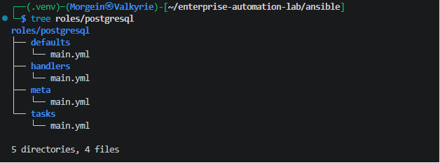
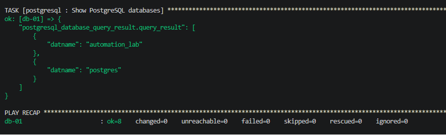
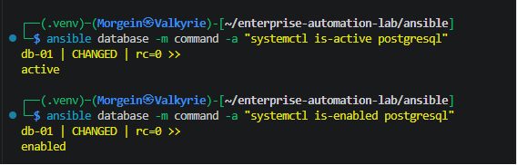
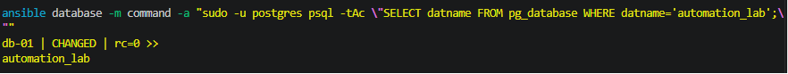

# Stage 2.5 - PostgreSQL Role for Database Server

## 1. Purpose

This document describes Stage 2.5 of the Enterprise Automation Lab.

The goal of this stage is to create a dedicated Ansible role for deploying and validating PostgreSQL on the database server.

Before this stage, the project already had:

- a multi-node Hyper-V lab
- four managed Linux nodes
- a reusable `linux_baseline` role
- an `nginx` role for web servers
- GitHub Actions validation
- successful `yamllint` and `ansible-lint` checks

In this stage, the project adds the database layer:

```text
postgresql role -> database group -> db-01
```

The role installs PostgreSQL, starts the service, creates a test database and validates the result.

---

## 2. Target Host

The PostgreSQL role is applied only to the `database` inventory group.

Inventory group:

```ini
[database]
db-01 ansible_host=192.168.100.21
```

Target database server:

| Hostname | IP Address | Group | Purpose |
|---|---:|---|---|
| db-01 | 192.168.100.21 | database | PostgreSQL database server |

The role is not applied to:

```text
web-01
web-02
monitor-01
```

This is intentional.

Web servers should run Nginx.

The database server should run PostgreSQL.

The monitoring server will later run monitoring tools.

---

## 3. Why This Stage Is Important

This stage introduces the database layer into the lab.

The project now has a clearer service separation:

```text
linux_baseline role -> all Linux nodes
nginx role          -> web nodes
postgresql role     -> database node
```

This is a common real-world infrastructure pattern.

Different server groups receive different roles depending on their responsibility.

| Role | Target Group | Target Hosts | Purpose |
|---|---|---|---|
| `linux_baseline` | `linux` | all nodes | Common Linux baseline |
| `nginx` | `web` | web-01, web-02 | Web server configuration |
| `postgresql` | `database` | db-01 | Database server configuration |

This stage also introduces Ansible collections because PostgreSQL management is done through proper PostgreSQL modules instead of raw shell commands.

---

## 4. Files Created or Updated

This stage adds or updates the following files:

| File | Purpose |
|---|---|
| `ansible/requirements.yml` | Defines required Ansible collections |
| `ansible/roles/postgresql/defaults/main.yml` | Default PostgreSQL role variables |
| `ansible/roles/postgresql/handlers/main.yml` | PostgreSQL service handler |
| `ansible/roles/postgresql/tasks/main.yml` | PostgreSQL installation and validation tasks |
| `ansible/roles/postgresql/meta/main.yml` | PostgreSQL role metadata |
| `ansible/playbooks/04-deploy-postgresql.yml` | Playbook for deploying PostgreSQL |
| `ansible/inventories/dev/group_vars/database.yml` | Database group variables |
| `.github/workflows/ansible-validation.yml` | CI validation updated for PostgreSQL playbook |
| `.ansible-lint` | Excludes downloaded collections from linting |
| `.yamllint` | Excludes downloaded collections from YAML linting |
| `.gitignore` | Prevents `ansible/collections/` from being committed |

---

## 5. Ansible Collection Requirement

PostgreSQL management uses modules from the `community.postgresql` collection.

File:

```text
ansible/requirements.yml
```

Content:

```yaml
---
collections:
  - name: community.postgresql
```

### Explanation

```yaml
collections:
```

Defines the list of Ansible collections required by this project.

```yaml
- name: community.postgresql
```

Installs the PostgreSQL collection.

This collection provides modules such as:

```text
community.postgresql.postgresql_db
community.postgresql.postgresql_query
community.postgresql.postgresql_user
```

These modules are better than raw shell commands because they are designed for idempotent PostgreSQL management.

---

## 6. Installing the Collection Locally

The collection is installed from the Ansible project directory:

```bash
cd ~/enterprise-automation-lab/ansible
ansible-galaxy collection install -r requirements.yml -p ./collections --force
```

### Explanation

```bash
ansible-galaxy
```

Ansible tool used to install roles and collections.

```bash
collection install
```

Tells Ansible Galaxy to install collections.

```bash
-r requirements.yml
```

Reads required collections from `requirements.yml`.

```bash
-p ./collections
```

Installs the collection into the local project path:

```text
ansible/collections/
```

```bash
--force
```

Reinstalls or updates the collection if it already exists.

---

## 7. Collection Path Configuration

The project uses local Ansible collections.

File:

```text
ansible/ansible.cfg
```

Important line:

```ini
collections_path = ./collections
```

### Why This Is Needed

Ansible needs to know where to find installed collections.

The PostgreSQL role uses:

```yaml
community.postgresql.postgresql_db:
```

and:

```yaml
community.postgresql.postgresql_query:
```

Without a valid collection path, Ansible and `ansible-lint` may fail with an error like:

```text
couldn't resolve module/action 'community.postgresql.postgresql_db'
```

The `collections_path` setting tells Ansible to search inside:

```text
ansible/collections/
```

---

## 8. Why Collections Are Not Committed

Downloaded collections are dependencies.

They are not part of the project source code.

The project commits:

```text
ansible/requirements.yml
```

but does not commit:

```text
ansible/collections/
```

This is similar to not committing:

```text
node_modules/
.terraform/
vendor/
```

The `.gitignore` file should include:

```gitignore
ansible/collections/
```

The CI pipeline installs collections automatically from `requirements.yml`.

---

## 9. Role Directory Structure

The PostgreSQL role is located at:

```text
ansible/roles/postgresql/
```

Final structure:

```text
ansible/roles/postgresql/
├── defaults/
│   └── main.yml
├── handlers/
│   └── main.yml
├── meta/
│   └── main.yml
└── tasks/
    └── main.yml
```

### Directory Purpose

| Directory | Purpose |
|---|---|
| `defaults/` | Default role variables |
| `handlers/` | Service restart handlers |
| `meta/` | Role metadata |
| `tasks/` | Main PostgreSQL automation tasks |

---

## 10. Role Defaults

File:

```text
ansible/roles/postgresql/defaults/main.yml
```

Content:

```yaml
---
# Default variables for the postgresql role.
# These values can be overridden by inventory group_vars or host_vars.

postgresql_packages:
  - acl
  - postgresql
  - postgresql-contrib
  - python3-psycopg2

postgresql_service_name: postgresql

postgresql_databases:
  - automation_lab
```

---

## 11. Defaults Explanation

### postgresql_packages

```yaml
postgresql_packages:
```

Defines the packages required for PostgreSQL deployment and Ansible PostgreSQL module execution.

---

### acl

```yaml
- acl
```

This package is important for Ansible privilege escalation.

Ansible connects as:

```text
automation
```

but some PostgreSQL tasks must run as:

```text
postgres
```

When Ansible switches from `automation` to `postgres`, it creates temporary module files on the managed node.

The `acl` package allows Ansible to safely set permissions on those temporary files.

Without `acl`, the playbook may fail with an error like:

```text
Failed to set permissions on the temporary files Ansible needs to create when becoming an unprivileged user
```

In simple terms:

```text
acl is needed so Ansible can safely become the postgres user.
```

---

### postgresql

```yaml
- postgresql
```

This installs the PostgreSQL database server.

---

### postgresql-contrib

```yaml
- postgresql-contrib
```

This installs additional PostgreSQL utilities and extensions.

---

### python3-psycopg2

```yaml
- python3-psycopg2
```

This package allows Ansible PostgreSQL modules to connect to PostgreSQL from Python.

Without it, modules from `community.postgresql` may fail on the managed node.

---

### postgresql_service_name

```yaml
postgresql_service_name: postgresql
```

Defines the systemd service name for PostgreSQL on Ubuntu.

---

### postgresql_databases

```yaml
postgresql_databases:
  - automation_lab
```

Defines the list of databases that should exist.

At this stage, the role creates one database:

```text
automation_lab
```

---

## 12. Database Group Variables

Environment-specific values for database hosts are stored in inventory group variables.

File:

```text
ansible/inventories/dev/group_vars/database.yml
```

Content:

```yaml
---
# Variables for database hosts in the development inventory.

postgresql_databases:
  - automation_lab
```

### Why This File Exists

The role has default values in:

```text
ansible/roles/postgresql/defaults/main.yml
```

but environment-specific values should live in inventory variables.

Because the inventory has a group named:

```ini
[database]
```

Ansible automatically applies:

```text
ansible/inventories/dev/group_vars/database.yml
```

to hosts in the `database` group.

Currently, that means:

```text
db-01
```

---

## 13. Role Handler

File:

```text
ansible/roles/postgresql/handlers/main.yml
```

Content:

```yaml
---
- name: Restart PostgreSQL
  ansible.builtin.service:
    name: "{{ postgresql_service_name }}"
    state: restarted
```

### Handler Explanation

```yaml
- name: Restart PostgreSQL
```

This is the handler name.

Handlers are special tasks that run only when notified by another task.

```yaml
ansible.builtin.service:
```

This module manages system services.

```yaml
name: "{{ postgresql_service_name }}"
```

The service name is loaded from the role variable.

Current value:

```text
postgresql
```

```yaml
state: restarted
```

If the handler is triggered, PostgreSQL will be restarted.

At this stage, the handler is prepared for future configuration changes, such as editing `postgresql.conf` or `pg_hba.conf`.

---

## 14. Role Tasks

File:

```text
ansible/roles/postgresql/tasks/main.yml
```

Content:

```yaml
---
- name: Install PostgreSQL packages
  ansible.builtin.apt:
    name: "{{ postgresql_packages }}"
    state: present
    update_cache: true

- name: Ensure PostgreSQL service is enabled and running
  ansible.builtin.service:
    name: "{{ postgresql_service_name }}"
    state: started
    enabled: true

- name: Create PostgreSQL databases
  community.postgresql.postgresql_db:
    name: "{{ item }}"
    state: present
  become: true
  become_user: postgres
  loop: "{{ postgresql_databases }}"

- name: Validate PostgreSQL version
  ansible.builtin.command: psql --version
  register: postgresql_version_result
  changed_when: false

- name: Show PostgreSQL version
  ansible.builtin.debug:
    var: postgresql_version_result.stdout

- name: Validate PostgreSQL databases
  community.postgresql.postgresql_query:
    login_db: postgres
    query: "SELECT datname FROM pg_database WHERE datistemplate = false ORDER BY datname;"
  become: true
  become_user: postgres
  register: postgresql_database_query_result
  changed_when: false

- name: Show PostgreSQL databases
  ansible.builtin.debug:
    var: postgresql_database_query_result.query_result
```

---

## 15. Task Explanation

### Install PostgreSQL packages

```yaml
- name: Install PostgreSQL packages
```

This task installs all required PostgreSQL-related packages.

```yaml
ansible.builtin.apt:
```

The `apt` module is used because the managed node runs Ubuntu.

```yaml
name: "{{ postgresql_packages }}"
```

The list of packages comes from the role variable.

```yaml
state: present
```

The packages must be installed.

If they are already installed, Ansible does not reinstall them.

```yaml
update_cache: true
```

Updates the APT package cache before installing packages.

---

### Ensure PostgreSQL service is enabled and running

```yaml
- name: Ensure PostgreSQL service is enabled and running
```

This task ensures that the PostgreSQL service is active now and enabled after reboot.

```yaml
ansible.builtin.service:
```

The service module manages system services.

```yaml
name: "{{ postgresql_service_name }}"
```

The service name comes from the role variable.

```yaml
state: started
```

The service must be running now.

```yaml
enabled: true
```

The service must start automatically after reboot.

---

### Create PostgreSQL databases

```yaml
- name: Create PostgreSQL databases
```

This task creates required PostgreSQL databases.

```yaml
community.postgresql.postgresql_db:
```

This module manages PostgreSQL databases.

It comes from the `community.postgresql` collection.

```yaml
name: "{{ item }}"
```

The database name comes from the loop item.

```yaml
state: present
```

The database must exist.

If the database already exists, Ansible does nothing.

```yaml
become: true
```

Enables privilege escalation.

```yaml
become_user: postgres
```

Runs the task as the Linux user `postgres`.

This is needed because PostgreSQL administration is normally performed by the `postgres` system user.

```yaml
loop: "{{ postgresql_databases }}"
```

Loops over the list of databases.

Current list:

```text
automation_lab
```

---

### Validate PostgreSQL version

```yaml
- name: Validate PostgreSQL version
```

This task verifies that the `psql` command is available.

```yaml
ansible.builtin.command: psql --version
```

Runs the PostgreSQL client version command.

```yaml
register: postgresql_version_result
```

Stores the command output.

```yaml
changed_when: false
```

The command only reads information.

It does not modify the system, so it should not be reported as changed.

---

### Show PostgreSQL version

```yaml
- name: Show PostgreSQL version
```

This task prints the PostgreSQL version collected by the previous task.

```yaml
ansible.builtin.debug:
  var: postgresql_version_result.stdout
```

Displays the command output.

---

### Validate PostgreSQL databases

```yaml
- name: Validate PostgreSQL databases
```

This task runs a SQL query to list non-template databases.

```yaml
community.postgresql.postgresql_query:
```

This module runs SQL queries against PostgreSQL.

```yaml
login_db: postgres
```

This tells the module to connect to the standard `postgres` database.

The older alias `db` is deprecated, so this role uses the newer `login_db` parameter.

```yaml
query: "SELECT datname FROM pg_database WHERE datistemplate = false ORDER BY datname;"
```

This SQL query lists regular databases and excludes template databases.

```yaml
become: true
become_user: postgres
```

Runs the query as the PostgreSQL system user.

```yaml
register: postgresql_database_query_result
```

Stores the query result.

```yaml
changed_when: false
```

The query only reads data and does not change the system.

---

### Show PostgreSQL databases

```yaml
- name: Show PostgreSQL databases
```

This task prints the database query result.

```yaml
ansible.builtin.debug:
  var: postgresql_database_query_result.query_result
```

The expected output includes:

```text
automation_lab
postgres
```

---

## 16. PostgreSQL Playbook

File:

```text
ansible/playbooks/04-deploy-postgresql.yml
```

Content:

```yaml
---
- name: Deploy PostgreSQL database server
  hosts: database
  become: true
  gather_facts: true

  roles:
    - postgresql
```

---

## 17. Playbook Explanation

### Play name

```yaml
- name: Deploy PostgreSQL database server
```

This is the human-readable play name shown in Ansible output.

---

### Target group

```yaml
hosts: database
```

This applies the playbook only to the `database` inventory group.

Currently, this group contains:

```text
db-01
```

This prevents PostgreSQL from being installed on web or monitoring nodes.

---

### Privilege escalation

```yaml
become: true
```

PostgreSQL package installation and service management require elevated privileges.

This tells Ansible to use sudo.

---

### Fact gathering

```yaml
gather_facts: true
```

This collects system information from the managed node.

Even though this PostgreSQL role does not heavily depend on facts yet, keeping fact gathering enabled makes the playbook consistent with the rest of the project.

---

### Role application

```yaml
roles:
  - postgresql
```

This applies the PostgreSQL role to the target hosts.

---

## 18. Validation Commands

Run from the Ansible directory:

```bash
cd ~/enterprise-automation-lab/ansible
```

Check role structure:

```bash
tree roles/postgresql
```

Check playbook syntax:

```bash
ansible-playbook playbooks/04-deploy-postgresql.yml --syntax-check
```

Run the PostgreSQL role:

```bash
ansible-playbook playbooks/04-deploy-postgresql.yml
```

Run it again for idempotency:

```bash
ansible-playbook playbooks/04-deploy-postgresql.yml
```

Expected repeated run result:

```text
db-01 changed=0 failed=0 unreachable=0
```

---

## 19. Service Validation

Check that PostgreSQL is active:

```bash
ansible database -m command -a "systemctl is-active postgresql"
```

Expected result:

```text
active
```

Check that PostgreSQL is enabled after reboot:

```bash
ansible database -m command -a "systemctl is-enabled postgresql"
```

Expected result:

```text
enabled
```

---

## 20. Database Validation

Check that the `automation_lab` database exists:

```bash
ansible database -m command -a "sudo -u postgres psql -tAc \"SELECT datname FROM pg_database WHERE datname='automation_lab';\""
```

Expected result:

```text
automation_lab
```

This confirms that the database was actually created inside PostgreSQL.

---

## 21. Linting

Run from the repository root:

```bash
cd ~/enterprise-automation-lab
yamllint .
```

Run from the Ansible directory:

```bash
cd ~/enterprise-automation-lab/ansible
ansible-lint .
```

Expected result:

```text
Passed: 0 failure(s), 0 warning(s)
```

---

## 22. GitHub Actions Validation

The GitHub Actions workflow must install required Ansible collections before linting and syntax checks.

Required workflow step:

```yaml
- name: Install Ansible collections
  working-directory: ansible
  run: ansible-galaxy collection install -r requirements.yml -p ./collections --force
```

The workflow must also syntax-check the PostgreSQL playbook:

```yaml
- name: Syntax check PostgreSQL deployment playbook
  working-directory: ansible
  run: ansible-playbook playbooks/04-deploy-postgresql.yml --syntax-check
```

This ensures that CI validates the new PostgreSQL stage.

---

## 23. Validation Evidence

The following screenshots provide evidence that the PostgreSQL role was created, executed and validated successfully.

### PostgreSQL Role Structure

The screenshot shows the final PostgreSQL role structure, including `defaults`, `handlers`, `meta` and `tasks`.



### PostgreSQL Role Idempotency

The screenshot shows a repeated execution of the PostgreSQL deployment playbook.

The result confirms that `db-01` completed successfully with:

```text
failed=0
unreachable=0
changed=0
```



### PostgreSQL Service Validation

The screenshot shows that the PostgreSQL service is active and enabled.

Expected values:

```text
active
enabled
```



### PostgreSQL Database Validation

The screenshot shows that the `automation_lab` database exists inside PostgreSQL.

Expected value:

```text
automation_lab
```



---

## 24. Troubleshooting

### Module Not Found

Error example:

```text
couldn't resolve module/action 'community.postgresql.postgresql_db'
```

Cause:

The `community.postgresql` collection is missing or Ansible cannot find it.

Fix:

```bash
cd ~/enterprise-automation-lab/ansible
ansible-galaxy collection install -r requirements.yml -p ./collections --force
```

Also confirm that `ansible.cfg` contains:

```ini
collections_path = ./collections
```

---

### Ansible Fails When Becoming postgres

Error example:

```text
Failed to set permissions on the temporary files Ansible needs to create when becoming an unprivileged user
```

Cause:

Ansible connects as `automation`, but PostgreSQL tasks run as `postgres`.

The managed node needs the `acl` package so Ansible can safely manage permissions on temporary module files.

Fix:

Ensure `acl` is included in:

```yaml
postgresql_packages:
  - acl
  - postgresql
  - postgresql-contrib
  - python3-psycopg2
```

---

### ansible-lint Checks Downloaded Collections

Error example:

```text
DuplicateKeyError
found duplicate merge key "<<"
```

Cause:

`ansible-lint` is checking downloaded dependencies under:

```text
ansible/collections/
```

Fix:

Exclude collections from `.ansible-lint`:

```yaml
exclude_paths:
  - ansible/collections/
  - collections/
```

Also exclude them from `.yamllint`:

```yaml
ignore: |
  ansible/collections/
  collections/
```

---

### partial-become Warning

Error example:

```text
become_user should have a corresponding become at the same level as itself
```

Cause:

A task has:

```yaml
become_user: postgres
```

without:

```yaml
become: true
```

Fix:

Use both:

```yaml
become: true
become_user: postgres
```

---

### Deprecated db Alias Warning

Warning example:

```text
Alias 'db' is deprecated
```

Cause:

The PostgreSQL query task used the older alias:

```yaml
db: postgres
```

Fix:

Use:

```yaml
login_db: postgres
```

---

## 25. Stage Result

At the end of this stage:

```text
PostgreSQL role created
PostgreSQL installed on db-01
PostgreSQL service enabled and running
automation_lab database created
PostgreSQL version validation works
PostgreSQL database query validation works
Role idempotency validated
ansible-lint passed
yamllint passed
GitHub Actions validation prepared
```

---

## 26. Current Status

Current project status:

```text
Stage 2.5 - PostgreSQL role for db-01 completed
```

Next planned stage:

```text
Stage 2.6 - Monitoring role for monitor-01
```

The next stage will add a monitoring layer to the lab.
