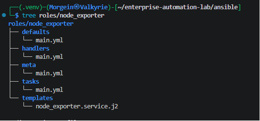
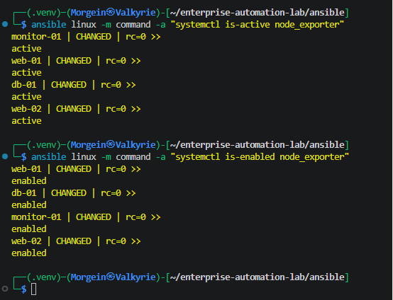
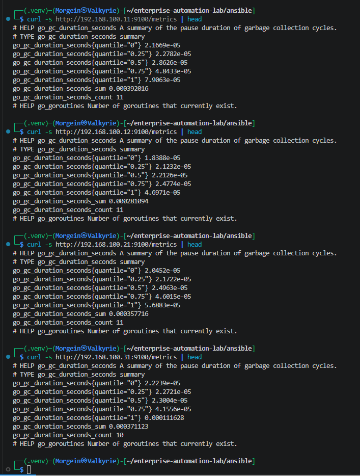
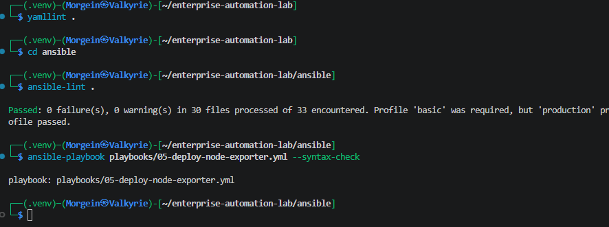

# Stage 2.6 - Prometheus Node Exporter Role

## 1. Purpose

This document describes Stage 2.6 of the Enterprise Automation Lab.

The goal of this stage is to create a reusable Ansible role for deploying Prometheus Node Exporter on all Linux nodes in the lab.

Node Exporter is a lightweight monitoring agent that exposes Linux system metrics over HTTP.

After this stage, every managed Linux node exposes metrics on port `9100`.

Target metrics endpoint format:

```text
http://SERVER_IP:9100/metrics
```

The role is applied to the full `linux` inventory group.

Current target nodes:

```text
web-01
web-02
db-01
monitor-01
```

---

## 2. Why This Stage Exists

Before this stage, the lab already had:

```text
Linux baseline role -> all Linux nodes
Nginx role          -> web servers
PostgreSQL role     -> database server
```

This stage adds the first monitoring component:

```text
Node Exporter -> all Linux nodes
```

This prepares the infrastructure for future Prometheus and Grafana stages.

The monitoring architecture will later look like this:

```text
web-01      -> node_exporter -> :9100/metrics
web-02      -> node_exporter -> :9100/metrics
db-01       -> node_exporter -> :9100/metrics
monitor-01  -> node_exporter -> :9100/metrics

monitor-01  -> Prometheus -> scrape all node_exporter endpoints
monitor-01  -> Grafana    -> visualize Prometheus metrics
```

At this stage, only Node Exporter is deployed.

Prometheus and Grafana are planned for later stages.

---

## 3. What Node Exporter Does

Node Exporter collects and exposes operating system metrics.

It provides metrics such as:

```text
CPU usage
memory usage
disk usage
filesystem statistics
network statistics
system load
boot time
system time
process-related metrics
```

Node Exporter does not store metrics.

It only exposes them.

Prometheus will later collect these metrics.

Simple flow:

```text
Linux server
    |
    v
node_exporter
    |
    v
http://server-ip:9100/metrics
    |
    v
Prometheus scrape target
```

---

## 4. Target Hosts

The Node Exporter role is applied to the `linux` inventory group.

Inventory structure:

```ini
[web]
web-01 ansible_host=192.168.100.11
web-02 ansible_host=192.168.100.12

[database]
db-01 ansible_host=192.168.100.21

[monitoring]
monitor-01 ansible_host=192.168.100.31

[linux:children]
web
database
monitoring
```

Because `linux` is a parent group, the role is applied to:

| Hostname | IP Address | Group | Purpose |
|---|---:|---|---|
| web-01 | 192.168.100.11 | web | Web server |
| web-02 | 192.168.100.12 | web | Web server |
| db-01 | 192.168.100.21 | database | PostgreSQL database server |
| monitor-01 | 192.168.100.31 | monitoring | Monitoring server |

---

## 5. Files Created or Updated

This stage creates or updates the following files:

| File | Purpose |
|---|---|
| `ansible/roles/node_exporter/defaults/main.yml` | Default role variables |
| `ansible/roles/node_exporter/handlers/main.yml` | Node Exporter restart handler |
| `ansible/roles/node_exporter/templates/node_exporter.service.j2` | systemd service template |
| `ansible/roles/node_exporter/tasks/main.yml` | Main automation tasks |
| `ansible/roles/node_exporter/meta/main.yml` | Role metadata |
| `ansible/playbooks/05-deploy-node-exporter.yml` | Playbook for deploying Node Exporter |
| `.github/workflows/ansible-validation.yml` | CI syntax-check updated for the new playbook |
| `README.md` | Project status and role list updated |
| `docs/runbooks/stage-02-06-node-exporter-role.md` | This runbook |

---

## 6. Role Directory Structure

Role path:

```text
ansible/roles/node_exporter/
```

Final structure:

```text
ansible/roles/node_exporter/
├── defaults/
│   └── main.yml
├── handlers/
│   └── main.yml
├── meta/
│   └── main.yml
├── tasks/
│   └── main.yml
└── templates/
    └── node_exporter.service.j2
```

### Directory Purpose

| Directory | Purpose |
|---|---|
| `defaults/` | Stores default variables for the role |
| `handlers/` | Stores restart/reload handlers |
| `meta/` | Stores Ansible Galaxy metadata |
| `tasks/` | Stores main role logic |
| `templates/` | Stores Jinja2 templates |

---

## 7. Role Defaults

File:

```text
ansible/roles/node_exporter/defaults/main.yml
```

Content:

```yaml
---
# Default variables for the node_exporter role.
# These values can be overridden by inventory group_vars or host_vars.

node_exporter_version: "1.8.2"

node_exporter_arch: linux-amd64

node_exporter_package_name: "node_exporter-{{ node_exporter_version }}.{{ node_exporter_arch }}"

node_exporter_user: node_exporter

node_exporter_group: node_exporter

node_exporter_install_dir: /usr/local/bin

node_exporter_binary_path: "{{ node_exporter_install_dir }}/node_exporter"

node_exporter_download_url: >-
  https://github.com/prometheus/node_exporter/releases/download/v{{ node_exporter_version }}/{{ node_exporter_package_name }}.tar.gz

node_exporter_archive_path: "/tmp/{{ node_exporter_package_name }}.tar.gz"

node_exporter_extract_path: "/tmp/{{ node_exporter_package_name }}"

node_exporter_service_name: node_exporter

node_exporter_listen_address: "0.0.0.0:9100"
```

---

## 8. Defaults File Line-by-Line Explanation

```yaml
---
```

Marks the beginning of a YAML document.

This is a good YAML style and is expected by many linters.

---

```yaml
# Default variables for the node_exporter role.
# These values can be overridden by inventory group_vars or host_vars.
```

These are comments.

They explain that the file contains default values.

Default variables have the lowest priority in Ansible variable precedence.

That means they can be overridden later by:

```text
group_vars
host_vars
extra vars
```

---

```yaml
node_exporter_version: "1.8.2"
```

Defines the Node Exporter version to install.

The value is quoted as a string.

This role installs version:

```text
1.8.2
```

If a newer version is needed later, only this variable needs to be changed.

---

```yaml
node_exporter_arch: linux-amd64
```

Defines the architecture of the Node Exporter binary package.

The lab uses Ubuntu Server VMs on x86_64 architecture, so the correct package is:

```text
linux-amd64
```

---

```yaml
node_exporter_package_name: "node_exporter-{{ node_exporter_version }}.{{ node_exporter_arch }}"
```

Builds the package name dynamically from two variables:

```text
node_exporter_version
node_exporter_arch
```

With current values, this becomes:

```text
node_exporter-1.8.2.linux-amd64
```

This avoids duplicating the same string in multiple places.

---

```yaml
node_exporter_user: node_exporter
```

Defines the Linux system user that will run the Node Exporter service.

The service should not run as `root`.

Running it as a dedicated low-privilege user is safer.

---

```yaml
node_exporter_group: node_exporter
```

Defines the Linux group for the Node Exporter service user.

The group has the same name as the user.

---

```yaml
node_exporter_install_dir: /usr/local/bin
```

Defines where the Node Exporter binary will be installed.

`/usr/local/bin` is a standard location for manually installed local binaries.

---

```yaml
node_exporter_binary_path: "{{ node_exporter_install_dir }}/node_exporter"
```

Defines the full path to the installed Node Exporter binary.

With the current value, this becomes:

```text
/usr/local/bin/node_exporter
```

---

```yaml
node_exporter_download_url: >-
  https://github.com/prometheus/node_exporter/releases/download/v{{ node_exporter_version }}/{{ node_exporter_package_name }}.tar.gz
```

Defines the download URL for the Node Exporter archive.

The `>-` YAML syntax allows the URL to be written across multiple lines in the file while still being treated as a single string.

This avoids a long-line warning from `yamllint`.

With the current variables, the final URL becomes:

```text
https://github.com/prometheus/node_exporter/releases/download/v1.8.2/node_exporter-1.8.2.linux-amd64.tar.gz
```

---

```yaml
node_exporter_archive_path: "/tmp/{{ node_exporter_package_name }}.tar.gz"
```

Defines where the downloaded archive will be stored on the managed node.

With current values, this becomes:

```text
/tmp/node_exporter-1.8.2.linux-amd64.tar.gz
```

The `/tmp` directory is used because the archive is only needed during installation.

---

```yaml
node_exporter_extract_path: "/tmp/{{ node_exporter_package_name }}"
```

Defines where the archive will be extracted.

With current values, this becomes:

```text
/tmp/node_exporter-1.8.2.linux-amd64
```

---

```yaml
node_exporter_service_name: node_exporter
```

Defines the systemd service name.

The final service file will be:

```text
/etc/systemd/system/node_exporter.service
```

The service will be managed with the name:

```text
node_exporter
```

---

```yaml
node_exporter_listen_address: "0.0.0.0:9100"
```

Defines where Node Exporter listens for HTTP connections.

`0.0.0.0` means listen on all network interfaces.

`9100` is the default Node Exporter port.

This allows metrics to be accessed from the WSL control node and later by Prometheus.

---

## 9. Role Handler

File:

```text
ansible/roles/node_exporter/handlers/main.yml
```

Content:

```yaml
---
- name: Restart node_exporter
  ansible.builtin.systemd:
    name: "{{ node_exporter_service_name }}"
    state: restarted
    daemon_reload: true
```

---

## 10. Handler Line-by-Line Explanation

```yaml
---
```

Marks the beginning of the YAML document.

---

```yaml
- name: Restart node_exporter
```

Defines the handler name.

Handlers are special Ansible tasks that run only when notified by another task.

This handler restarts Node Exporter when the binary or service file changes.

---

```yaml
ansible.builtin.systemd:
```

Uses the Ansible `systemd` module.

This is better than calling `systemctl` through the `command` module because Ansible understands systemd state management directly.

---

```yaml
name: "{{ node_exporter_service_name }}"
```

Defines the service name to manage.

The variable currently resolves to:

```text
node_exporter
```

---

```yaml
state: restarted
```

Tells systemd to restart the service.

This is used when the installed binary or service unit file changes.

---

```yaml
daemon_reload: true
```

Reloads systemd unit files before restarting.

This is required when a service file under `/etc/systemd/system/` is created or changed.

Without this, systemd may not notice the updated service definition.

---

## 11. systemd Service Template

File:

```text
ansible/roles/node_exporter/templates/node_exporter.service.j2
```

Content:

```ini
[Unit]
Description=Prometheus Node Exporter
Documentation=https://github.com/prometheus/node_exporter
After=network-online.target
Wants=network-online.target

[Service]
Type=simple
User={{ node_exporter_user }}
Group={{ node_exporter_group }}
ExecStart={{ node_exporter_binary_path }} --web.listen-address={{ node_exporter_listen_address }}

Restart=on-failure
RestartSec=5s

NoNewPrivileges=true
ProtectSystem=full
ProtectHome=true
PrivateTmp=true

[Install]
WantedBy=multi-user.target
```

---

## 12. systemd Template Line-by-Line Explanation

```ini
[Unit]
```

Starts the unit metadata section.

This section describes the service and its startup relationships.

---

```ini
Description=Prometheus Node Exporter
```

Human-readable description of the service.

This appears in commands such as:

```bash
systemctl status node_exporter
```

---

```ini
Documentation=https://github.com/prometheus/node_exporter
```

Provides a documentation URL for the service.

This is informational.

---

```ini
After=network-online.target
```

Tells systemd to start Node Exporter after the network is online.

This matters because Node Exporter exposes an HTTP endpoint.

---

```ini
Wants=network-online.target
```

Tells systemd that this service wants the network to be online.

This does not create a hard dependency, but it helps systemd order startup properly.

---

```ini
[Service]
```

Starts the service execution section.

This section defines how the service runs.

---

```ini
Type=simple
```

Means the process started by `ExecStart` is the main service process.

This is correct for Node Exporter because it runs in the foreground.

---

```ini
User={{ node_exporter_user }}
```

Runs the service as the dedicated user defined in Ansible variables.

With current values, this becomes:

```ini
User=node_exporter
```

---

```ini
Group={{ node_exporter_group }}
```

Runs the service with the dedicated group defined in Ansible variables.

With current values, this becomes:

```ini
Group=node_exporter
```

---

```ini
ExecStart={{ node_exporter_binary_path }} --web.listen-address={{ node_exporter_listen_address }}
```

Defines the exact command systemd uses to start Node Exporter.

With current values, this becomes:

```ini
ExecStart=/usr/local/bin/node_exporter --web.listen-address=0.0.0.0:9100
```

This starts Node Exporter and exposes metrics on port `9100`.

---

```ini
Restart=on-failure
```

Restarts the service automatically if it crashes.

This improves reliability.

---

```ini
RestartSec=5s
```

Waits five seconds before restarting after a failure.

This prevents systemd from restarting the service too aggressively.

---

```ini
NoNewPrivileges=true
```

Prevents the service process from gaining new privileges.

This is a security hardening option.

---

```ini
ProtectSystem=full
```

Makes system directories read-only for the service where possible.

This reduces the damage a compromised service could cause.

---

```ini
ProtectHome=true
```

Prevents the service from accessing user home directories.

Node Exporter does not need access to home directories.

---

```ini
PrivateTmp=true
```

Gives the service a private `/tmp`.

This isolates temporary files from other services.

---

```ini
[Install]
```

Starts the installation section.

This section controls how the service is enabled at boot.

---

```ini
WantedBy=multi-user.target
```

Makes the service start during the normal multi-user boot target.

This is the standard target for server services.

---

## 13. Role Tasks

File:

```text
ansible/roles/node_exporter/tasks/main.yml
```

Content:

```yaml
---
- name: Ensure node_exporter group exists
  ansible.builtin.group:
    name: "{{ node_exporter_group }}"
    system: true
    state: present

- name: Ensure node_exporter user exists
  ansible.builtin.user:
    name: "{{ node_exporter_user }}"
    group: "{{ node_exporter_group }}"
    system: true
    shell: /usr/sbin/nologin
    create_home: false
    state: present

- name: Download node_exporter archive
  ansible.builtin.get_url:
    url: "{{ node_exporter_download_url }}"
    dest: "{{ node_exporter_archive_path }}"
    mode: "0644"

- name: Extract node_exporter archive
  ansible.builtin.unarchive:
    src: "{{ node_exporter_archive_path }}"
    dest: /tmp
    remote_src: true
    creates: "{{ node_exporter_extract_path }}/node_exporter"

- name: Install node_exporter binary
  ansible.builtin.copy:
    src: "{{ node_exporter_extract_path }}/node_exporter"
    dest: "{{ node_exporter_binary_path }}"
    owner: root
    group: root
    mode: "0755"
    remote_src: true
  notify: Restart node_exporter

- name: Deploy node_exporter systemd service
  ansible.builtin.template:
    src: node_exporter.service.j2
    dest: "/etc/systemd/system/{{ node_exporter_service_name }}.service"
    owner: root
    group: root
    mode: "0644"
  notify: Restart node_exporter

- name: Ensure node_exporter service is enabled and running
  ansible.builtin.systemd:
    name: "{{ node_exporter_service_name }}"
    state: started
    enabled: true
    daemon_reload: true

- name: Validate node_exporter HTTP metrics endpoint locally
  ansible.builtin.uri:
    url: "http://127.0.0.1:9100/metrics"
    status_code: 200
    return_content: false
  changed_when: false

- name: Gather service facts
  ansible.builtin.service_facts:

- name: Validate node_exporter service facts
  ansible.builtin.assert:
    that:
      - "ansible_facts.services[node_exporter_service_name ~ '.service'].state == 'running'"
      - "ansible_facts.services[node_exporter_service_name ~ '.service'].status == 'enabled'"
    success_msg: "node_exporter service is running and enabled"
    fail_msg: "node_exporter service is not running or not enabled"

- name: Show node_exporter service facts
  ansible.builtin.debug:
    msg:
      - "Service: {{ node_exporter_service_name }}"
      - "State: {{ ansible_facts.services[node_exporter_service_name ~ '.service'].state }}"
      - "Status: {{ ansible_facts.services[node_exporter_service_name ~ '.service'].status }}"
```

---

## 14. Tasks File Line-by-Line Explanation

### Ensure node_exporter group exists

```yaml
- name: Ensure node_exporter group exists
```

Task name.

It describes that Ansible will make sure the `node_exporter` group exists.

---

```yaml
ansible.builtin.group:
```

Uses the Ansible `group` module.

This module manages Linux groups.

---

```yaml
name: "{{ node_exporter_group }}"
```

Defines the group name.

Current value:

```text
node_exporter
```

---

```yaml
system: true
```

Creates a system group.

System groups are intended for services and daemons, not normal human users.

---

```yaml
state: present
```

Ensures the group exists.

If it already exists, Ansible does nothing.

This is idempotent.

---

### Ensure node_exporter user exists

```yaml
- name: Ensure node_exporter user exists
```

Task name.

It ensures the service user exists.

---

```yaml
ansible.builtin.user:
```

Uses the Ansible `user` module.

This module manages Linux users.

---

```yaml
name: "{{ node_exporter_user }}"
```

Defines the username.

Current value:

```text
node_exporter
```

---

```yaml
group: "{{ node_exporter_group }}"
```

Assigns the user to the `node_exporter` group.

---

```yaml
system: true
```

Creates a system user.

This user is for running a service, not for logging in interactively.

---

```yaml
shell: /usr/sbin/nologin
```

Prevents interactive shell login for this user.

This is a security best practice for service accounts.

---

```yaml
create_home: false
```

Does not create a home directory.

Node Exporter does not need a home directory.

---

```yaml
state: present
```

Ensures the user exists.

If it already exists, Ansible does nothing.

---

### Download node_exporter archive

```yaml
- name: Download node_exporter archive
```

Task name.

It downloads the Node Exporter release archive.

---

```yaml
ansible.builtin.get_url:
```

Uses the Ansible `get_url` module.

This module downloads files from HTTP or HTTPS URLs.

---

```yaml
url: "{{ node_exporter_download_url }}"
```

Defines the source URL.

The URL is generated from the variables:

```text
node_exporter_version
node_exporter_package_name
```

---

```yaml
dest: "{{ node_exporter_archive_path }}"
```

Defines where the downloaded archive is stored on the managed node.

Current final path:

```text
/tmp/node_exporter-1.8.2.linux-amd64.tar.gz
```

---

```yaml
mode: "0644"
```

Sets file permissions on the downloaded archive.

`0644` means:

```text
owner can read and write
group can read
others can read
```

The mode is quoted because YAML can interpret leading-zero numbers incorrectly.

---

### Extract node_exporter archive

```yaml
- name: Extract node_exporter archive
```

Task name.

It extracts the downloaded archive.

---

```yaml
ansible.builtin.unarchive:
```

Uses the Ansible `unarchive` module.

This module extracts archive files.

---

```yaml
src: "{{ node_exporter_archive_path }}"
```

Source archive path on the managed node.

---

```yaml
dest: /tmp
```

Extracts the archive into `/tmp`.

---

```yaml
remote_src: true
```

Tells Ansible that the archive already exists on the remote managed node.

Without this, Ansible would try to find the file on the control node.

---

```yaml
creates: "{{ node_exporter_extract_path }}/node_exporter"
```

Makes the extraction idempotent.

If this file already exists:

```text
/tmp/node_exporter-1.8.2.linux-amd64/node_exporter
```

Ansible skips extraction.

This prevents unnecessary changes on repeated runs.

---

### Install node_exporter binary

```yaml
- name: Install node_exporter binary
```

Task name.

It copies the extracted binary into the final install path.

---

```yaml
ansible.builtin.copy:
```

Uses the Ansible `copy` module.

In this case, it copies from one location on the remote host to another location on the same remote host.

---

```yaml
src: "{{ node_exporter_extract_path }}/node_exporter"
```

Source binary path after extraction.

---

```yaml
dest: "{{ node_exporter_binary_path }}"
```

Destination path.

Current final path:

```text
/usr/local/bin/node_exporter
```

---

```yaml
owner: root
```

Sets file owner to `root`.

The binary should be owned by root so the service user cannot modify it.

---

```yaml
group: root
```

Sets file group to `root`.

---

```yaml
mode: "0755"
```

Makes the binary executable.

`0755` means:

```text
owner can read, write, execute
group can read and execute
others can read and execute
```

---

```yaml
remote_src: true
```

Tells Ansible that the source file is already on the remote host.

---

```yaml
notify: Restart node_exporter
```

Triggers the handler if the binary changes.

If a new binary is installed, the service must restart to use it.

---

### Deploy node_exporter systemd service

```yaml
- name: Deploy node_exporter systemd service
```

Task name.

It deploys the systemd service unit file.

---

```yaml
ansible.builtin.template:
```

Uses the Ansible `template` module.

This module processes a Jinja2 template and places the rendered file on the managed node.

---

```yaml
src: node_exporter.service.j2
```

Source template file from the role's `templates/` directory.

---

```yaml
dest: "/etc/systemd/system/{{ node_exporter_service_name }}.service"
```

Destination service file path.

With the current variable, this becomes:

```text
/etc/systemd/system/node_exporter.service
```

---

```yaml
owner: root
```

The service file is owned by root.

---

```yaml
group: root
```

The service file group is root.

---

```yaml
mode: "0644"
```

Permissions for the service file.

The file can be read by everyone but modified only by root.

---

```yaml
notify: Restart node_exporter
```

Triggers the restart handler if the systemd unit file changes.

This is needed because service configuration changes require a restart.

---

### Ensure node_exporter service is enabled and running

```yaml
- name: Ensure node_exporter service is enabled and running
```

Task name.

It ensures the service is running now and enabled after reboot.

---

```yaml
ansible.builtin.systemd:
```

Uses the Ansible `systemd` module.

This is the correct module for managing systemd services.

---

```yaml
name: "{{ node_exporter_service_name }}"
```

Defines the service name.

Current value:

```text
node_exporter
```

---

```yaml
state: started
```

Ensures the service is currently running.

---

```yaml
enabled: true
```

Ensures the service starts automatically after reboot.

---

```yaml
daemon_reload: true
```

Reloads systemd units.

This is important because the role creates or updates a service file under `/etc/systemd/system/`.

---

### Validate node_exporter HTTP metrics endpoint locally

```yaml
- name: Validate node_exporter HTTP metrics endpoint locally
```

Task name.

It validates that Node Exporter responds on the local machine.

---

```yaml
ansible.builtin.uri:
```

Uses the Ansible `uri` module.

This module performs HTTP requests.

---

```yaml
url: "http://127.0.0.1:9100/metrics"
```

Tests the local metrics endpoint from inside each managed node.

Each server checks its own local Node Exporter service.

---

```yaml
status_code: 200
```

Expects HTTP status code `200 OK`.

If the endpoint does not respond correctly, the playbook fails.

---

```yaml
return_content: false
```

Does not print the full `/metrics` output.

This keeps Ansible output clean because `/metrics` can be very long.

---

```yaml
changed_when: false
```

This task only validates state.

It does not change the system.

Therefore, it should not be counted as a changed task.

---

### Gather service facts

```yaml
- name: Gather service facts
```

Task name.

It collects information about system services.

---

```yaml
ansible.builtin.service_facts:
```

Uses the Ansible `service_facts` module.

This gathers service information into:

```text
ansible_facts.services
```

This avoids using raw commands like:

```bash
systemctl is-active node_exporter
```

Using `service_facts` is more Ansible-native and passes `ansible-lint`.

---

### Validate node_exporter service facts

```yaml
- name: Validate node_exporter service facts
```

Task name.

It validates that the service is running and enabled.

---

```yaml
ansible.builtin.assert:
```

Uses the Ansible `assert` module.

This module checks conditions and fails the playbook if they are false.

---

```yaml
that:
```

Starts the list of conditions that must be true.

---

```yaml
- "ansible_facts.services[node_exporter_service_name ~ '.service'].state == 'running'"
```

Checks that the service state is `running`.

The expression:

```text
node_exporter_service_name ~ '.service'
```

builds this service key:

```text
node_exporter.service
```

Then Ansible checks:

```text
ansible_facts.services['node_exporter.service'].state
```

Expected value:

```text
running
```

---

```yaml
- "ansible_facts.services[node_exporter_service_name ~ '.service'].status == 'enabled'"
```

Checks that the service is enabled at boot.

Expected value:

```text
enabled
```

---

```yaml
success_msg: "node_exporter service is running and enabled"
```

Message shown when both assertions pass.

---

```yaml
fail_msg: "node_exporter service is not running or not enabled"
```

Message shown if one of the checks fails.

---

### Show node_exporter service facts

```yaml
- name: Show node_exporter service facts
```

Task name.

It prints service validation information.

---

```yaml
ansible.builtin.debug:
```

Uses the Ansible `debug` module.

This module prints variables or messages.

---

```yaml
msg:
```

Defines a custom list of messages to print.

---

```yaml
- "Service: {{ node_exporter_service_name }}"
```

Prints the service name.

Expected output:

```text
Service: node_exporter
```

---

```yaml
- "State: {{ ansible_facts.services[node_exporter_service_name ~ '.service'].state }}"
```

Prints the service runtime state.

Expected output:

```text
State: running
```

---

```yaml
- "Status: {{ ansible_facts.services[node_exporter_service_name ~ '.service'].status }}"
```

Prints whether the service is enabled.

Expected output:

```text
Status: enabled
```

---

## 15. Role Metadata

File:

```text
ansible/roles/node_exporter/meta/main.yml
```

Content:

```yaml
---
galaxy_info:
  author: Morgein
  description: Prometheus Node Exporter role for the Enterprise Automation Lab
  company: Personal Lab
  license: MIT
  min_ansible_version: "2.15"

  platforms:
    - name: Ubuntu
      versions:
        - noble
        - jammy

  galaxy_tags:
    - monitoring
    - prometheus
    - node-exporter
    - metrics
    - linux
    - automation

dependencies: []
```

---

## 16. Metadata File Explanation

```yaml
---
```

YAML document start.

---

```yaml
galaxy_info:
```

Starts Ansible Galaxy metadata.

Even though this role is local and not published to Galaxy, metadata keeps the role structured and professional.

---

```yaml
author: Morgein
```

Defines the role author.

---

```yaml
description: Prometheus Node Exporter role for the Enterprise Automation Lab
```

Short role description.

---

```yaml
company: Personal Lab
```

Project/company field.

For this lab, it is a personal lab.

---

```yaml
license: MIT
```

Defines the role license.

---

```yaml
min_ansible_version: "2.15"
```

Defines the minimum supported Ansible version.

The value is quoted as a string.

---

```yaml
platforms:
```

Defines supported operating systems.

---

```yaml
- name: Ubuntu
```

The role is intended for Ubuntu.

---

```yaml
versions:
  - noble
  - jammy
```

Supported Ubuntu versions:

```text
noble = Ubuntu 24.04
jammy = Ubuntu 22.04
```

---

```yaml
galaxy_tags:
```

Tags describing the role.

---

```yaml
- monitoring
- prometheus
- node-exporter
- metrics
- linux
- automation
```

Tags show that the role is related to monitoring, Prometheus, Linux metrics and automation.

---

```yaml
dependencies: []
```

Means this role has no role dependencies.

It does not automatically require another Ansible role.

---

## 17. Deployment Playbook

File:

```text
ansible/playbooks/05-deploy-node-exporter.yml
```

Content:

```yaml
---
- name: Deploy Prometheus Node Exporter
  hosts: linux
  become: true
  gather_facts: true

  roles:
    - node_exporter
```

---

## 18. Playbook Line-by-Line Explanation

```yaml
---
```

YAML document start.

---

```yaml
- name: Deploy Prometheus Node Exporter
```

Human-readable play name.

This appears in Ansible output.

---

```yaml
hosts: linux
```

Targets the `linux` inventory group.

This group includes:

```text
web
database
monitoring
```

Therefore, the role runs on:

```text
web-01
web-02
db-01
monitor-01
```

---

```yaml
become: true
```

Enables privilege escalation.

This is required because the role:

```text
creates system users
creates system groups
copies files to /usr/local/bin
writes systemd unit files
starts services
enables services
```

All of those require elevated privileges.

---

```yaml
gather_facts: true
```

Collects facts from managed nodes before running the role.

This keeps the playbook consistent with the rest of the project.

Facts may also be useful later for architecture-specific decisions.

---

```yaml
roles:
```

Starts the role list.

---

```yaml
- node_exporter
```

Applies the `node_exporter` role to all hosts in the `linux` group.

---

## 19. Local Validation Commands

Run from the repository root:

```bash
cd ~/enterprise-automation-lab
```

Check YAML files:

```bash
yamllint .
```

Expected result:

```text
No output
```

No output means there are no YAML linting errors.

---

Run Ansible lint:

```bash
cd ~/enterprise-automation-lab/ansible
ansible-lint .
```

Expected result:

```text
Passed: 0 failure(s), 0 warning(s)
```

---

Check playbook syntax:

```bash
ansible-playbook playbooks/05-deploy-node-exporter.yml --syntax-check
```

Expected result:

```text
playbook: playbooks/05-deploy-node-exporter.yml
```

---

## 20. Deployment Commands

Run the playbook:

```bash
cd ~/enterprise-automation-lab/ansible
ansible-playbook playbooks/05-deploy-node-exporter.yml
```

Run it again to validate idempotency:

```bash
ansible-playbook playbooks/05-deploy-node-exporter.yml
```

Expected repeated run result:

```text
web-01      changed=0 unreachable=0 failed=0
web-02      changed=0 unreachable=0 failed=0
db-01       changed=0 unreachable=0 failed=0
monitor-01  changed=0 unreachable=0 failed=0
```

This confirms that the role is idempotent.

---

## 21. Service Validation

Check service active state:

```bash
ansible linux -m command -a "systemctl is-active node_exporter"
```

Expected result on every host:

```text
active
```

Check service enabled state:

```bash
ansible linux -m command -a "systemctl is-enabled node_exporter"
```

Expected result on every host:

```text
enabled
```

The role itself validates this with `service_facts` and `assert`, but manual validation is still useful for screenshots and documentation.

---

## 22. HTTP Endpoint Validation

Validate Node Exporter from the WSL control node:

```bash
curl -s http://192.168.100.11:9100/metrics | head
curl -s http://192.168.100.12:9100/metrics | head
curl -s http://192.168.100.21:9100/metrics | head
curl -s http://192.168.100.31:9100/metrics | head
```

Expected output includes Prometheus-style metrics:

```text
# HELP
# TYPE
```

Example metric names may include:

```text
go_gc_duration_seconds
node_cpu_seconds_total
node_memory_MemAvailable_bytes
node_filesystem_avail_bytes
```

This confirms that Node Exporter is reachable over HTTP from the control node.

---

## 23. GitHub Actions Validation

The GitHub Actions workflow must check the new Node Exporter playbook.

Workflow file:

```text
.github/workflows/ansible-validation.yml
```

Required workflow step:

```yaml
- name: Syntax check Node Exporter deployment playbook
  working-directory: ansible
  run: ansible-playbook playbooks/05-deploy-node-exporter.yml --syntax-check
```

This step checks that:

```text
the playbook syntax is valid
the node_exporter role exists
the role can be loaded by Ansible
the YAML structure is correct
```

---

## 24. Validation Evidence

Validation screenshots for this stage are stored in:

```text
docs/screenshots/stage-02-node-exporter-role/
```

### Node Exporter Role Structure

This screenshot shows the final role structure.



### Node Exporter Idempotency

This screenshot shows the repeated playbook run with:

```text
changed=0
failed=0
unreachable=0
```


### Node Exporter Service Validation

This screenshot shows that `node_exporter` is active and enabled on all Linux nodes.



### Node Exporter HTTP Endpoint Validation

This screenshot shows `/metrics` output from all managed nodes.



### Lint and Syntax Validation

This screenshot shows successful `yamllint`, `ansible-lint` and syntax-check results.



---

## 25. Troubleshooting

### yamllint reports line too long

Example:

```text
line too long (194 > 160 characters)
```

Cause:

A YAML line is longer than the configured limit.

Fix:

Use a separate variable or YAML folded style.

Example:

```yaml
node_exporter_download_url: >-
  https://github.com/prometheus/node_exporter/releases/download/v{{ node_exporter_version }}/{{ node_exporter_package_name }}.tar.gz
```

---

### ansible-lint reports systemctl used instead of systemd module

Example:

```text
command-instead-of-module: systemctl used in place of systemd module
```

Cause:

A task used:

```yaml
ansible.builtin.command: systemctl ...
```

when an Ansible module should be used instead.

Fix:

Use:

```yaml
ansible.builtin.systemd:
```

for service management.

For service validation, use:

```yaml
ansible.builtin.service_facts:
```

and:

```yaml
ansible.builtin.assert:
```

---

### Missing newline at end of file

Example:

```text
no new line character at the end of file
```

Cause:

The YAML file does not end with a newline.

Fix:

Open the file and press `Enter` after the last line, or run:

```bash
sed -i -e '$a\' path/to/file.yml
```

---

### Node Exporter download fails

Possible failing task:

```text
Download node_exporter archive
```

Cause:

The managed node cannot access GitHub.

Possible reasons:

```text
DNS problem
NAT problem
internet access problem
GitHub unreachable from the VM
```

Validation commands:

```bash
ansible linux -m command -a "ping -c 2 github.com"
ansible linux -m command -a "getent hosts github.com"
```

Fix:

Restore internet access from managed nodes or download the archive on the control node and distribute it with Ansible.

---

### Port 9100 is not reachable from WSL

Cause may be:

```text
node_exporter service is not running
firewall blocks port 9100
WSL to Hyper-V routing problem
wrong listen address
```

Validation on the managed node:

```bash
ansible linux -m command -a "ss -tulpn | grep 9100"
```

Expected listener:

```text
0.0.0.0:9100
```

If it only listens on `127.0.0.1:9100`, remote access from WSL will not work.

The role uses:

```yaml
node_exporter_listen_address: "0.0.0.0:9100"
```

to avoid that problem.

---

## 26. Stage Result

At the end of this stage:

```text
node_exporter role created
node_exporter user created
node_exporter group created
Node Exporter binary installed
systemd service deployed
node_exporter service enabled
node_exporter service running
local /metrics endpoint validated by Ansible
service state validated through service_facts
HTTP endpoints reachable from WSL
role idempotency validated
yamllint passed
ansible-lint passed
syntax-check passed
```

---

## 27. Current Project Status

Current stage completed:

```text
Stage 2.6 - Prometheus Node Exporter role
```

Current monitoring foundation:

```text
web-01      -> node_exporter active on :9100
web-02      -> node_exporter active on :9100
db-01       -> node_exporter active on :9100
monitor-01  -> node_exporter active on :9100
```

Next planned stage:

```text
Stage 2.7 - Prometheus server role for monitor-01
```

In the next stage, Prometheus will be installed on `monitor-01` and configured to scrape metrics from all Node Exporter endpoints.
