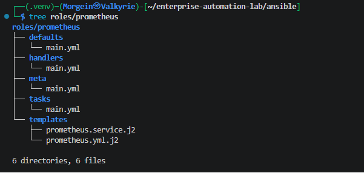
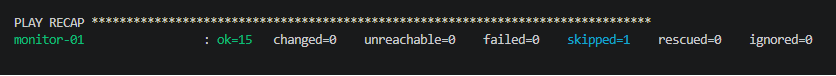
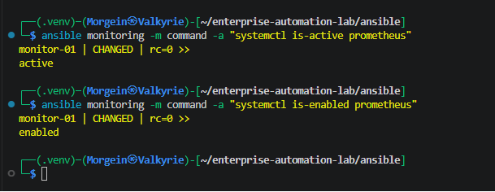
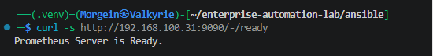
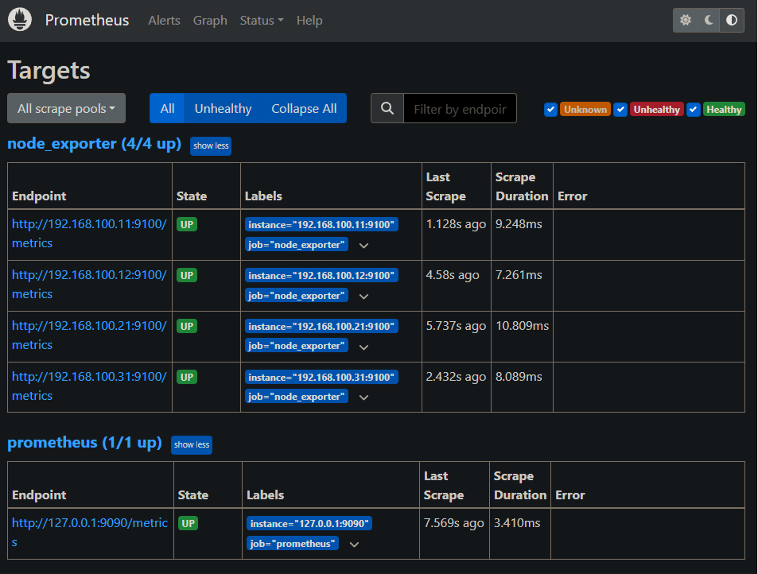
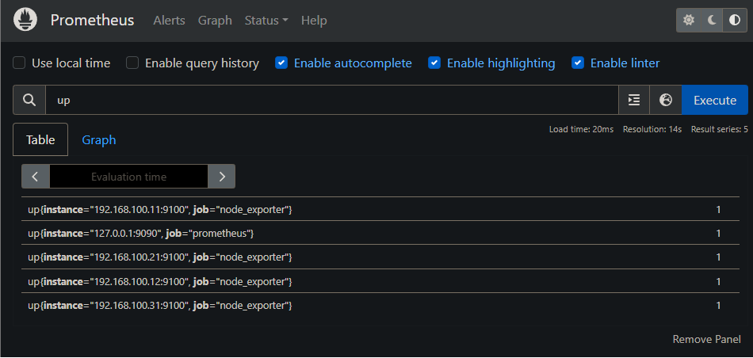
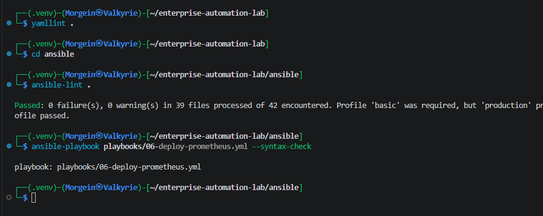

# Stage 2.7 - Prometheus Server Role

## 1. Purpose

This document describes Stage 2.7 of the Enterprise Automation Lab.

The goal of this stage is to create a reusable Ansible role for deploying a Prometheus monitoring server on the dedicated monitoring node.

Prometheus is responsible for collecting metrics from Node Exporter endpoints and storing them as time-series data.

Before this stage, the lab already had Node Exporter running on all Linux nodes:

```text
web-01      -> node_exporter -> 192.168.100.11:9100/metrics
web-02      -> node_exporter -> 192.168.100.12:9100/metrics
db-01       -> node_exporter -> 192.168.100.21:9100/metrics
monitor-01  -> node_exporter -> 192.168.100.31:9100/metrics
```

In this stage, Prometheus is installed on:

```text
monitor-01
```

Prometheus listens on:

```text
192.168.100.31:9090
```

and scrapes metrics from all Node Exporter targets.

---

## 2. Why This Stage Exists

Node Exporter only exposes metrics.

It does not store them.

Prometheus collects those metrics, stores them over time and allows querying them through PromQL.

The monitoring flow after this stage is:

```text
web-01:9100
web-02:9100
db-01:9100
monitor-01:9100
        |
        v
monitor-01:9090
Prometheus Server
        |
        v
Time-series metrics storage
```

This stage creates the central metrics collector for the lab.

Later, Grafana will use Prometheus as a data source.

---

## 3. Target Host

The Prometheus role is applied only to the `monitoring` inventory group.

Inventory group:

```ini
[monitoring]
monitor-01 ansible_host=192.168.100.31
```

Target server:

| Hostname | IP Address | Group | Purpose |
|---|---:|---|---|
| monitor-01 | 192.168.100.31 | monitoring | Prometheus monitoring server |

Prometheus is not installed on:

```text
web-01
web-02
db-01
```

This is intentional.

Node Exporter runs on all Linux nodes.

Prometheus server runs only on the monitoring node.

---

## 4. Monitoring Architecture After This Stage

```text
Kali Linux WSL
    |
    | Ansible / SSH
    v
Hyper-V Linux Nodes
    |
    ├── web-01
    │   └── Node Exporter
    │       └── 192.168.100.11:9100/metrics
    │
    ├── web-02
    │   └── Node Exporter
    │       └── 192.168.100.12:9100/metrics
    │
    ├── db-01
    │   └── Node Exporter
    │       └── 192.168.100.21:9100/metrics
    │
    └── monitor-01
        ├── Node Exporter
        │   └── 192.168.100.31:9100/metrics
        │
        └── Prometheus Server
            ├── Web UI: 192.168.100.31:9090
            ├── Scrapes web-01:9100
            ├── Scrapes web-02:9100
            ├── Scrapes db-01:9100
            └── Scrapes monitor-01:9100
```

---

## 5. Files Created or Updated

This stage creates or updates the following files:

| File | Purpose |
|---|---|
| `ansible/roles/prometheus/defaults/main.yml` | Default Prometheus role variables |
| `ansible/roles/prometheus/handlers/main.yml` | Prometheus restart handler |
| `ansible/roles/prometheus/templates/prometheus.service.j2` | systemd service template |
| `ansible/roles/prometheus/templates/prometheus.yml.j2` | Prometheus configuration template |
| `ansible/roles/prometheus/tasks/main.yml` | Main Prometheus automation tasks |
| `ansible/roles/prometheus/meta/main.yml` | Role metadata |
| `ansible/inventories/dev/group_vars/monitoring.yml` | Monitoring group variables |
| `ansible/playbooks/06-deploy-prometheus.yml` | Prometheus deployment playbook |
| `.github/workflows/ansible-validation.yml` | CI syntax-check updated for Prometheus |
| `README.md` | Project status updated |
| `docs/runbooks/stage-02-07-prometheus-role.md` | This runbook |

---

## 6. Role Directory Structure

Role path:

```text
ansible/roles/prometheus/
```

Final structure:

```text
ansible/roles/prometheus/
├── defaults/
│   └── main.yml
├── handlers/
│   └── main.yml
├── meta/
│   └── main.yml
├── tasks/
│   └── main.yml
└── templates/
    ├── prometheus.service.j2
    └── prometheus.yml.j2
```

### Directory Purpose

| Directory | Purpose |
|---|---|
| `defaults/` | Stores default role variables |
| `handlers/` | Stores restart/reload handlers |
| `meta/` | Stores role metadata |
| `tasks/` | Stores main automation logic |
| `templates/` | Stores Jinja2 templates for service and configuration files |

---

## 7. Role Defaults

File:

```text
ansible/roles/prometheus/defaults/main.yml
```

Content:

```yaml
---
# Default variables for the prometheus role.
# These values can be overridden by inventory group_vars or host_vars.

prometheus_version: "2.55.1"

prometheus_arch: linux-amd64

prometheus_package_name: "prometheus-{{ prometheus_version }}.{{ prometheus_arch }}"

prometheus_user: prometheus

prometheus_group: prometheus

prometheus_install_dir: /usr/local/bin

prometheus_binary_path: "{{ prometheus_install_dir }}/prometheus"

prometheus_promtool_binary_path: "{{ prometheus_install_dir }}/promtool"

prometheus_config_dir: /etc/prometheus

prometheus_config_file: "{{ prometheus_config_dir }}/prometheus.yml"

prometheus_data_dir: /var/lib/prometheus

prometheus_download_url: >-
  https://github.com/prometheus/prometheus/releases/download/v{{ prometheus_version }}/{{ prometheus_package_name }}.tar.gz

prometheus_archive_path: "/tmp/{{ prometheus_package_name }}.tar.gz"

prometheus_extract_path: "/tmp/{{ prometheus_package_name }}"

prometheus_service_name: prometheus

prometheus_web_listen_address: "0.0.0.0:9090"

prometheus_self_scrape_target: "127.0.0.1:9090"

prometheus_scrape_interval: 15s

prometheus_evaluation_interval: 15s

prometheus_node_exporter_targets: []
```

---

## 8. Defaults File Line-by-Line Explanation

```yaml
---
```

Marks the beginning of a YAML document.

This keeps the file compatible with YAML style rules and linters.

---

```yaml
# Default variables for the prometheus role.
# These values can be overridden by inventory group_vars or host_vars.
```

These comments explain that this file stores default role variables.

Default variables have low priority in Ansible variable precedence.

That means they can be overridden by:

```text
group_vars
host_vars
extra vars
```

---

```yaml
prometheus_version: "2.55.1"
```

Defines the Prometheus version to install.

The value is quoted as a string.

Using a fixed version makes the role reproducible.

The role will install the same version every time unless this variable is changed.

---

```yaml
prometheus_arch: linux-amd64
```

Defines the Prometheus release architecture.

The lab uses Ubuntu Server VMs on x86_64 architecture, so the correct release package is:

```text
linux-amd64
```

---

```yaml
prometheus_package_name: "prometheus-{{ prometheus_version }}.{{ prometheus_arch }}"
```

Builds the Prometheus package name dynamically.

With the current values, this becomes:

```text
prometheus-2.55.1.linux-amd64
```

This avoids repeating the version and architecture manually in multiple variables.

---

```yaml
prometheus_user: prometheus
```

Defines the Linux system user that runs the Prometheus service.

Prometheus should not run as root.

A dedicated service user is more secure.

---

```yaml
prometheus_group: prometheus
```

Defines the Linux group for the Prometheus service user.

The group has the same name as the user.

---

```yaml
prometheus_install_dir: /usr/local/bin
```

Defines where the Prometheus binaries will be installed.

`/usr/local/bin` is a common location for manually installed binaries.

---

```yaml
prometheus_binary_path: "{{ prometheus_install_dir }}/prometheus"
```

Defines the full path to the Prometheus binary.

With current values, this becomes:

```text
/usr/local/bin/prometheus
```

---

```yaml
prometheus_promtool_binary_path: "{{ prometheus_install_dir }}/promtool"
```

Defines the full path to the `promtool` binary.

With current values, this becomes:

```text
/usr/local/bin/promtool
```

`promtool` is used to validate Prometheus configuration before applying it.

---

```yaml
prometheus_config_dir: /etc/prometheus
```

Defines the directory where Prometheus configuration files are stored.

---

```yaml
prometheus_config_file: "{{ prometheus_config_dir }}/prometheus.yml"
```

Defines the full path to the main Prometheus configuration file.

With current values, this becomes:

```text
/etc/prometheus/prometheus.yml
```

---

```yaml
prometheus_data_dir: /var/lib/prometheus
```

Defines where Prometheus stores time-series data.

Prometheus writes collected metrics into this directory.

This directory must be writable by the Prometheus service user.

---

```yaml
prometheus_download_url: >-
  https://github.com/prometheus/prometheus/releases/download/v{{ prometheus_version }}/{{ prometheus_package_name }}.tar.gz
```

Defines the download URL for the Prometheus release archive.

The `>-` YAML syntax allows the long URL to be written across multiple lines while still being interpreted as a single string.

With current values, the final URL becomes:

```text
https://github.com/prometheus/prometheus/releases/download/v2.55.1/prometheus-2.55.1.linux-amd64.tar.gz
```

---

```yaml
prometheus_archive_path: "/tmp/{{ prometheus_package_name }}.tar.gz"
```

Defines where the downloaded archive is stored on the managed node.

With current values, this becomes:

```text
/tmp/prometheus-2.55.1.linux-amd64.tar.gz
```

---

```yaml
prometheus_extract_path: "/tmp/{{ prometheus_package_name }}"
```

Defines where the archive will be extracted.

With current values, this becomes:

```text
/tmp/prometheus-2.55.1.linux-amd64
```

---

```yaml
prometheus_service_name: prometheus
```

Defines the systemd service name.

The final service file will be:

```text
/etc/systemd/system/prometheus.service
```

---

```yaml
prometheus_web_listen_address: "0.0.0.0:9090"
```

Defines the Prometheus web UI and API listen address.

`0.0.0.0` means Prometheus listens on all network interfaces.

`9090` is the default Prometheus web port.

This allows access from the Windows browser and from Kali WSL.

---

```yaml
prometheus_self_scrape_target: "127.0.0.1:9090"
```

Defines the local Prometheus self-scrape target.

Prometheus scrapes itself to collect its own internal metrics.

---

```yaml
prometheus_scrape_interval: 15s
```

Defines how often Prometheus scrapes configured targets.

Current value:

```text
15 seconds
```

---

```yaml
prometheus_evaluation_interval: 15s
```

Defines how often Prometheus evaluates rules.

Alerting and recording rules are not configured yet, but the value is included for a complete baseline configuration.

---

```yaml
prometheus_node_exporter_targets: []
```

Defines the default list of Node Exporter targets.

The default value is empty.

Real targets are defined in:

```text
ansible/inventories/dev/group_vars/monitoring.yml
```

This keeps environment-specific IP addresses out of role defaults.

---

## 9. Monitoring Group Variables

File:

```text
ansible/inventories/dev/group_vars/monitoring.yml
```

Content:

```yaml
---
# Variables for monitoring hosts in the development inventory.

prometheus_node_exporter_targets:
  - "192.168.100.11:9100"
  - "192.168.100.12:9100"
  - "192.168.100.21:9100"
  - "192.168.100.31:9100"
```

---

## 10. Monitoring Group Variables Explanation

```yaml
---
```

Marks the beginning of a YAML document.

---

```yaml
# Variables for monitoring hosts in the development inventory.
```

Comment explaining that this file contains variables for the monitoring group in the dev environment.

---

```yaml
prometheus_node_exporter_targets:
```

Defines the list of Node Exporter targets that Prometheus should scrape.

This variable is used inside the `prometheus.yml.j2` template.

---

```yaml
- "192.168.100.11:9100"
```

Node Exporter endpoint for `web-01`.

---

```yaml
- "192.168.100.12:9100"
```

Node Exporter endpoint for `web-02`.

---

```yaml
- "192.168.100.21:9100"
```

Node Exporter endpoint for `db-01`.

---

```yaml
- "192.168.100.31:9100"
```

Node Exporter endpoint for `monitor-01`.

Prometheus also scrapes the monitoring node because it is also a Linux node.

---

## 11. Role Handler

File:

```text
ansible/roles/prometheus/handlers/main.yml
```

Content:

```yaml
---
- name: Restart prometheus
  ansible.builtin.systemd:
    name: "{{ prometheus_service_name }}"
    state: restarted
    daemon_reload: true
```

---

## 12. Handler Line-by-Line Explanation

```yaml
---
```

Marks the beginning of a YAML document.

---

```yaml
- name: Restart prometheus
```

Defines the handler name.

Handlers run only when notified by another task.

This handler restarts Prometheus when the binary, service file or configuration file changes.

---

```yaml
ansible.builtin.systemd:
```

Uses the Ansible `systemd` module.

This is better than running `systemctl` manually through the `command` module.

---

```yaml
name: "{{ prometheus_service_name }}"
```

Defines the service name.

With current values, this becomes:

```text
prometheus
```

---

```yaml
state: restarted
```

Restarts the service.

This is needed when configuration or binary files change.

---

```yaml
daemon_reload: true
```

Reloads systemd unit files before restarting.

This is required when the systemd service file under `/etc/systemd/system/` changes.

---

## 13. Prometheus systemd Service Template

File:

```text
ansible/roles/prometheus/templates/prometheus.service.j2
```

Content:

```ini
[Unit]
Description=Prometheus Monitoring Server
Documentation=https://prometheus.io/docs/introduction/overview/
After=network-online.target
Wants=network-online.target

[Service]
Type=simple
User={{ prometheus_user }}
Group={{ prometheus_group }}
ExecStart={{ prometheus_binary_path }} \
  --config.file={{ prometheus_config_file }} \
  --storage.tsdb.path={{ prometheus_data_dir }} \
  --web.listen-address={{ prometheus_web_listen_address }}

Restart=on-failure
RestartSec=5s

NoNewPrivileges=true
ProtectSystem=full
ReadWritePaths={{ prometheus_data_dir }}
ProtectHome=true
PrivateTmp=true

[Install]
WantedBy=multi-user.target
```

---

## 14. systemd Template Line-by-Line Explanation

```ini
[Unit]
```

Starts the systemd unit metadata section.

This section describes the service and startup ordering.

---

```ini
Description=Prometheus Monitoring Server
```

Human-readable service description.

This appears in:

```bash
systemctl status prometheus
```

---

```ini
Documentation=https://prometheus.io/docs/introduction/overview/
```

Documentation URL for the service.

This is informational.

---

```ini
After=network-online.target
```

Tells systemd to start Prometheus after the network is online.

Prometheus needs network access because it scrapes remote Node Exporter endpoints.

---

```ini
Wants=network-online.target
```

Tells systemd that Prometheus wants the network to be online.

This improves service startup ordering.

---

```ini
[Service]
```

Starts the service execution section.

---

```ini
Type=simple
```

Prometheus runs in the foreground as the main process.

Therefore, `simple` is correct.

---

```ini
User={{ prometheus_user }}
```

Runs Prometheus as the dedicated service user.

After rendering, this becomes:

```ini
User=prometheus
```

---

```ini
Group={{ prometheus_group }}
```

Runs Prometheus with the dedicated service group.

After rendering, this becomes:

```ini
Group=prometheus
```

---

```ini
ExecStart={{ prometheus_binary_path }} \
  --config.file={{ prometheus_config_file }} \
  --storage.tsdb.path={{ prometheus_data_dir }} \
  --web.listen-address={{ prometheus_web_listen_address }}
```

Defines the command used to start Prometheus.

After rendering, this becomes:

```text
/usr/local/bin/prometheus \
  --config.file=/etc/prometheus/prometheus.yml \
  --storage.tsdb.path=/var/lib/prometheus \
  --web.listen-address=0.0.0.0:9090
```

`--config.file` tells Prometheus where its configuration is.

`--storage.tsdb.path` tells Prometheus where to store metrics.

`--web.listen-address` tells Prometheus where to expose the web UI and API.

---

```ini
Restart=on-failure
```

Restarts Prometheus automatically if it crashes.

---

```ini
RestartSec=5s
```

Waits five seconds before restarting Prometheus after a failure.

---

```ini
NoNewPrivileges=true
```

Prevents the Prometheus process from gaining additional privileges.

This is a service hardening setting.

---

```ini
ProtectSystem=full
```

Makes system directories read-only for the service where possible.

This limits what Prometheus can modify.

---

```ini
ReadWritePaths={{ prometheus_data_dir }}
```

Allows Prometheus to write to its data directory.

After rendering, this becomes:

```ini
ReadWritePaths=/var/lib/prometheus
```

This is needed because `ProtectSystem=full` restricts writes to system paths.

---

```ini
ProtectHome=true
```

Prevents Prometheus from accessing user home directories.

Prometheus does not need access to home directories.

---

```ini
PrivateTmp=true
```

Gives Prometheus a private `/tmp`.

This isolates temporary files from other services.

---

```ini
[Install]
```

Starts the install section.

This controls how the service is enabled at boot.

---

```ini
WantedBy=multi-user.target
```

Makes Prometheus start during the normal multi-user boot target.

This is standard for server services.

---

## 15. Prometheus Configuration Template

File:

```text
ansible/roles/prometheus/templates/prometheus.yml.j2
```

Content:

```yaml
---
global:
  scrape_interval: "{{ prometheus_scrape_interval }}"
  evaluation_interval: "{{ prometheus_evaluation_interval }}"

scrape_configs:
  - job_name: prometheus
    static_configs:
      - targets:
          - "{{ prometheus_self_scrape_target }}"

  - job_name: node_exporter
    static_configs:
      - targets:

          - "{{ target }}"

```

---

## 16. Prometheus Configuration Line-by-Line Explanation

```yaml
---
```

YAML document start.

The final rendered file is a Prometheus YAML configuration file.

---

```yaml
global:
```

Starts the global Prometheus configuration section.

Values in this section apply to all scrape jobs unless overridden.

---

```yaml
scrape_interval: "{{ prometheus_scrape_interval }}"
```

Defines how often Prometheus scrapes targets.

With current values, this becomes:

```yaml
scrape_interval: "15s"
```

---

```yaml
evaluation_interval: "{{ prometheus_evaluation_interval }}"
```

Defines how often Prometheus evaluates rules.

With current values, this becomes:

```yaml
evaluation_interval: "15s"
```

---

```yaml
scrape_configs:
```

Starts the list of scrape jobs.

Each scrape job defines a group of targets that Prometheus collects metrics from.

---

```yaml
- job_name: prometheus
```

Defines a scrape job named `prometheus`.

This job is used for Prometheus self-monitoring.

---

```yaml
static_configs:
```

Defines a static list of targets.

Static targets are explicitly written in the configuration.

---

```yaml
- targets:
```

Starts the target list.

---

```yaml
- "{{ prometheus_self_scrape_target }}"
```

Adds the Prometheus self-scrape target.

With current values, this becomes:

```yaml
- "127.0.0.1:9090"
```

---

```yaml
- job_name: node_exporter
```

Defines a scrape job named `node_exporter`.

This job is used to collect Linux system metrics from Node Exporter.

---

```yaml
static_configs:
  - targets:
```

Defines a static target list for Node Exporter endpoints.

---

```jinja

```

Starts a Jinja2 loop.

The loop iterates over all targets defined in:

```text
ansible/inventories/dev/group_vars/monitoring.yml
```

---

```yaml
- "{{ target }}"
```

Renders each Node Exporter target as a YAML list item.

The final rendered result becomes:

```yaml
- "192.168.100.11:9100"
- "192.168.100.12:9100"
- "192.168.100.21:9100"
- "192.168.100.31:9100"
```

---

```jinja

```

Ends the Jinja2 loop.

---

## 17. Role Tasks

File:

```text
ansible/roles/prometheus/tasks/main.yml
```

Content:

```yaml
---
- name: Ensure prometheus group exists
  ansible.builtin.group:
    name: "{{ prometheus_group }}"
    system: true
    state: present

- name: Ensure prometheus user exists
  ansible.builtin.user:
    name: "{{ prometheus_user }}"
    group: "{{ prometheus_group }}"
    system: true
    shell: /usr/sbin/nologin
    create_home: false
    state: present

- name: Ensure Prometheus configuration directory exists
  ansible.builtin.file:
    path: "{{ prometheus_config_dir }}"
    state: directory
    owner: root
    group: root
    mode: "0755"

- name: Ensure Prometheus data directory exists
  ansible.builtin.file:
    path: "{{ prometheus_data_dir }}"
    state: directory
    owner: "{{ prometheus_user }}"
    group: "{{ prometheus_group }}"
    mode: "0755"

- name: Download Prometheus archive
  ansible.builtin.get_url:
    url: "{{ prometheus_download_url }}"
    dest: "{{ prometheus_archive_path }}"
    mode: "0644"

- name: Extract Prometheus archive
  ansible.builtin.unarchive:
    src: "{{ prometheus_archive_path }}"
    dest: /tmp
    remote_src: true
    creates: "{{ prometheus_extract_path }}/prometheus"

- name: Install Prometheus binaries
  ansible.builtin.copy:
    src: "{{ prometheus_extract_path }}/{{ item }}"
    dest: "{{ prometheus_install_dir }}/{{ item }}"
    owner: root
    group: root
    mode: "0755"
    remote_src: true
  loop:
    - prometheus
    - promtool
  notify: Restart prometheus

- name: Deploy Prometheus configuration
  ansible.builtin.template:
    src: prometheus.yml.j2
    dest: "{{ prometheus_config_file }}"
    owner: root
    group: root
    mode: "0644"
    validate: "{{ prometheus_promtool_binary_path }} check config %s"
  notify: Restart prometheus

- name: Deploy Prometheus systemd service
  ansible.builtin.template:
    src: prometheus.service.j2
    dest: "/etc/systemd/system/{{ prometheus_service_name }}.service"
    owner: root
    group: root
    mode: "0644"
  notify: Restart prometheus

- name: Ensure Prometheus service is enabled and running
  ansible.builtin.systemd:
    name: "{{ prometheus_service_name }}"
    state: started
    enabled: true
    daemon_reload: true

- name: Validate Prometheus readiness endpoint locally
  ansible.builtin.uri:
    url: "http://127.0.0.1:9090/-/ready"
    status_code: 200
    return_content: false
  changed_when: false

- name: Validate Prometheus targets API locally
  ansible.builtin.uri:
    url: "http://127.0.0.1:9090/api/v1/targets"
    status_code: 200
    return_content: false
  changed_when: false

- name: Gather service facts
  ansible.builtin.service_facts:

- name: Validate Prometheus service facts
  ansible.builtin.assert:
    that:
      - "ansible_facts.services[prometheus_service_name ~ '.service'].state == 'running'"
      - "ansible_facts.services[prometheus_service_name ~ '.service'].status == 'enabled'"
    success_msg: "Prometheus service is running and enabled"
    fail_msg: "Prometheus service is not running or not enabled"

- name: Show Prometheus service facts
  ansible.builtin.debug:
    msg:
      - "Service: {{ prometheus_service_name }}"
      - "State: {{ ansible_facts.services[prometheus_service_name ~ '.service'].state }}"
      - "Status: {{ ansible_facts.services[prometheus_service_name ~ '.service'].status }}"
```

---

## 18. Tasks File Line-by-Line Explanation

### Ensure prometheus group exists

```yaml
- name: Ensure prometheus group exists
```

Task name.

This task ensures the Linux group for Prometheus exists.

---

```yaml
ansible.builtin.group:
```

Uses the Ansible `group` module.

This module manages Linux groups.

---

```yaml
name: "{{ prometheus_group }}"
```

Defines the group name.

With current values, this becomes:

```text
prometheus
```

---

```yaml
system: true
```

Creates a system group.

System groups are used by services and daemons.

---

```yaml
state: present
```

Ensures the group exists.

If it already exists, Ansible does nothing.

This makes the task idempotent.

---

### Ensure prometheus user exists

```yaml
- name: Ensure prometheus user exists
```

Task name.

This task ensures the Linux service user for Prometheus exists.

---

```yaml
ansible.builtin.user:
```

Uses the Ansible `user` module.

This module manages Linux users.

---

```yaml
name: "{{ prometheus_user }}"
```

Defines the username.

With current values, this becomes:

```text
prometheus
```

---

```yaml
group: "{{ prometheus_group }}"
```

Assigns the user to the Prometheus group.

---

```yaml
system: true
```

Creates a system user.

This user is meant for running a service, not for interactive login.

---

```yaml
shell: /usr/sbin/nologin
```

Disables interactive shell login for this user.

This is safer for service accounts.

---

```yaml
create_home: false
```

Does not create a home directory.

Prometheus does not need a home directory.

---

```yaml
state: present
```

Ensures the user exists.

If it already exists, Ansible does nothing.

---

### Ensure Prometheus configuration directory exists

```yaml
- name: Ensure Prometheus configuration directory exists
```

Task name.

This task creates the Prometheus configuration directory.

---

```yaml
ansible.builtin.file:
```

Uses the Ansible `file` module.

This module manages files, directories, symlinks and permissions.

---

```yaml
path: "{{ prometheus_config_dir }}"
```

Defines the directory path.

With current values, this becomes:

```text
/etc/prometheus
```

---

```yaml
state: directory
```

Ensures the path exists as a directory.

---

```yaml
owner: root
```

Sets the directory owner to `root`.

---

```yaml
group: root
```

Sets the directory group to `root`.

---

```yaml
mode: "0755"
```

Sets directory permissions.

`0755` means:

```text
owner can read, write and enter
group can read and enter
others can read and enter
```

The mode is quoted to avoid YAML numeric interpretation issues.

---

### Ensure Prometheus data directory exists

```yaml
- name: Ensure Prometheus data directory exists
```

Task name.

This task creates the Prometheus data directory.

---

```yaml
path: "{{ prometheus_data_dir }}"
```

Defines the data directory path.

With current values, this becomes:

```text
/var/lib/prometheus
```

---

```yaml
state: directory
```

Ensures the path exists as a directory.

---

```yaml
owner: "{{ prometheus_user }}"
```

Sets the owner to the Prometheus service user.

This is necessary because Prometheus needs to write time-series data into this directory.

---

```yaml
group: "{{ prometheus_group }}"
```

Sets the group to the Prometheus service group.

---

```yaml
mode: "0755"
```

Sets directory permissions.

This allows the Prometheus user to write data and allows read/execute access for others.

---

### Download Prometheus archive

```yaml
- name: Download Prometheus archive
```

Task name.

This task downloads the Prometheus release archive.

---

```yaml
ansible.builtin.get_url:
```

Uses the Ansible `get_url` module.

This module downloads files from HTTP or HTTPS URLs.

---

```yaml
url: "{{ prometheus_download_url }}"
```

Defines the download URL.

The URL is built from:

```text
prometheus_version
prometheus_package_name
```

---

```yaml
dest: "{{ prometheus_archive_path }}"
```

Defines where the archive is stored on the managed node.

With current values, this becomes:

```text
/tmp/prometheus-2.55.1.linux-amd64.tar.gz
```

---

```yaml
mode: "0644"
```

Sets permissions on the downloaded archive.

`0644` means:

```text
owner can read and write
group can read
others can read
```

---

### Extract Prometheus archive

```yaml
- name: Extract Prometheus archive
```

Task name.

This task extracts the Prometheus archive.

---

```yaml
ansible.builtin.unarchive:
```

Uses the Ansible `unarchive` module.

This module extracts archive files.

---

```yaml
src: "{{ prometheus_archive_path }}"
```

Source archive path on the managed node.

---

```yaml
dest: /tmp
```

Extracts the archive into `/tmp`.

---

```yaml
remote_src: true
```

Tells Ansible that the archive already exists on the remote managed node.

Without this, Ansible would try to find the archive on the control node.

---

```yaml
creates: "{{ prometheus_extract_path }}/prometheus"
```

Makes extraction idempotent.

If this file already exists:

```text
/tmp/prometheus-2.55.1.linux-amd64/prometheus
```

Ansible skips extraction.

---

### Install Prometheus binaries

```yaml
- name: Install Prometheus binaries
```

Task name.

This task installs Prometheus binaries into `/usr/local/bin`.

---

```yaml
ansible.builtin.copy:
```

Uses the Ansible `copy` module.

In this role, it copies files from one location on the remote host to another location on the same remote host.

---

```yaml
src: "{{ prometheus_extract_path }}/{{ item }}"
```

Defines the source file.

The `item` variable comes from the loop.

The loop installs:

```text
prometheus
promtool
```

---

```yaml
dest: "{{ prometheus_install_dir }}/{{ item }}"
```

Defines the destination path.

With current values, this installs:

```text
/usr/local/bin/prometheus
/usr/local/bin/promtool
```

---

```yaml
owner: root
```

Sets binary owner to `root`.

The service user should run the binary but should not be able to modify it.

---

```yaml
group: root
```

Sets binary group to `root`.

---

```yaml
mode: "0755"
```

Makes the binaries executable.

---

```yaml
remote_src: true
```

Tells Ansible that the source file is already on the remote host.

---

```yaml
loop:
  - prometheus
  - promtool
```

Runs the copy task twice.

First for:

```text
prometheus
```

Second for:

```text
promtool
```

---

```yaml
notify: Restart prometheus
```

Triggers the restart handler if a binary changes.

This ensures Prometheus restarts after a binary update.

---

### Deploy Prometheus configuration

```yaml
- name: Deploy Prometheus configuration
```

Task name.

This task deploys the main Prometheus configuration file.

---

```yaml
ansible.builtin.template:
```

Uses the Ansible `template` module.

This module renders a Jinja2 template and copies the result to the managed node.

---

```yaml
src: prometheus.yml.j2
```

Source template file from the role's `templates/` directory.

---

```yaml
dest: "{{ prometheus_config_file }}"
```

Destination configuration path.

With current values, this becomes:

```text
/etc/prometheus/prometheus.yml
```

---

```yaml
owner: root
```

Sets the file owner to `root`.

---

```yaml
group: root
```

Sets the file group to `root`.

---

```yaml
mode: "0644"
```

Sets file permissions.

The file is readable by Prometheus but writable only by root.

---

```yaml
validate: "{{ prometheus_promtool_binary_path }} check config %s"
```

Validates the new configuration before replacing the existing config file.

Ansible temporarily renders the file and runs:

```bash
/usr/local/bin/promtool check config <temporary-file>
```

The `%s` placeholder is replaced by Ansible with the temporary file path.

This prevents broken Prometheus configuration from being deployed.

---

```yaml
notify: Restart prometheus
```

Restarts Prometheus only if the configuration file changed.

---

### Deploy Prometheus systemd service

```yaml
- name: Deploy Prometheus systemd service
```

Task name.

This task deploys the Prometheus systemd unit file.

---

```yaml
ansible.builtin.template:
```

Uses the Ansible `template` module.

The service file contains variables such as:

```text
prometheus_user
prometheus_group
prometheus_binary_path
prometheus_config_file
prometheus_data_dir
```

---

```yaml
src: prometheus.service.j2
```

Source systemd service template.

---

```yaml
dest: "/etc/systemd/system/{{ prometheus_service_name }}.service"
```

Destination service file path.

With current values, this becomes:

```text
/etc/systemd/system/prometheus.service
```

---

```yaml
owner: root
```

Sets service file owner to root.

---

```yaml
group: root
```

Sets service file group to root.

---

```yaml
mode: "0644"
```

Sets file permissions.

The service file can be read by everyone but modified only by root.

---

```yaml
notify: Restart prometheus
```

Restarts Prometheus if the service definition changes.

---

### Ensure Prometheus service is enabled and running

```yaml
- name: Ensure Prometheus service is enabled and running
```

Task name.

This task ensures Prometheus is active now and starts automatically after reboot.

---

```yaml
ansible.builtin.systemd:
```

Uses the Ansible `systemd` module.

---

```yaml
name: "{{ prometheus_service_name }}"
```

Defines the service name.

With current values, this becomes:

```text
prometheus
```

---

```yaml
state: started
```

Ensures the service is currently running.

---

```yaml
enabled: true
```

Ensures the service is enabled at boot.

---

```yaml
daemon_reload: true
```

Reloads systemd unit definitions.

This is needed because the role creates or updates a unit file.

---

### Validate Prometheus readiness endpoint locally

```yaml
- name: Validate Prometheus readiness endpoint locally
```

Task name.

This task checks that Prometheus is ready.

---

```yaml
ansible.builtin.uri:
```

Uses the Ansible `uri` module.

This module performs HTTP requests.

---

```yaml
url: "http://127.0.0.1:9090/-/ready"
```

Checks the local Prometheus readiness endpoint from inside `monitor-01`.

---

```yaml
status_code: 200
```

Expects HTTP status code `200 OK`.

If Prometheus is not ready, the playbook fails.

---

```yaml
return_content: false
```

Does not print the response body.

This keeps Ansible output clean.

---

```yaml
changed_when: false
```

This is a validation task.

It does not modify the system, so it should not be reported as changed.

---

### Validate Prometheus targets API locally

```yaml
- name: Validate Prometheus targets API locally
```

Task name.

This task checks that the Prometheus API is responding.

---

```yaml
url: "http://127.0.0.1:9090/api/v1/targets"
```

Checks the local Prometheus targets API endpoint.

This endpoint returns information about scrape targets.

---

```yaml
status_code: 200
```

Expects HTTP status code `200 OK`.

---

```yaml
return_content: false
```

Does not print the full API response.

---

```yaml
changed_when: false
```

This task validates state and does not change anything.

---

### Gather service facts

```yaml
- name: Gather service facts
```

Task name.

This task collects service information from the managed node.

---

```yaml
ansible.builtin.service_facts:
```

Uses the Ansible `service_facts` module.

This collects data into:

```text
ansible_facts.services
```

This avoids using raw `systemctl` commands in the role.

---

### Validate Prometheus service facts

```yaml
- name: Validate Prometheus service facts
```

Task name.

This task validates Prometheus service state.

---

```yaml
ansible.builtin.assert:
```

Uses the Ansible `assert` module.

This module checks conditions and fails if they are false.

---

```yaml
that:
```

Starts the list of required conditions.

---

```yaml
- "ansible_facts.services[prometheus_service_name ~ '.service'].state == 'running'"
```

Checks that the service is running.

The expression:

```text
prometheus_service_name ~ '.service'
```

builds the service key:

```text
prometheus.service
```

Then Ansible checks:

```text
ansible_facts.services['prometheus.service'].state
```

Expected value:

```text
running
```

---

```yaml
- "ansible_facts.services[prometheus_service_name ~ '.service'].status == 'enabled'"
```

Checks that the service is enabled at boot.

Expected value:

```text
enabled
```

---

```yaml
success_msg: "Prometheus service is running and enabled"
```

Message shown when both checks pass.

---

```yaml
fail_msg: "Prometheus service is not running or not enabled"
```

Message shown if one of the checks fails.

---

### Show Prometheus service facts

```yaml
- name: Show Prometheus service facts
```

Task name.

This task prints service state details.

---

```yaml
ansible.builtin.debug:
```

Uses the Ansible `debug` module.

---

```yaml
msg:
```

Defines a list of messages to print.

---

```yaml
- "Service: {{ prometheus_service_name }}"
```

Prints the service name.

Expected output:

```text
Service: prometheus
```

---

```yaml
- "State: {{ ansible_facts.services[prometheus_service_name ~ '.service'].state }}"
```

Prints the current service state.

Expected output:

```text
State: running
```

---

```yaml
- "Status: {{ ansible_facts.services[prometheus_service_name ~ '.service'].status }}"
```

Prints whether the service is enabled.

Expected output:

```text
Status: enabled
```

---

## 19. Role Metadata

File:

```text
ansible/roles/prometheus/meta/main.yml
```

Content:

```yaml
---
galaxy_info:
  author: Morgein
  description: Prometheus server role for the Enterprise Automation Lab
  company: Personal Lab
  license: MIT
  min_ansible_version: "2.15"

  platforms:
    - name: Ubuntu
      versions:
        - noble
        - jammy

  galaxy_tags:
    - monitoring
    - prometheus
    - metrics
    - time-series
    - automation

dependencies: []
```

---

## 20. Metadata File Explanation

```yaml
---
```

YAML document start.

---

```yaml
galaxy_info:
```

Starts Ansible Galaxy metadata.

Even though this role is local, metadata makes the role more structured and professional.

---

```yaml
author: Morgein
```

Defines the role author.

---

```yaml
description: Prometheus server role for the Enterprise Automation Lab
```

Short role description.

---

```yaml
company: Personal Lab
```

Project or company field.

For this project, it is a personal lab.

---

```yaml
license: MIT
```

Defines the role license.

---

```yaml
min_ansible_version: "2.15"
```

Defines the minimum supported Ansible version.

The value is quoted as a string.

---

```yaml
platforms:
```

Defines supported platforms.

---

```yaml
- name: Ubuntu
```

The role is intended for Ubuntu.

---

```yaml
versions:
  - noble
  - jammy
```

Supported Ubuntu versions:

```text
noble = Ubuntu 24.04
jammy = Ubuntu 22.04
```

---

```yaml
galaxy_tags:
```

Defines descriptive tags for the role.

---

```yaml
- monitoring
- prometheus
- metrics
- time-series
- automation
```

Tags show that the role is related to monitoring, Prometheus, metrics and infrastructure automation.

---

```yaml
dependencies: []
```

Means this role has no role dependencies.

It does not automatically depend on another Ansible role.

---

## 21. Deployment Playbook

File:

```text
ansible/playbooks/06-deploy-prometheus.yml
```

Content:

```yaml
---
- name: Deploy Prometheus monitoring server
  hosts: monitoring
  become: true
  gather_facts: true

  roles:
    - prometheus
```

---

## 22. Playbook Line-by-Line Explanation

```yaml
---
```

YAML document start.

---

```yaml
- name: Deploy Prometheus monitoring server
```

Human-readable play name.

This appears in Ansible output.

---

```yaml
hosts: monitoring
```

Targets only the `monitoring` inventory group.

Currently, this group contains:

```text
monitor-01
```

This prevents Prometheus from being installed on web or database nodes.

---

```yaml
become: true
```

Enables privilege escalation.

This is required because the role:

```text
creates system users
creates system groups
writes to /usr/local/bin
writes to /etc/prometheus
writes to /etc/systemd/system
creates /var/lib/prometheus
manages systemd services
```

All of these actions require elevated privileges.

---

```yaml
gather_facts: true
```

Collects facts from the managed node before running the role.

This keeps the playbook consistent with other project playbooks.

---

```yaml
roles:
```

Starts the role list.

---

```yaml
- prometheus
```

Applies the `prometheus` role to the target host.

---

## 23. Local Validation Commands

Run from the repository root:

```bash
cd ~/enterprise-automation-lab
```

Check YAML files:

```bash
yamllint .
```

Expected result:

```text
No output
```

No output means no YAML linting errors.

---

Run Ansible lint:

```bash
cd ~/enterprise-automation-lab/ansible
ansible-lint .
```

Expected result:

```text
Passed: 0 failure(s), 0 warning(s)
```

---

Check Prometheus playbook syntax:

```bash
ansible-playbook playbooks/06-deploy-prometheus.yml --syntax-check
```

Expected result:

```text
playbook: playbooks/06-deploy-prometheus.yml
```

---

Check all playbooks:

```bash
ansible-playbook playbooks/01-bootstrap-linux.yml --syntax-check
ansible-playbook playbooks/02-apply-linux-baseline.yml --syntax-check
ansible-playbook playbooks/03-deploy-nginx.yml --syntax-check
ansible-playbook playbooks/04-deploy-postgresql.yml --syntax-check
ansible-playbook playbooks/05-deploy-node-exporter.yml --syntax-check
ansible-playbook playbooks/06-deploy-prometheus.yml --syntax-check
```

Each command should return the playbook path without errors.

---

## 24. Deployment Commands

Run the Prometheus playbook:

```bash
cd ~/enterprise-automation-lab/ansible
ansible-playbook playbooks/06-deploy-prometheus.yml
```

Run it again to validate idempotency:

```bash
ansible-playbook playbooks/06-deploy-prometheus.yml
```

Expected repeated run result:

```text
monitor-01 changed=0 unreachable=0 failed=0
```

This confirms that the role is idempotent.

---

## 25. Service Validation

Check Prometheus active state:

```bash
ansible monitoring -m command -a "systemctl is-active prometheus"
```

Expected result:

```text
active
```

Check Prometheus enabled state:

```bash
ansible monitoring -m command -a "systemctl is-enabled prometheus"
```

Expected result:

```text
enabled
```

The role itself validates service state through:

```text
service_facts
assert
```

The manual commands are useful for screenshot evidence.

---

## 26. HTTP Endpoint Validation

Validate Prometheus readiness from Kali WSL:

```bash
curl -s http://192.168.100.31:9090/-/ready
```

Expected result:

```text
Prometheus Server is Ready.
```

Validate Prometheus targets API:

```bash
curl -s http://192.168.100.31:9090/api/v1/targets | head
```

Expected result:

```text
JSON output from Prometheus API
```

Open Prometheus UI from Windows browser:

```text
http://192.168.100.31:9090
```

---

## 27. Target Validation

Prometheus should scrape the following Node Exporter targets:

```text
192.168.100.11:9100
192.168.100.12:9100
192.168.100.21:9100
192.168.100.31:9100
```

Prometheus UI path:

```text
Status -> Targets
```

Expected state:

```text
UP
```

for all Node Exporter targets.

---

## 28. Prometheus Query Validation

Open Prometheus UI:

```text
http://192.168.100.31:9090
```

Example queries:

```promql
up
```

This shows whether scrape targets are up.

Expected value:

```text
1
```

for healthy targets.

Another useful query:

```promql
node_uname_info
```

This returns Linux system information from Node Exporter.

Another query:

```promql
node_memory_MemAvailable_bytes
```

This returns available memory metrics.

---

## 29. GitHub Actions Validation

The GitHub Actions workflow must check the Prometheus playbook.

Workflow file:

```text
.github/workflows/ansible-validation.yml
```

Required workflow step:

```yaml
- name: Syntax check Prometheus deployment playbook
  working-directory: ansible
  run: ansible-playbook playbooks/06-deploy-prometheus.yml --syntax-check
```

This step checks that:

```text
the playbook syntax is valid
the prometheus role exists
the role can be loaded by Ansible
the YAML structure is valid
```

---

## 30. Validation Evidence

Validation screenshots for this stage are stored in:

```text
docs/screenshots/stage-02-prometheus-role/
```

### Prometheus Role Structure

This screenshot shows the final Prometheus role structure.



### Prometheus Idempotency

This screenshot shows a repeated playbook run with:

```text
changed=0
failed=0
unreachable=0
```



### Prometheus Service Validation

This screenshot shows that Prometheus is active and enabled on `monitor-01`.



### Prometheus Readiness Validation

This screenshot shows that the Prometheus readiness endpoint returns:

```text
Prometheus Server is Ready.
```



### Prometheus Targets Validation

This screenshot shows Prometheus targets or the targets API output.

Expected result:

```text
Node Exporter targets are visible and UP
```



### Prometheus Web UI

This screenshot shows the Prometheus web interface.



### Lint and Syntax Validation

This screenshot shows successful `yamllint`, `ansible-lint` and syntax-check results.



---

## 31. Troubleshooting

### yamllint reports trailing spaces or missing newline

Example:

```text
trailing spaces
no new line character at the end of file
```

Cause:

A YAML file has spaces at the end of a line or does not end with a newline.

Fix:

```bash
sed -i 's/[[:space:]]\+$//' path/to/file.yml
sed -i -e '$a\' path/to/file.yml
```

---

### Prometheus download fails

Possible failing task:

```text
Download Prometheus archive
```

Cause:

`monitor-01` cannot reach GitHub.

Possible reasons:

```text
DNS problem
NAT problem
internet access problem
GitHub unreachable from the VM
```

Validation commands:

```bash
ansible monitoring -m command -a "ping -c 2 github.com"
ansible monitoring -m command -a "getent hosts github.com"
```

---

### Prometheus configuration validation fails

Possible failing task:

```text
Deploy Prometheus configuration
```

Cause:

The rendered Prometheus configuration is invalid.

The role validates config with:

```bash
promtool check config
```

Fix:

Check the rendered file on `monitor-01`:

```bash
ansible monitoring -m command -a "sudo cat /etc/prometheus/prometheus.yml"
```

Then validate manually:

```bash
ansible monitoring -m command -a "promtool check config /etc/prometheus/prometheus.yml"
```

---

### Prometheus service does not start

Check service status:

```bash
ansible monitoring -m command -a "systemctl status prometheus --no-pager"
```

Check logs:

```bash
ansible monitoring -m command -a "journalctl -u prometheus --no-pager -n 50"
```

Common causes:

```text
bad configuration file
wrong permissions on /var/lib/prometheus
wrong binary path
invalid systemd unit file
port 9090 already in use
```

---

### Prometheus readiness endpoint fails

Command:

```bash
curl -s http://192.168.100.31:9090/-/ready
```

If this fails, check:

```bash
ansible monitoring -m command -a "systemctl is-active prometheus"
ansible monitoring -m command -a "ss -tulpn | grep 9090"
```

Expected listener:

```text
0.0.0.0:9090
```

---

### Node Exporter targets are DOWN

This means Prometheus is running, but it cannot scrape some targets.

Check from `monitor-01`:

```bash
ansible monitoring -m command -a "curl -s http://192.168.100.11:9100/metrics"
ansible monitoring -m command -a "curl -s http://192.168.100.12:9100/metrics"
ansible monitoring -m command -a "curl -s http://192.168.100.21:9100/metrics"
ansible monitoring -m command -a "curl -s http://192.168.100.31:9100/metrics"
```

If those commands fail, the issue is not Prometheus itself.

Possible causes:

```text
node_exporter service stopped
port 9100 blocked
wrong IP address
network connectivity issue between monitor-01 and target node
```

---

## 32. Stage Result

At the end of this stage:

```text
Prometheus role created
Prometheus user created
Prometheus group created
Prometheus configuration directory created
Prometheus data directory created
Prometheus binary installed
promtool binary installed
Prometheus configuration deployed
configuration validated with promtool
systemd service deployed
Prometheus service enabled
Prometheus service running
Prometheus readiness endpoint validated
Prometheus targets API validated
service state validated through service_facts
Node Exporter targets configured
role idempotency validated
yamllint passed
ansible-lint passed
syntax-check passed
```

---

## 33. Current Project Status

Current stage completed:

```text
Stage 2.7 - Prometheus server role
```

Current monitoring stack:

```text
web-01      -> node_exporter -> 192.168.100.11:9100
web-02      -> node_exporter -> 192.168.100.12:9100
db-01       -> node_exporter -> 192.168.100.21:9100
monitor-01  -> node_exporter -> 192.168.100.31:9100

monitor-01  -> prometheus   -> 192.168.100.31:9090
```

Next planned stage:

```text
Stage 2.8 - Grafana role for monitor-01
```

In the next stage, Grafana will be installed on `monitor-01` and configured to visualize metrics from Prometheus.
