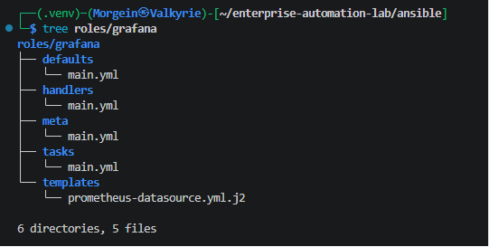
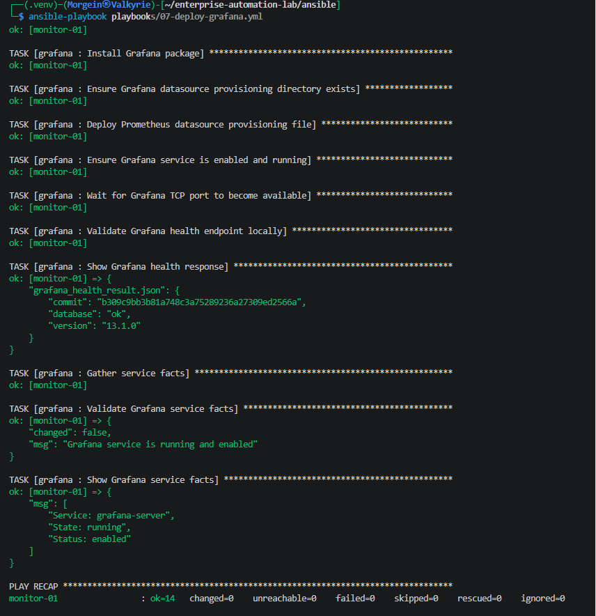
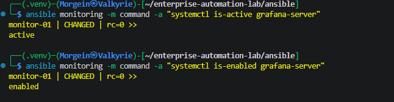
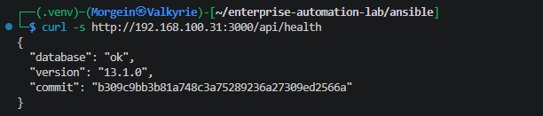
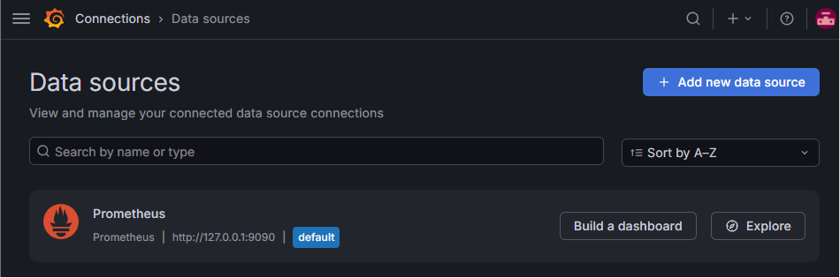
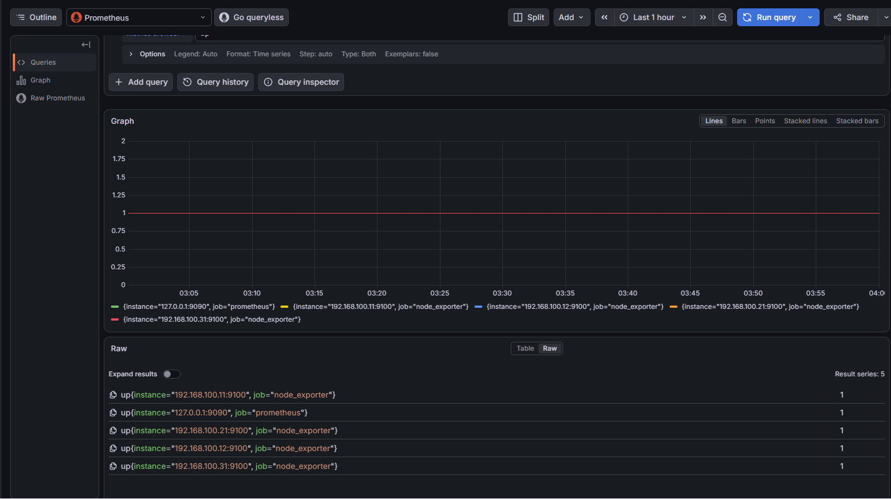
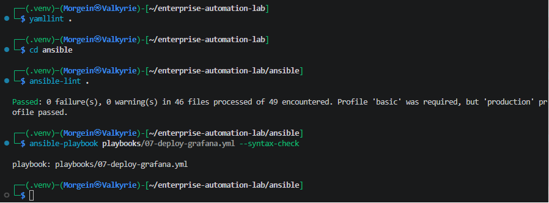

# Stage 2.8 - Grafana Role

## 1. Purpose

This document describes Stage 2.8 of the Enterprise Automation Lab.

The goal of this stage is to create a reusable Ansible role for deploying Grafana on the dedicated monitoring node.

Grafana is used to visualize metrics collected by Prometheus.

Before this stage, the lab already had:

```text
Node Exporter -> exposes Linux metrics on all nodes
Prometheus    -> collects metrics on monitor-01
Grafana       -> visualizes Prometheus metrics
```

In this stage, Grafana is installed on:

```text
monitor-01
```

Grafana listens on:

```text
192.168.100.31:3000
```

Prometheus is automatically configured as a Grafana data source through provisioning.

---

## 2. Why This Stage Exists

Prometheus is powerful for collecting and querying metrics, but its built-in UI is not designed for long-term dashboard visualization.

Grafana provides dashboards, panels, visual queries and better monitoring visualization.

The monitoring stack after this stage is:

```text
Linux nodes
    |
    v
Node Exporter :9100
    |
    v
Prometheus :9090
    |
    v
Grafana :3000
```

This creates the foundation for dashboard-based infrastructure monitoring.

---

## 3. Target Host

Grafana is deployed only to the `monitoring` inventory group.

Inventory group:

```ini
[monitoring]
monitor-01 ansible_host=192.168.100.31
```

Target server:

| Hostname | IP Address | Group | Purpose |
|---|---:|---|---|
| monitor-01 | 192.168.100.31 | monitoring | Grafana visualization server |

Grafana is not installed on:

```text
web-01
web-02
db-01
```

This is intentional.

Node Exporter runs on all Linux nodes.

Prometheus and Grafana run only on the monitoring node.

---

## 4. Monitoring Architecture After This Stage

```text
web-01
  └── Node Exporter :9100

web-02
  └── Node Exporter :9100

db-01
  └── Node Exporter :9100

monitor-01
  ├── Node Exporter :9100
  ├── Prometheus :9090
  └── Grafana :3000
```

Prometheus scrapes Node Exporter targets.

Grafana connects to Prometheus as a data source.

---

## 5. Files Created or Updated

This stage creates or updates the following files:

| File | Purpose |
|---|---|
| `ansible/roles/grafana/defaults/main.yml` | Default Grafana role variables |
| `ansible/roles/grafana/handlers/main.yml` | Grafana restart handler |
| `ansible/roles/grafana/templates/prometheus-datasource.yml.j2` | Grafana Prometheus datasource template |
| `ansible/roles/grafana/tasks/main.yml` | Main Grafana automation tasks |
| `ansible/roles/grafana/meta/main.yml` | Grafana role metadata |
| `ansible/playbooks/07-deploy-grafana.yml` | Grafana deployment playbook |
| `.github/workflows/ansible-validation.yml` | CI syntax-check updated for Grafana |
| `README.md` | Project status updated |
| `docs/runbooks/stage-02-08-grafana-role.md` | This runbook |

---

## 6. Role Directory Structure

Role path:

```text
ansible/roles/grafana/
```

Final structure:

```text
ansible/roles/grafana/
├── defaults/
│   └── main.yml
├── handlers/
│   └── main.yml
├── meta/
│   └── main.yml
├── tasks/
│   └── main.yml
└── templates/
    └── prometheus-datasource.yml.j2
```

### Directory Purpose

| Directory | Purpose |
|---|---|
| `defaults/` | Stores default role variables |
| `handlers/` | Stores restart handlers |
| `meta/` | Stores Ansible role metadata |
| `tasks/` | Stores main automation tasks |
| `templates/` | Stores Jinja2 templates |

---

## 7. Role Defaults

File:

```text
ansible/roles/grafana/defaults/main.yml
```

Content:

```yaml
---
# Default variables for the grafana role.
# These values can be overridden by inventory group_vars or host_vars.

grafana_prerequisite_packages:
  - apt-transport-https
  - ca-certificates
  - gnupg
  - python3-apt

grafana_apt_key_url: https://apt.grafana.com/gpg.key

grafana_apt_key_path: /usr/share/keyrings/grafana.asc

grafana_apt_repository_url: https://apt.grafana.com

grafana_package_name: grafana

grafana_service_name: grafana-server

grafana_provisioning_datasources_dir: /etc/grafana/provisioning/datasources

grafana_prometheus_datasource_file: "{{ grafana_provisioning_datasources_dir }}/prometheus.yml"

grafana_prometheus_datasource_name: Prometheus

grafana_prometheus_url: http://127.0.0.1:9090

grafana_http_port: 3000

grafana_health_url: "http://127.0.0.1:{{ grafana_http_port }}/api/health"
```

---

## 8. Defaults File Line-by-Line Explanation

```yaml
---
```

Marks the beginning of a YAML document.

---

```yaml
# Default variables for the grafana role.
# These values can be overridden by inventory group_vars or host_vars.
```

Comments explaining that this file stores default role variables.

These variables can be overridden later by inventory variables if needed.

---

```yaml
grafana_prerequisite_packages:
```

Defines packages required before adding the Grafana APT repository.

---

```yaml
- apt-transport-https
```

Allows APT to use HTTPS repositories.

---

```yaml
- ca-certificates
```

Installs trusted certificate authority certificates.

This is required for HTTPS repository access.

---

```yaml
- gnupg
```

Provides tools for working with GPG keys.

APT uses GPG keys to verify repository packages.

---

```yaml
- python3-apt
```

Python library used by Ansible APT-related modules on Debian/Ubuntu systems.

---

```yaml
grafana_apt_key_url: https://apt.grafana.com/gpg.key
```

Defines the URL of the Grafana repository signing key.

---

```yaml
grafana_apt_key_path: /usr/share/keyrings/grafana.asc
```

Defines where the repository key will be stored on the managed node.

Using `/usr/share/keyrings/` is a modern repository key management approach.

---

```yaml
grafana_apt_repository_url: https://apt.grafana.com
```

Defines the Grafana APT repository URL.

---

```yaml
grafana_package_name: grafana
```

Defines the package name installed by APT.

---

```yaml
grafana_service_name: grafana-server
```

Defines the systemd service name for Grafana.

The Grafana package creates a service called:

```text
grafana-server
```

---

```yaml
grafana_provisioning_datasources_dir: /etc/grafana/provisioning/datasources
```

Defines the Grafana provisioning directory for data sources.

Grafana reads YAML files from this directory and automatically creates data sources.

---

```yaml
grafana_prometheus_datasource_file: "{{ grafana_provisioning_datasources_dir }}/prometheus.yml"
```

Defines the full path to the Prometheus data source provisioning file.

With current values, this becomes:

```text
/etc/grafana/provisioning/datasources/prometheus.yml
```

---

```yaml
grafana_prometheus_datasource_name: Prometheus
```

Defines the display name of the Prometheus data source in Grafana.

---

```yaml
grafana_prometheus_url: http://127.0.0.1:9090
```

Defines the Prometheus URL used by Grafana.

`127.0.0.1` is used because Grafana and Prometheus run on the same server:

```text
monitor-01
```

So the connection flow is:

```text
Grafana -> localhost:9090 -> Prometheus
```

---

```yaml
grafana_http_port: 3000
```

Defines the Grafana HTTP port.

Grafana uses port `3000` by default.

---

```yaml
grafana_health_url: "http://127.0.0.1:{{ grafana_http_port }}/api/health"
```

Defines the Grafana health endpoint.

With current values, this becomes:

```text
http://127.0.0.1:3000/api/health
```

The role uses this endpoint to validate that Grafana is running.

---

## 9. Role Handler

File:

```text
ansible/roles/grafana/handlers/main.yml
```

Content:

```yaml
---
- name: Restart grafana
  ansible.builtin.systemd:
    name: "{{ grafana_service_name }}"
    state: restarted
    daemon_reload: true
```

---

## 10. Handler Line-by-Line Explanation

```yaml
---
```

YAML document start.

---

```yaml
- name: Restart grafana
```

Defines the handler name.

Handlers run only when notified by a task.

---

```yaml
ansible.builtin.systemd:
```

Uses the Ansible `systemd` module to manage a systemd service.

This is better than running `systemctl` manually.

---

```yaml
name: "{{ grafana_service_name }}"
```

Defines the service to manage.

With current variables, this becomes:

```text
grafana-server
```

---

```yaml
state: restarted
```

Restarts the Grafana service.

This is needed when the data source provisioning file changes.

---

```yaml
daemon_reload: true
```

Reloads systemd unit files.

This keeps the handler consistent with other service roles in the project.

---

## 11. Prometheus Data Source Template

File:

```text
ansible/roles/grafana/templates/prometheus-datasource.yml.j2
```

Content:

```yaml
---
apiVersion: 1

datasources:
  - name: "{{ grafana_prometheus_datasource_name }}"
    type: prometheus
    access: proxy
    url: "{{ grafana_prometheus_url }}"
    isDefault: true
    editable: true
```

---

## 12. Data Source Template Line-by-Line Explanation

```yaml
---
```

YAML document start.

---

```yaml
apiVersion: 1
```

Defines the Grafana provisioning API version.

For data source provisioning, version `1` is used.

---

```yaml
datasources:
```

Starts the list of data sources Grafana should create or update.

---

```yaml
- name: "{{ grafana_prometheus_datasource_name }}"
```

Defines the data source name.

With current values, this becomes:

```text
Prometheus
```

---

```yaml
type: prometheus
```

Defines the data source type.

This tells Grafana that the data source is Prometheus.

---

```yaml
access: proxy
```

Means Grafana server connects to Prometheus on behalf of the browser.

The flow is:

```text
Browser -> Grafana -> Prometheus
```

This is better than making the browser connect directly to Prometheus.

---

```yaml
url: "{{ grafana_prometheus_url }}"
```

Defines the Prometheus URL.

With current values, this becomes:

```text
http://127.0.0.1:9090
```

---

```yaml
isDefault: true
```

Makes Prometheus the default data source.

When a dashboard or Explore query is created, Grafana will use Prometheus by default.

---

```yaml
editable: true
```

Allows editing the data source in the Grafana UI.

This is convenient for a lab environment.

In stricter production setups, this could be set to `false`.

---

## 13. Role Tasks

File:

```text
ansible/roles/grafana/tasks/main.yml
```

Content:

```yaml
---
- name: Install Grafana prerequisite packages
  ansible.builtin.apt:
    name: "{{ grafana_prerequisite_packages }}"
    state: present
    update_cache: true

- name: Download Grafana APT repository key
  ansible.builtin.get_url:
    url: "{{ grafana_apt_key_url }}"
    dest: "{{ grafana_apt_key_path }}"
    owner: root
    group: root
    mode: "0644"

- name: Add Grafana APT repository
  ansible.builtin.apt_repository:
    repo: "deb [signed-by={{ grafana_apt_key_path }}] {{ grafana_apt_repository_url }} stable main"
    filename: grafana
    state: present
    update_cache: true

- name: Install Grafana package
  ansible.builtin.apt:
    name: "{{ grafana_package_name }}"
    state: present
    update_cache: true

- name: Ensure Grafana datasource provisioning directory exists
  ansible.builtin.file:
    path: "{{ grafana_provisioning_datasources_dir }}"
    state: directory
    owner: root
    group: grafana
    mode: "0755"

- name: Deploy Prometheus datasource provisioning file
  ansible.builtin.template:
    src: prometheus-datasource.yml.j2
    dest: "{{ grafana_prometheus_datasource_file }}"
    owner: root
    group: grafana
    mode: "0644"
  notify: Restart grafana

- name: Ensure Grafana service is enabled and running
  ansible.builtin.systemd:
    name: "{{ grafana_service_name }}"
    state: started
    enabled: true
    daemon_reload: true

- name: Wait for Grafana TCP port to become available
  ansible.builtin.wait_for:
    host: 127.0.0.1
    port: "{{ grafana_http_port }}"
    timeout: 90

- name: Validate Grafana health endpoint locally
  ansible.builtin.uri:
    url: "{{ grafana_health_url }}"
    status_code: 200
    return_content: true
  register: grafana_health_result
  retries: 10
  delay: 3
  until: grafana_health_result.status == 200
  changed_when: false

- name: Show Grafana health response
  ansible.builtin.debug:
    var: grafana_health_result.json

- name: Gather service facts
  ansible.builtin.service_facts:

- name: Validate Grafana service facts
  ansible.builtin.assert:
    that:
      - "ansible_facts.services[grafana_service_name ~ '.service'].state == 'running'"
      - "ansible_facts.services[grafana_service_name ~ '.service'].status == 'enabled'"
    success_msg: "Grafana service is running and enabled"
    fail_msg: "Grafana service is not running or not enabled"

- name: Show Grafana service facts
  ansible.builtin.debug:
    msg:
      - "Service: {{ grafana_service_name }}"
      - "State: {{ ansible_facts.services[grafana_service_name ~ '.service'].state }}"
      - "Status: {{ ansible_facts.services[grafana_service_name ~ '.service'].status }}"
```

---

## 14. Tasks File Line-by-Line Explanation

### Install Grafana prerequisite packages

```yaml
- name: Install Grafana prerequisite packages
```

Task name.

This task installs packages required before adding the Grafana APT repository.

---

```yaml
ansible.builtin.apt:
```

Uses the Ansible `apt` module.

This module manages packages on Debian/Ubuntu systems.

---

```yaml
name: "{{ grafana_prerequisite_packages }}"
```

Installs the list of prerequisite packages from role defaults.

---

```yaml
state: present
```

Ensures the packages are installed.

If they are already installed, Ansible does nothing.

---

```yaml
update_cache: true
```

Updates the APT package cache before installing packages.

---

### Download Grafana APT repository key

```yaml
- name: Download Grafana APT repository key
```

Task name.

This task downloads the Grafana repository signing key.

---

```yaml
ansible.builtin.get_url:
```

Uses the Ansible `get_url` module.

This module downloads files from HTTP or HTTPS URLs.

---

```yaml
url: "{{ grafana_apt_key_url }}"
```

Defines the source URL for the Grafana GPG key.

---

```yaml
dest: "{{ grafana_apt_key_path }}"
```

Defines where the key is saved.

Current value:

```text
/usr/share/keyrings/grafana.asc
```

---

```yaml
owner: root
group: root
```

The key file is owned by root.

---

```yaml
mode: "0644"
```

The key is readable by the system but writable only by root.

---

### Add Grafana APT repository

```yaml
- name: Add Grafana APT repository
```

Task name.

This task adds the Grafana APT repository to the system.

---

```yaml
ansible.builtin.apt_repository:
```

Uses the Ansible `apt_repository` module.

This module manages APT repository entries.

---

```yaml
repo: "deb [signed-by={{ grafana_apt_key_path }}] {{ grafana_apt_repository_url }} stable main"
```

Defines the repository line.

After rendering, this becomes:

```text
deb [signed-by=/usr/share/keyrings/grafana.asc] https://apt.grafana.com stable main
```

`signed-by` tells APT which key should be used to verify packages from this repository.

---

```yaml
filename: grafana
```

Creates the repository file as:

```text
/etc/apt/sources.list.d/grafana.list
```

---

```yaml
state: present
```

Ensures the repository exists.

---

```yaml
update_cache: true
```

Updates the APT package cache after adding the repository.

This is required so APT can see the `grafana` package.

---

### Install Grafana package

```yaml
- name: Install Grafana package
```

Task name.

This task installs Grafana.

---

```yaml
name: "{{ grafana_package_name }}"
```

Installs the package defined in defaults.

Current value:

```text
grafana
```

---

```yaml
state: present
```

Ensures Grafana is installed.

---

```yaml
update_cache: true
```

Updates package cache before installation.

---

### Ensure Grafana datasource provisioning directory exists

```yaml
- name: Ensure Grafana datasource provisioning directory exists
```

Task name.

This task ensures the data source provisioning directory exists.

---

```yaml
ansible.builtin.file:
```

Uses the Ansible `file` module.

This module manages directories and permissions.

---

```yaml
path: "{{ grafana_provisioning_datasources_dir }}"
```

Defines the directory path.

Current value:

```text
/etc/grafana/provisioning/datasources
```

---

```yaml
state: directory
```

Ensures the path exists as a directory.

---

```yaml
owner: root
```

Directory owner is root.

---

```yaml
group: grafana
```

Directory group is `grafana`.

This matches the Grafana package user/group.

---

```yaml
mode: "0755"
```

Directory permissions.

The directory is readable and executable by everyone, writable only by owner.

---

### Deploy Prometheus datasource provisioning file

```yaml
- name: Deploy Prometheus datasource provisioning file
```

Task name.

This task deploys the data source configuration.

---

```yaml
ansible.builtin.template:
```

Uses the Ansible `template` module.

This renders a Jinja2 template into a real file on the managed node.

---

```yaml
src: prometheus-datasource.yml.j2
```

Source template file inside the role's `templates/` directory.

---

```yaml
dest: "{{ grafana_prometheus_datasource_file }}"
```

Destination file path.

Current value:

```text
/etc/grafana/provisioning/datasources/prometheus.yml
```

---

```yaml
owner: root
group: grafana
mode: "0644"
```

File ownership and permissions.

Grafana can read the file, but only root can modify it.

---

```yaml
notify: Restart grafana
```

Triggers the Grafana restart handler if the data source file changes.

Grafana needs a restart to reliably load provisioning changes.

---

### Ensure Grafana service is enabled and running

```yaml
- name: Ensure Grafana service is enabled and running
```

Task name.

This task starts Grafana and enables it after reboot.

---

```yaml
ansible.builtin.systemd:
```

Uses the Ansible `systemd` module.

---

```yaml
name: "{{ grafana_service_name }}"
```

Service name.

Current value:

```text
grafana-server
```

---

```yaml
state: started
```

Ensures the service is currently running.

---

```yaml
enabled: true
```

Ensures the service starts automatically after reboot.

---

```yaml
daemon_reload: true
```

Reloads systemd unit definitions.

---

### Wait for Grafana TCP port to become available

```yaml
- name: Wait for Grafana TCP port to become available
```

Task name.

This task waits until Grafana starts listening on its TCP port.

---

```yaml
ansible.builtin.wait_for:
```

Uses the Ansible `wait_for` module.

This module waits for a port, file or condition.

---

```yaml
host: 127.0.0.1
```

Checks the port locally on `monitor-01`.

---

```yaml
port: "{{ grafana_http_port }}"
```

Uses the Grafana HTTP port variable.

Current value:

```text
3000
```

---

```yaml
timeout: 90
```

Waits up to 90 seconds.

This is important because Grafana may need time to start after first installation.

Without this task, the health check may fail with:

```text
Connection refused
```

---

### Validate Grafana health endpoint locally

```yaml
- name: Validate Grafana health endpoint locally
```

Task name.

This task checks that Grafana HTTP API is responding.

---

```yaml
ansible.builtin.uri:
```

Uses the Ansible `uri` module.

This module sends HTTP requests.

---

```yaml
url: "{{ grafana_health_url }}"
```

Health endpoint URL.

Current value:

```text
http://127.0.0.1:3000/api/health
```

---

```yaml
status_code: 200
```

Expects HTTP `200 OK`.

---

```yaml
return_content: true
```

Returns response content.

This allows Ansible to parse and show the returned JSON.

---

```yaml
register: grafana_health_result
```

Stores the HTTP response in a variable.

---

```yaml
retries: 10
delay: 3
until: grafana_health_result.status == 200
```

Retries the health check up to 10 times with a 3-second delay.

This makes the role more stable if Grafana needs a few seconds to fully initialize.

---

```yaml
changed_when: false
```

This is a validation task.

It does not change the system, so it should not be counted as changed.

---

### Show Grafana health response

```yaml
- name: Show Grafana health response
```

Task name.

This task prints the Grafana health response.

---

```yaml
ansible.builtin.debug:
  var: grafana_health_result.json
```

Prints the JSON returned by Grafana.

Expected fields include:

```text
database
version
commit
```

The important value is:

```text
database: ok
```

---

### Gather service facts

```yaml
- name: Gather service facts
```

Task name.

This task gathers system service information.

---

```yaml
ansible.builtin.service_facts:
```

Uses Ansible's service facts module.

It stores service information in:

```text
ansible_facts.services
```

---

### Validate Grafana service facts

```yaml
- name: Validate Grafana service facts
```

Task name.

This task validates that Grafana is running and enabled.

---

```yaml
ansible.builtin.assert:
```

Uses the Ansible `assert` module.

This fails the playbook if conditions are not true.

---

```yaml
that:
```

Starts the list of required conditions.

---

```yaml
- "ansible_facts.services[grafana_service_name ~ '.service'].state == 'running'"
```

Checks that the Grafana service is running.

---

```yaml
- "ansible_facts.services[grafana_service_name ~ '.service'].status == 'enabled'"
```

Checks that Grafana is enabled after reboot.

---

```yaml
success_msg: "Grafana service is running and enabled"
```

Success message if both checks pass.

---

```yaml
fail_msg: "Grafana service is not running or not enabled"
```

Failure message if a condition fails.

---

### Show Grafana service facts

```yaml
- name: Show Grafana service facts
```

Task name.

Prints service state information.

---

```yaml
ansible.builtin.debug:
```

Uses the debug module.

---

```yaml
msg:
```

Prints a custom list of messages.

---

```yaml
- "Service: {{ grafana_service_name }}"
```

Prints service name.

Expected:

```text
grafana-server
```

---

```yaml
- "State: {{ ansible_facts.services[grafana_service_name ~ '.service'].state }}"
```

Prints runtime state.

Expected:

```text
running
```

---

```yaml
- "Status: {{ ansible_facts.services[grafana_service_name ~ '.service'].status }}"
```

Prints enablement status.

Expected:

```text
enabled
```

---

## 15. Role Metadata

File:

```text
ansible/roles/grafana/meta/main.yml
```

Content:

```yaml
---
galaxy_info:
  author: Morgein
  description: Grafana role for the Enterprise Automation Lab
  company: Personal Lab
  license: MIT
  min_ansible_version: "2.15"

  platforms:
    - name: Ubuntu
      versions:
        - noble
        - jammy

  galaxy_tags:
    - monitoring
    - grafana
    - dashboards
    - visualization
    - automation

dependencies: []
```

---

## 16. Deployment Playbook

File:

```text
ansible/playbooks/07-deploy-grafana.yml
```

Content:

```yaml
---
- name: Deploy Grafana visualization server
  hosts: monitoring
  become: true
  gather_facts: true

  roles:
    - grafana
```

---

## 17. Playbook Line-by-Line Explanation

```yaml
---
```

YAML document start.

---

```yaml
- name: Deploy Grafana visualization server
```

Human-readable play name.

---

```yaml
hosts: monitoring
```

Targets only the `monitoring` group.

Currently, this means:

```text
monitor-01
```

---

```yaml
become: true
```

Enables privilege escalation.

Grafana installation requires root privileges because the role installs packages, writes files under `/etc`, and manages systemd services.

---

```yaml
gather_facts: true
```

Collects host facts before running the role.

This keeps the playbook consistent with the rest of the project.

---

```yaml
roles:
  - grafana
```

Applies the `grafana` role.

---

## 18. Validation Commands

Run from the repository root:

```bash
cd ~/enterprise-automation-lab
yamllint .
```

Run from the Ansible directory:

```bash
cd ~/enterprise-automation-lab/ansible
ansible-lint .
ansible-playbook playbooks/07-deploy-grafana.yml --syntax-check
```

Deploy Grafana:

```bash
ansible-playbook playbooks/07-deploy-grafana.yml
```

Run again for idempotency:

```bash
ansible-playbook playbooks/07-deploy-grafana.yml
```

Expected repeated run:

```text
monitor-01 changed=0 unreachable=0 failed=0
```

---

## 19. Service Validation

Check service active state:

```bash
ansible monitoring -m command -a "systemctl is-active grafana-server"
```

Expected result:

```text
active
```

Check service enabled state:

```bash
ansible monitoring -m command -a "systemctl is-enabled grafana-server"
```

Expected result:

```text
enabled
```

---

## 20. HTTP Health Validation

Check Grafana health endpoint from Kali WSL:

```bash
curl -s http://192.168.100.31:3000/api/health
```

Expected result:

```json
{"database":"ok","version":"...","commit":"..."}
```

The exact version and commit may differ.

The important field is:

```text
database: ok
```

---

## 21. Web UI Validation

Open Grafana in a browser:

```text
http://192.168.100.31:3000
```

Default first login:

```text
username: admin
password: admin
```

After the first login, Grafana usually asks to change the password.

---

## 22. Prometheus Data Source Validation

Open Grafana UI and check:

```text
Connections -> Data sources
```

Expected data source:

```text
Prometheus
```

This data source is created automatically by Ansible through:

```text
/etc/grafana/provisioning/datasources/prometheus.yml
```

The connection URL is:

```text
http://127.0.0.1:9090
```

because Grafana and Prometheus run on the same server.

---

## 23. Query Validation

Open Grafana:

```text
Explore
```

Select data source:

```text
Prometheus
```

Run query:

```promql
up
```

Expected result:

```text
1
```

for healthy Prometheus scrape targets.

Useful additional queries:

```promql
node_uname_info
```

```promql
node_memory_MemAvailable_bytes
```

```promql
node_cpu_seconds_total
```

---

## 24. GitHub Actions Validation

The GitHub Actions workflow must check the Grafana playbook.

Workflow file:

```text
.github/workflows/ansible-validation.yml
```

Required workflow step:

```yaml
- name: Syntax check Grafana deployment playbook
  working-directory: ansible
  run: ansible-playbook playbooks/07-deploy-grafana.yml --syntax-check
```

This validates that:

```text
the playbook exists
the role exists
YAML syntax is valid
Ansible can parse the playbook
```

---

## 25. Validation Evidence

Validation screenshots for this stage are stored in:

```text
docs/screenshots/stage-02-grafana-role/
```

### Grafana Role Structure



### Grafana Idempotency

Repeated playbook run showing:

```text
changed=0
failed=0
unreachable=0
```



### Grafana Service Validation

Shows:

```text
active
enabled
```



### Grafana Health Validation

Shows `/api/health` output.



### Grafana Web UI

Shows Grafana web interface.


### Prometheus Data Source

Shows automatically provisioned Prometheus data source.



### Grafana Explore Query

Shows Prometheus query `up` in Grafana Explore.



### Lint and Syntax Validation

Shows successful `yamllint`, `ansible-lint` and syntax-check.



---

## 26. Troubleshooting

### Grafana health check fails with Connection refused

Error example:

```text
Connection refused
http://127.0.0.1:3000/api/health
```

Cause:

Grafana service started, but the HTTP port was not ready yet.

Fix:

The role includes:

```yaml
- name: Wait for Grafana TCP port to become available
  ansible.builtin.wait_for:
    host: 127.0.0.1
    port: "{{ grafana_http_port }}"
    timeout: 90
```

and retries the health check:

```yaml
retries: 10
delay: 3
until: grafana_health_result.status == 200
```

---

### Grafana service does not start

Check service:

```bash
ansible monitoring -m command -a "systemctl status grafana-server --no-pager"
```

Check logs:

```bash
ansible monitoring -m command -a "journalctl -u grafana-server --no-pager -n 50"
```

Common causes:

```text
APT package installation failed
port 3000 already in use
bad provisioning file
permissions problem under /etc/grafana
```

---

### Grafana repository cannot be reached

Check DNS:

```bash
ansible monitoring -m command -a "getent hosts apt.grafana.com"
```

Check HTTPS:

```bash
ansible monitoring -m command -a "curl -I https://apt.grafana.com"
```

Possible causes:

```text
DNS problem
NAT problem
internet access problem
certificate problem
```

---

### Prometheus data source is missing

Check provisioning file:

```bash
ansible monitoring -m command -a "sudo cat /etc/grafana/provisioning/datasources/prometheus.yml"
```

Restart Grafana:

```bash
ansible monitoring -m command -a "sudo systemctl restart grafana-server"
```

Then check Grafana UI again:

```text
Connections -> Data sources
```

---

### Grafana cannot query Prometheus

Check Prometheus from `monitor-01`:

```bash
ansible monitoring -m command -a "curl -s http://127.0.0.1:9090/-/ready"
```

Expected:

```text
Prometheus Server is Ready.
```

If this fails, Grafana is not the root problem.

Prometheus must be fixed first.

---

## 27. Stage Result

At the end of this stage:

```text
Grafana role created
Grafana APT repository configured
Grafana package installed
Grafana service enabled
Grafana service running
Prometheus data source provisioned
Grafana health endpoint validated
Grafana web UI reachable
Prometheus data source visible in Grafana
Prometheus queries work from Grafana Explore
role idempotency validated
yamllint passed
ansible-lint passed
syntax-check passed
```

---

## 28. Current Project Status

Current stage completed:

```text
Stage 2.8 - Grafana role
```

Current monitoring stack:

```text
Node Exporter -> Prometheus -> Grafana
```

Current monitoring endpoints:

```text
Node Exporter:
web-01      192.168.100.11:9100
web-02      192.168.100.12:9100
db-01       192.168.100.21:9100
monitor-01  192.168.100.31:9100

Prometheus:
monitor-01  192.168.100.31:9090

Grafana:
monitor-01  192.168.100.31:3000
```

Next planned stage:

```text
Stage 2.9 - Grafana dashboard provisioning
```

In the next stage, Grafana dashboards can be provisioned automatically through Ansible instead of being created manually in the UI.
