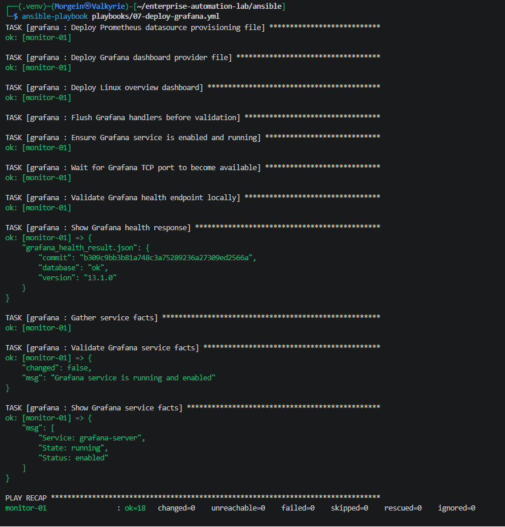
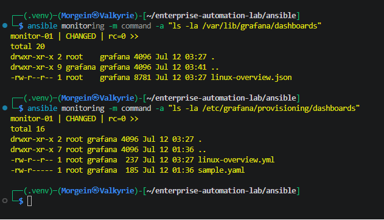
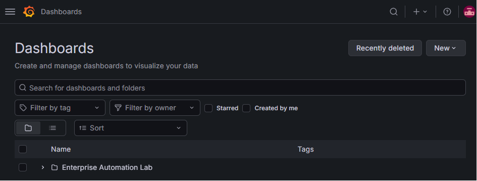
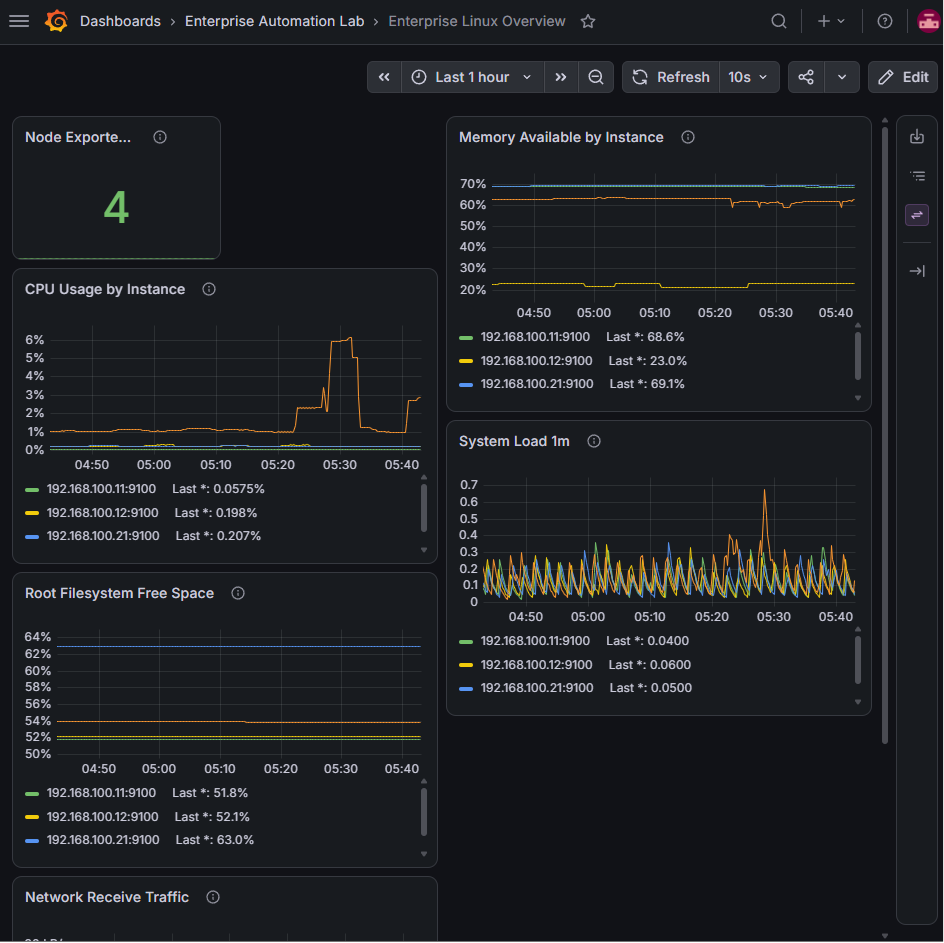
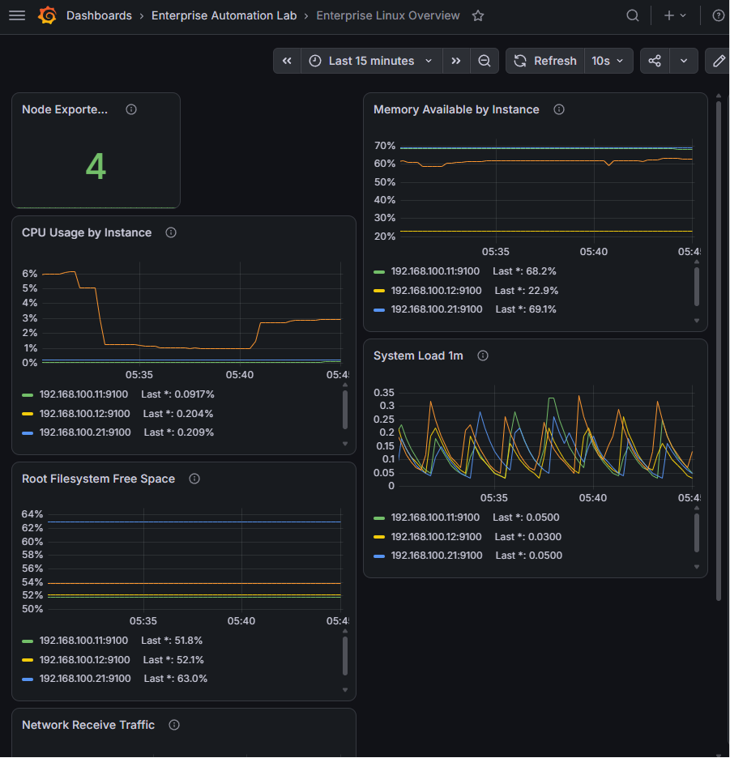
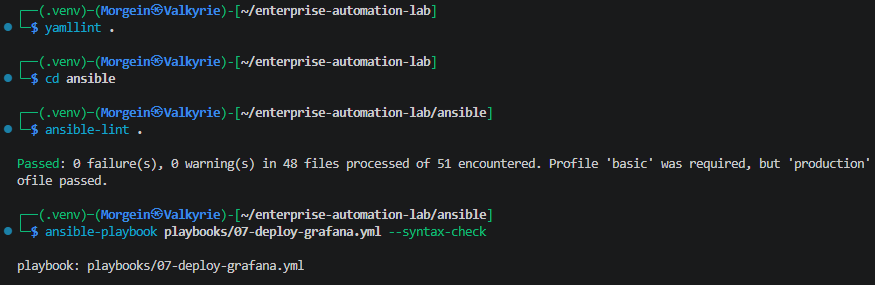

# Stage 2.9 - Grafana Dashboard Provisioning

## 1. Purpose

This document describes Stage 2.9 of the Enterprise Automation Lab.

The goal of this stage is to extend the existing Grafana Ansible role and add automatic dashboard provisioning.

Before this stage, the monitoring stack already had:

```text
Node Exporter -> exposes Linux metrics
Prometheus    -> collects Linux metrics
Grafana       -> visualizes metrics from Prometheus
```

In this stage, Grafana is configured to automatically load a Linux overview dashboard from a JSON file managed by Ansible.

The dashboard is created without manual UI work.

Final result:

```text
Ansible
  -> Grafana dashboard provider file
  -> Grafana dashboard JSON file
  -> Grafana automatically loads dashboard
```

---

## 2. Why This Stage Exists

A monitoring setup is stronger when dashboards are stored as code.

Manual dashboards created only through the UI are difficult to reproduce.

With dashboard provisioning, the dashboard becomes part of the infrastructure repository.

This means the dashboard can be:

```text
version controlled
reviewed in Git
deployed repeatedly
restored after rebuild
updated through Ansible
documented as part of the lab
```

This is closer to a production-style monitoring workflow.

---

## 3. Monitoring Architecture After This Stage

```text
web-01
  └── Node Exporter :9100

web-02
  └── Node Exporter :9100

db-01
  └── Node Exporter :9100

monitor-01
  ├── Node Exporter :9100
  ├── Prometheus :9090
  └── Grafana :3000
      ├── Prometheus datasource
      └── Enterprise Linux Overview dashboard
```

Grafana now has:

```text
Prometheus datasource provisioned automatically
Linux overview dashboard provisioned automatically
```

---

## 4. Target Host

Dashboard provisioning is part of the existing Grafana role.

The Grafana role is applied only to the `monitoring` group.

Inventory group:

```ini
[monitoring]
monitor-01 ansible_host=192.168.100.31
```

Target server:

| Hostname | IP Address | Group | Purpose |
|---|---:|---|---|
| monitor-01 | 192.168.100.31 | monitoring | Grafana dashboard server |

---

## 5. Files Created or Updated

This stage updates the existing Grafana role.

| File | Purpose |
|---|---|
| `ansible/roles/grafana/defaults/main.yml` | Adds dashboard provisioning variables |
| `ansible/roles/grafana/templates/dashboard-provider.yml.j2` | Defines Grafana dashboard provider |
| `ansible/roles/grafana/templates/linux-overview-dashboard.json.j2` | Defines Linux overview dashboard |
| `ansible/roles/grafana/tasks/main.yml` | Deploys dashboard provider and dashboard JSON |
| `docs/runbooks/stage-02-09-grafana-dashboard-provisioning.md` | This runbook |
| `README.md` | Project status update after this stage |

No new playbook is required.

This stage reuses the existing playbook:

```text
ansible/playbooks/07-deploy-grafana.yml
```

---

## 6. Updated Grafana Role Structure

Role path:

```text
ansible/roles/grafana/
```

Updated structure:

```text
ansible/roles/grafana/
├── defaults/
│   └── main.yml
├── handlers/
│   └── main.yml
├── meta/
│   └── main.yml
├── tasks/
│   └── main.yml
└── templates/
    ├── dashboard-provider.yml.j2
    ├── linux-overview-dashboard.json.j2
    └── prometheus-datasource.yml.j2
```

The new files are:

```text
dashboard-provider.yml.j2
linux-overview-dashboard.json.j2
```

---

## 7. Updated Defaults File

File:

```text
ansible/roles/grafana/defaults/main.yml
```

Content:

```yaml
---
# Default variables for the grafana role.
# These values can be overridden by inventory group_vars or host_vars.

grafana_prerequisite_packages:
  - apt-transport-https
  - ca-certificates
  - gnupg
  - python3-apt

grafana_apt_key_url: https://apt.grafana.com/gpg.key

grafana_apt_key_path: /usr/share/keyrings/grafana.asc

grafana_apt_repository_url: https://apt.grafana.com

grafana_package_name: grafana

grafana_service_name: grafana-server

grafana_provisioning_datasources_dir: /etc/grafana/provisioning/datasources

grafana_prometheus_datasource_file: "{{ grafana_provisioning_datasources_dir }}/prometheus.yml"

grafana_prometheus_datasource_name: Prometheus

grafana_prometheus_url: http://127.0.0.1:9090

grafana_provisioning_dashboards_dir: /etc/grafana/provisioning/dashboards

grafana_dashboard_provider_file: "{{ grafana_provisioning_dashboards_dir }}/linux-overview.yml"

grafana_dashboards_dir: /var/lib/grafana/dashboards

grafana_linux_overview_dashboard_file: "{{ grafana_dashboards_dir }}/linux-overview.json"

grafana_dashboard_provider_name: Enterprise Automation Lab

grafana_dashboard_folder_name: Enterprise Automation Lab

grafana_linux_overview_dashboard_title: Enterprise Linux Overview

grafana_http_port: 3000

grafana_health_url: "http://127.0.0.1:{{ grafana_http_port }}/api/health"
```

---

## 8. New Defaults Explanation

The earlier Grafana defaults already handled package installation, repository configuration, service name and Prometheus datasource provisioning.

This stage adds dashboard provisioning variables.

---

### grafana_provisioning_dashboards_dir

```yaml
grafana_provisioning_dashboards_dir: /etc/grafana/provisioning/dashboards
```

This defines the directory where Grafana looks for dashboard provider configuration files.

A provider file tells Grafana where dashboard JSON files are stored.

---

### grafana_dashboard_provider_file

```yaml
grafana_dashboard_provider_file: "{{ grafana_provisioning_dashboards_dir }}/linux-overview.yml"
```

This defines the full path to the dashboard provider file.

Rendered value:

```text
/etc/grafana/provisioning/dashboards/linux-overview.yml
```

This file does not contain the dashboard itself.

It tells Grafana where to find dashboards.

---

### grafana_dashboards_dir

```yaml
grafana_dashboards_dir: /var/lib/grafana/dashboards
```

This defines the directory where actual dashboard JSON files are stored.

The role creates this directory and places the dashboard JSON file there.

---

### grafana_linux_overview_dashboard_file

```yaml
grafana_linux_overview_dashboard_file: "{{ grafana_dashboards_dir }}/linux-overview.json"
```

This defines the full path to the Linux overview dashboard JSON file.

Rendered value:

```text
/var/lib/grafana/dashboards/linux-overview.json
```

---

### grafana_dashboard_provider_name

```yaml
grafana_dashboard_provider_name: Enterprise Automation Lab
```

This is the name of the dashboard provider.

It is used inside the provider YAML file.

---

### grafana_dashboard_folder_name

```yaml
grafana_dashboard_folder_name: Enterprise Automation Lab
```

This is the folder name shown in the Grafana UI.

The dashboard appears under:

```text
Dashboards -> Enterprise Automation Lab
```

---

### grafana_linux_overview_dashboard_title

```yaml
grafana_linux_overview_dashboard_title: Enterprise Linux Overview
```

This is the dashboard title inside Grafana.

The dashboard appears as:

```text
Enterprise Linux Overview
```

---

## 9. Dashboard Provider Template

File:

```text
ansible/roles/grafana/templates/dashboard-provider.yml.j2
```

Content:

```yaml
---
apiVersion: 1

providers:
  - name: "{{ grafana_dashboard_provider_name }}"
    orgId: 1
    folder: "{{ grafana_dashboard_folder_name }}"
    type: file
    disableDeletion: false
    editable: true
    options:
      path: "{{ grafana_dashboards_dir }}"
```

---

## 10. Dashboard Provider Line-by-Line Explanation

```yaml
---
```

Marks the beginning of the YAML document.

---

```yaml
apiVersion: 1
```

Defines the Grafana provisioning schema version.

For Grafana dashboard provisioning, `apiVersion: 1` is used.

---

```yaml
providers:
```

Starts the list of dashboard providers.

A provider tells Grafana where dashboards should be loaded from.

---

```yaml
- name: "{{ grafana_dashboard_provider_name }}"
```

Defines the provider name.

Rendered value:

```text
Enterprise Automation Lab
```

---

```yaml
orgId: 1
```

Defines the Grafana organization ID.

In a default single-organization Grafana installation, the main organization uses ID `1`.

---

```yaml
folder: "{{ grafana_dashboard_folder_name }}"
```

Defines the folder where dashboards will appear in the Grafana UI.

Rendered value:

```text
Enterprise Automation Lab
```

---

```yaml
type: file
```

Defines the provider type.

`file` means Grafana will load dashboards from the filesystem.

---

```yaml
disableDeletion: false
```

Allows Grafana to delete provisioned dashboards from the UI if the source JSON file is removed.

For this lab, this is acceptable.

---

```yaml
editable: true
```

Allows the provisioned dashboard to be edited in the Grafana UI.

This is useful for a learning lab.

In a stricter production setup, this could be set to:

```yaml
editable: false
```

---

```yaml
options:
```

Starts provider-specific options.

---

```yaml
path: "{{ grafana_dashboards_dir }}"
```

Defines the directory where Grafana should look for dashboard JSON files.

Rendered value:

```text
/var/lib/grafana/dashboards
```

---

## 11. Linux Overview Dashboard Template

File:

```text
ansible/roles/grafana/templates/linux-overview-dashboard.json.j2
```

Purpose:

```text
Defines the Grafana dashboard as JSON.
```

This dashboard contains panels for Linux infrastructure metrics collected through Node Exporter.

The dashboard is rendered by Ansible and placed at:

```text
/var/lib/grafana/dashboards/linux-overview.json
```

---

## 12. Dashboard Panels

The dashboard contains the following panels:

| Panel | Purpose |
|---|---|
| Node Exporter Targets UP | Shows how many Node Exporter targets are reachable |
| CPU Usage by Instance | Shows CPU usage per server |
| Memory Available by Instance | Shows available memory percentage |
| Root Filesystem Free Space | Shows free space on `/` |
| System Load 1m | Shows 1-minute system load |
| Network Receive Traffic | Shows received network traffic |

---

## 13. Important Dashboard JSON Concepts

### Dashboard UID

The dashboard uses:

```json
"uid": "enterprise-linux-overview"
```

This gives the dashboard a stable identity.

A stable UID prevents Grafana from treating the dashboard as a completely new dashboard every time the JSON is updated.

---

### Dashboard Title

The dashboard title uses an Ansible variable:

```json
"title": "{{ grafana_linux_overview_dashboard_title }}"
```

Rendered value:

```text
Enterprise Linux Overview
```

---

### Prometheus Datasource

Every panel uses:

```json
"datasource": "Prometheus"
```

This matches the provisioned datasource name:

```yaml
grafana_prometheus_datasource_name: Prometheus
```

If the datasource name and dashboard datasource name do not match, panels may not query correctly.

---

### Grafana Legend Variables and Ansible Escaping

The dashboard contains values like:

```json
"legendFormat": "{{ "{{ instance }}" }}"
```

This looks strange, but it is correct.

Grafana expects this final value:

```text
{{ instance }}
```

But Ansible also uses Jinja2 syntax:

```text
{{ variable }}
```

So the template must escape the Grafana variable.

This:

```jinja
{{ "{{ instance }}" }}
```

renders into:

```text
{{ instance }}
```

That allows Grafana to use the Prometheus label `instance` in panel legends.

---

## 14. Important PromQL Queries

### Node Exporter Targets UP

```promql
sum(up{job="node_exporter"})
```

This counts how many Node Exporter targets are currently up.

Expected value in this lab:

```text
4
```

because the lab has:

```text
web-01
web-02
db-01
monitor-01
```

---

### CPU Usage by Instance

```promql
100 - (avg by(instance) (rate(node_cpu_seconds_total{job="node_exporter",mode="idle"}[5m])) * 100)
```

This calculates CPU usage by measuring non-idle CPU time.

Simple meaning:

```text
100% - idle CPU percentage = CPU usage percentage
```

---

### Memory Available by Instance

```promql
(node_memory_MemAvailable_bytes{job="node_exporter"} / node_memory_MemTotal_bytes{job="node_exporter"}) * 100
```

This calculates available memory percentage.

Simple meaning:

```text
available memory / total memory * 100
```

---

### Root Filesystem Free Space

```promql
(node_filesystem_avail_bytes{job="node_exporter",mountpoint="/",fstype!~"tmpfs|squashfs|overlay"} / node_filesystem_size_bytes{job="node_exporter",mountpoint="/",fstype!~"tmpfs|squashfs|overlay"}) * 100
```

This calculates free disk space percentage for the root filesystem.

The expression excludes temporary and virtual filesystem types:

```text
tmpfs
squashfs
overlay
```

---

### System Load 1m

```promql
node_load1{job="node_exporter"}
```

This shows the 1-minute Linux load average.

---

### Network Receive Traffic

```promql
sum by(instance) (rate(node_network_receive_bytes_total{job="node_exporter",device!="lo"}[5m]))
```

This calculates network receive traffic per instance.

The loopback interface is excluded:

```text
device!="lo"
```

because loopback traffic is local internal traffic and not usually useful for infrastructure-level network overview.

---

## 15. Updated Grafana Tasks

File:

```text
ansible/roles/grafana/tasks/main.yml
```

This stage adds dashboard provisioning tasks to the existing Grafana role.

Important new tasks:

```yaml
- name: Ensure Grafana dashboard provisioning directory exists
```

```yaml
- name: Ensure Grafana dashboards directory exists
```

```yaml
- name: Deploy Grafana dashboard provider file
```

```yaml
- name: Deploy Linux overview dashboard
```

```yaml
- name: Flush Grafana handlers before validation
```

---

## 16. New Tasks Explanation

### Ensure Grafana dashboard provisioning directory exists

```yaml
- name: Ensure Grafana dashboard provisioning directory exists
  ansible.builtin.file:
    path: "{{ grafana_provisioning_dashboards_dir }}"
    state: directory
    owner: root
    group: grafana
    mode: "0755"
```

This creates:

```text
/etc/grafana/provisioning/dashboards
```

Grafana reads dashboard provider files from this directory.

---

### Ensure Grafana dashboards directory exists

```yaml
- name: Ensure Grafana dashboards directory exists
  ansible.builtin.file:
    path: "{{ grafana_dashboards_dir }}"
    state: directory
    owner: root
    group: grafana
    mode: "0755"
```

This creates:

```text
/var/lib/grafana/dashboards
```

This is where actual dashboard JSON files are stored.

---

### Deploy Grafana dashboard provider file

```yaml
- name: Deploy Grafana dashboard provider file
  ansible.builtin.template:
    src: dashboard-provider.yml.j2
    dest: "{{ grafana_dashboard_provider_file }}"
    owner: root
    group: grafana
    mode: "0644"
  notify: Restart grafana
```

This renders:

```text
ansible/roles/grafana/templates/dashboard-provider.yml.j2
```

to:

```text
/etc/grafana/provisioning/dashboards/linux-overview.yml
```

This file tells Grafana to load dashboards from:

```text
/var/lib/grafana/dashboards
```

If this file changes, Grafana is restarted.

---

### Deploy Linux overview dashboard

```yaml
- name: Deploy Linux overview dashboard
  ansible.builtin.template:
    src: linux-overview-dashboard.json.j2
    dest: "{{ grafana_linux_overview_dashboard_file }}"
    owner: root
    group: grafana
    mode: "0644"
  notify: Restart grafana
```

This renders the dashboard JSON template to:

```text
/var/lib/grafana/dashboards/linux-overview.json
```

If the dashboard changes, Grafana is restarted.

---

### Flush Grafana handlers before validation

```yaml
- name: Flush Grafana handlers before validation
  ansible.builtin.meta: flush_handlers
```

This forces Ansible to run pending handlers immediately.

Why this is important:

```text
If dashboard files changed, Grafana must restart before validation.
Otherwise, Grafana service may be healthy, but the new dashboard may not be loaded yet.
```

This makes validation more reliable.

---

## 17. Deployment Playbook

The same Grafana playbook is used:

```text
ansible/playbooks/07-deploy-grafana.yml
```

Content:

```yaml
---
- name: Deploy Grafana visualization server
  hosts: monitoring
  become: true
  gather_facts: true

  roles:
    - grafana
```

No new playbook was required because dashboard provisioning is part of the Grafana role.

---

## 18. Validation Commands

Run from repository root:

```bash
cd ~/enterprise-automation-lab
yamllint .
```

Run from Ansible directory:

```bash
cd ~/enterprise-automation-lab/ansible
ansible-lint .
ansible-playbook playbooks/07-deploy-grafana.yml --syntax-check
```

Deploy the updated Grafana role:

```bash
ansible-playbook playbooks/07-deploy-grafana.yml
```

Run again for idempotency:

```bash
ansible-playbook playbooks/07-deploy-grafana.yml
```

Expected repeated run:

```text
monitor-01 changed=0 unreachable=0 failed=0
```

---

## 19. File Validation on monitor-01

Check dashboard provider files:

```bash
ansible monitoring -m command -a "ls -la /etc/grafana/provisioning/dashboards"
```

Expected file:

```text
linux-overview.yml
```

Check dashboard JSON files:

```bash
ansible monitoring -m command -a "ls -la /var/lib/grafana/dashboards"
```

Expected file:

```text
linux-overview.json
```

---

## 20. Grafana UI Validation

Open Grafana:

```text
http://192.168.100.31:3000
```

Navigate to:

```text
Dashboards -> Enterprise Automation Lab -> Enterprise Linux Overview
```

Expected dashboard panels:

```text
Node Exporter Targets UP
CPU Usage by Instance
Memory Available by Instance
Root Filesystem Free Space
System Load 1m
Network Receive Traffic
```

---

## 21. Query Validation

Open Grafana Explore and run:

```promql
up
```

Expected result:

```text
1
```

for healthy scrape targets.

Open the provisioned dashboard and verify that panels show data.

The `Node Exporter Targets UP` panel should show:

```text
4
```

if all four Node Exporter targets are healthy.

---

## 22. Validation Evidence

Validation screenshots for this stage are stored in:

```text
docs/screenshots/stage-02-grafana-dashboard-provisioning/
```

### Grafana Templates Structure

Shows the updated Grafana templates directory.


### Grafana Dashboard Provisioning Idempotency

Shows repeated playbook run with:

```text
changed=0
failed=0
unreachable=0
```



### Dashboard Files on monitor-01

Shows:

```text
/etc/grafana/provisioning/dashboards/linux-overview.yml
/var/lib/grafana/dashboards/linux-overview.json
```



### Grafana Dashboard Folder

Shows the `Enterprise Automation Lab` folder in Grafana.



### Enterprise Linux Overview Dashboard

Shows the provisioned dashboard.



### Dashboard Query Panels

Shows dashboard panels with Linux metrics.



### Lint and Syntax Validation

Shows successful `yamllint`, `ansible-lint` and syntax-check.



---

## 23. Troubleshooting

### Ansible cannot find dashboard-provider.yml.j2

Error example:

```text
Could not find or access 'dashboard-provider.yml.j2'
```

Cause:

The template file is missing or was created in the wrong directory.

Correct path:

```text
ansible/roles/grafana/templates/dashboard-provider.yml.j2
```

Fix:

Create the file in the correct role templates directory.

---

### Ansible cannot find linux-overview-dashboard.json.j2

Cause:

The dashboard JSON template is missing.

Correct path:

```text
ansible/roles/grafana/templates/linux-overview-dashboard.json.j2
```

Fix:

Create the file in the correct role templates directory.

---

### Dashboard does not appear in Grafana UI

Check provider file:

```bash
ansible monitoring -m command -a "sudo cat /etc/grafana/provisioning/dashboards/linux-overview.yml"
```

Check dashboard JSON file:

```bash
ansible monitoring -m command -a "ls -la /var/lib/grafana/dashboards"
```

Restart Grafana:

```bash
ansible monitoring -m command -a "sudo systemctl restart grafana-server"
```

Check logs:

```bash
ansible monitoring -m command -a "journalctl -u grafana-server --no-pager -n 80"
```

---

### Dashboard appears but panels show no data

Check Prometheus datasource:

```text
Connections -> Data sources -> Prometheus
```

Check Prometheus query in Grafana Explore:

```promql
up
```

If `up` returns no data, check Prometheus targets:

```text
http://192.168.100.31:9090/targets
```

The Node Exporter targets should be `UP`.

---

### Jinja template breaks Grafana legendFormat

If Ansible breaks a Grafana variable such as:

```text
{{ instance }}
```

use escaping:

```jinja
{{ "{{ instance }}" }}
```

This renders the final dashboard JSON correctly for Grafana.

---

## 24. Stage Result

At the end of this stage:

```text
Grafana dashboard provisioning directory created
Grafana dashboards directory created
dashboard provider template created
Linux overview dashboard JSON template created
dashboard provider deployed to monitor-01
dashboard JSON deployed to monitor-01
Grafana restarted after dashboard changes
Enterprise Automation Lab dashboard folder created
Enterprise Linux Overview dashboard appears in Grafana
dashboard panels query Prometheus successfully
role idempotency validated
yamllint passed
ansible-lint passed
syntax-check passed
```

---

## 25. Current Project Status

Current stage completed:

```text
Stage 2.9 - Grafana dashboard provisioning
```

Current monitoring stack:

```text
Node Exporter -> Prometheus -> Grafana -> Provisioned Dashboard
```

Current dashboard:

```text
Enterprise Automation Lab / Enterprise Linux Overview
```

Next planned stage:

```text
Stage 2.10 - Monitoring stack final validation and screenshots
```

In the next stage, the monitoring stack will be validated end-to-end and documented as a completed monitoring layer.
