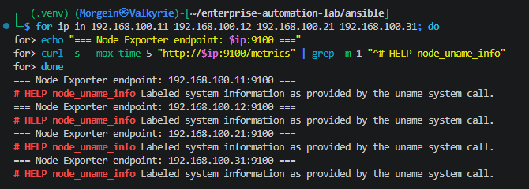
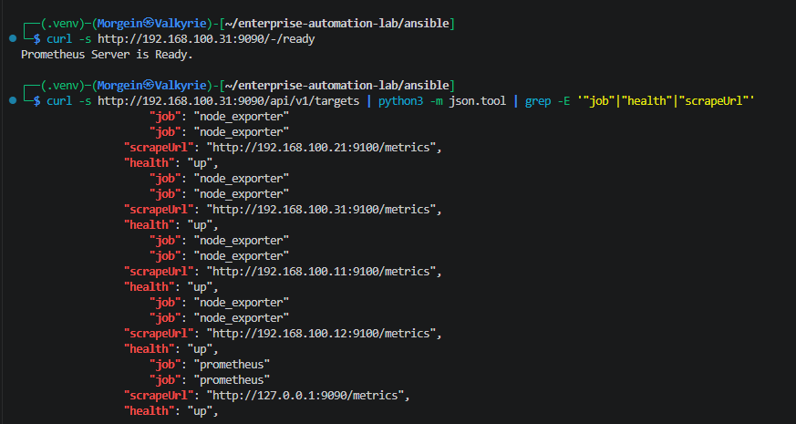
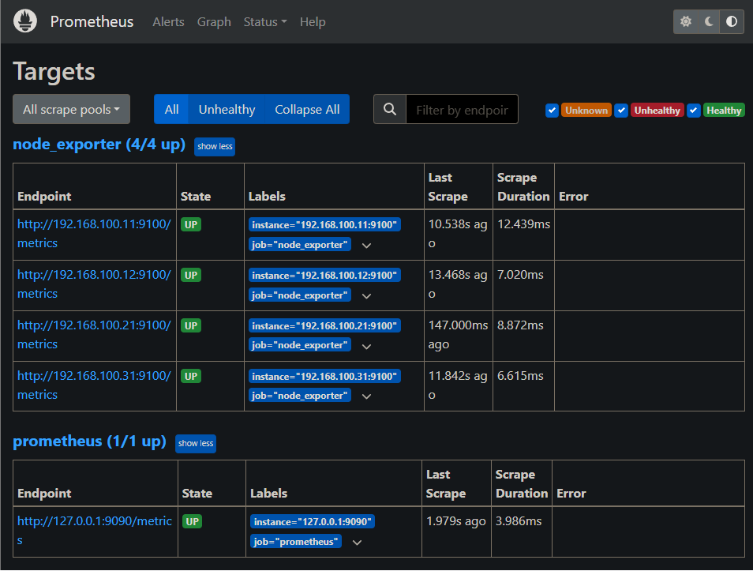
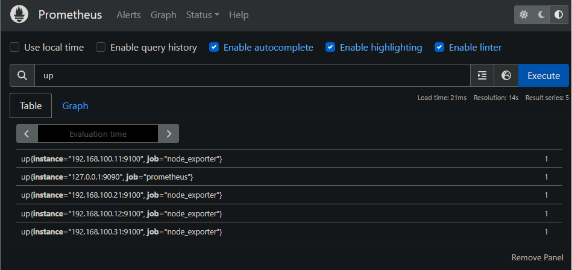
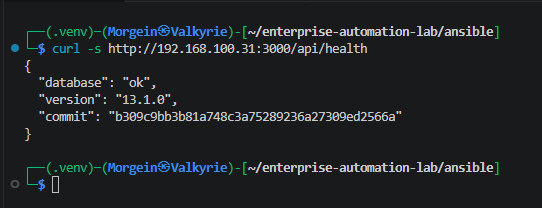
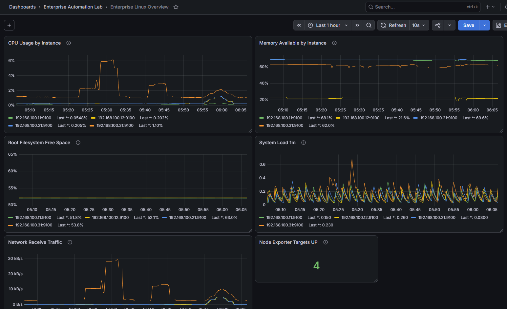
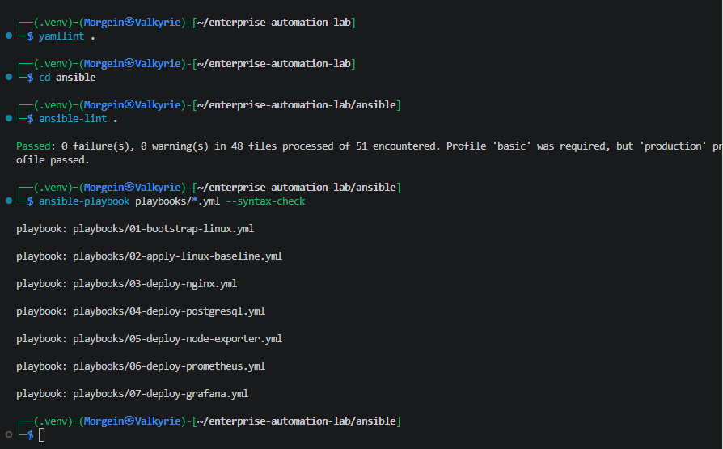

# Stage 2.10 - Monitoring Stack Final Validation

## 1. Purpose

This document describes Stage 2.10 of the Enterprise Automation Lab.

The goal of this stage is to validate the complete monitoring stack end-to-end.

The monitoring stack contains:

```text
Node Exporter -> Prometheus -> Grafana -> Provisioned Dashboard
```

This stage does not introduce a new major role.

Instead, it confirms that the monitoring layer works as a complete system.

---

## 2. Why This Stage Exists

Previous stages deployed the monitoring components one by one:

```text
Stage 2.6 - Node Exporter
Stage 2.7 - Prometheus
Stage 2.8 - Grafana
Stage 2.9 - Grafana dashboard provisioning
```

Each component was validated individually.

This stage validates the whole chain:

```text
Linux node produces system metrics
    ↓
Node Exporter exposes metrics on port 9100
    ↓
Prometheus scrapes Node Exporter targets
    ↓
Grafana queries Prometheus
    ↓
Grafana dashboard visualizes Linux infrastructure state
```

This proves that the monitoring layer is not just installed, but operational.

---

## 3. Final Monitoring Architecture

```text
web-01
  ├── Linux baseline
  ├── Nginx
  └── Node Exporter :9100
        |
        |
web-02  |
  ├── Linux baseline
  ├── Nginx
  └── Node Exporter :9100
        |
        |
db-01   |
  ├── Linux baseline
  ├── PostgreSQL
  └── Node Exporter :9100
        |
        |
monitor-01
  ├── Linux baseline
  ├── Node Exporter :9100
  ├── Prometheus :9090
  │     └── Scrapes all Node Exporter targets
  └── Grafana :3000
        ├── Prometheus datasource
        └── Enterprise Linux Overview dashboard
```

---

## 4. Monitoring Data Flow

The monitoring data flow is:

```text
Linux kernel and operating system metrics
    ↓
Node Exporter
    ↓
Prometheus scrape jobs
    ↓
Prometheus time-series database
    ↓
Grafana Prometheus datasource
    ↓
Grafana dashboard panels
```

Simple explanation:

```text
Node Exporter exposes metrics.
Prometheus collects metrics.
Grafana visualizes metrics.
```

---

## 5. Hosts and Services

| Hostname | IP Address | Monitoring Service |
|---|---:|---|
| `web-01` | `192.168.100.11` | Node Exporter |
| `web-02` | `192.168.100.12` | Node Exporter |
| `db-01` | `192.168.100.21` | Node Exporter |
| `monitor-01` | `192.168.100.31` | Node Exporter, Prometheus, Grafana |

---

## 6. Ports Used

| Service | Port | Purpose |
|---|---:|---|
| Node Exporter | `9100` | Linux system metrics endpoint |
| Prometheus | `9090` | Metrics collection server and web UI |
| Grafana | `3000` | Visualization web UI |

---

## 7. Expected Endpoints

### Node Exporter Endpoints

```text
http://192.168.100.11:9100/metrics
http://192.168.100.12:9100/metrics
http://192.168.100.21:9100/metrics
http://192.168.100.31:9100/metrics
```

### Prometheus Endpoints

```text
http://192.168.100.31:9090
http://192.168.100.31:9090/-/ready
http://192.168.100.31:9090/targets
http://192.168.100.31:9090/api/v1/targets
```

### Grafana Endpoints

```text
http://192.168.100.31:3000
http://192.168.100.31:3000/api/health
```

---

## 8. Service Validation

Run from the Ansible directory:

```bash
cd ~/enterprise-automation-lab/ansible
```

### Validate Node Exporter Services

```bash
ansible linux -m command -a "systemctl is-active node_exporter"
ansible linux -m command -a "systemctl is-enabled node_exporter"
```

Expected result:

```text
active
enabled
```

on:

```text
web-01
web-02
db-01
monitor-01
```

Meaning:

```text
active  = service is currently running
enabled = service starts automatically after reboot
```

---

### Validate Prometheus Service

```bash
ansible monitoring -m command -a "systemctl is-active prometheus"
ansible monitoring -m command -a "systemctl is-enabled prometheus"
```

Expected result:

```text
active
enabled
```

on:

```text
monitor-01
```

---

### Validate Grafana Service

```bash
ansible monitoring -m command -a "systemctl is-active grafana-server"
ansible monitoring -m command -a "systemctl is-enabled grafana-server"
```

Expected result:

```text
active
enabled
```

on:

```text
monitor-01
```

---

## 9. Node Exporter HTTP Validation

Run from Kali WSL:

```bash
cd ~/enterprise-automation-lab/ansible

for ip in 192.168.100.11 192.168.100.12 192.168.100.21 192.168.100.31; do
  echo "=== Node Exporter endpoint: $ip:9100 ==="
  curl -s --max-time 5 "http://$ip:9100/metrics" | grep -m 1 "^# HELP node_uname_info"
done
```

Expected result for each node:

```text
# HELP node_uname_info Labeled system information as provided by the uname system call.
```

Meaning:

```text
The Node Exporter metrics endpoint is reachable.
The endpoint returns Prometheus-compatible metrics.
The node can be scraped by Prometheus.
```

---

## 10. Prometheus Readiness Validation

Run:

```bash
curl -s http://192.168.100.31:9090/-/ready
```

Expected result:

```text
Prometheus Server is Ready.
```

Meaning:

```text
Prometheus is running.
Prometheus has loaded its configuration.
Prometheus is ready to serve queries and scrape targets.
```

---

## 11. Prometheus Targets API Validation

Run:

```bash
curl -s http://192.168.100.31:9090/api/v1/targets | python3 -m json.tool | grep -E '"job"|"health"|"scrapeUrl"'
```

Expected result contains:

```text
"job": "prometheus"
"health": "up"
"scrapeUrl": "http://127.0.0.1:9090/metrics"

"job": "node_exporter"
"health": "up"
"scrapeUrl": "http://192.168.100.11:9100/metrics"
"scrapeUrl": "http://192.168.100.12:9100/metrics"
"scrapeUrl": "http://192.168.100.21:9100/metrics"
"scrapeUrl": "http://192.168.100.31:9100/metrics"
```

Meaning:

```text
Prometheus sees its configured scrape targets.
Prometheus can reach the Node Exporter endpoints.
Targets are healthy.
```

---

## 12. Prometheus UI Validation

Open in browser:

```text
http://192.168.100.31:9090/targets
```

Expected result:

```text
prometheus target: UP
node_exporter targets: UP
```

The Node Exporter targets should include:

```text
192.168.100.11:9100
192.168.100.12:9100
192.168.100.21:9100
192.168.100.31:9100
```

Meaning:

```text
Prometheus UI confirms that all configured scrape targets are healthy.
```

---

## 13. Prometheus Query Validation

Open Prometheus:

```text
http://192.168.100.31:9090
```

Run query:

```promql
up
```

Expected value:

```text
1
```

for healthy targets.

Meaning:

```text
up = 1 means target is reachable.
up = 0 means target is unreachable.
```

Useful additional query:

```promql
sum(up{job="node_exporter"})
```

Expected result:

```text
4
```

because the lab currently has four Node Exporter targets.

---

## 14. Grafana Health Validation

Run from Kali WSL:

```bash
curl -s http://192.168.100.31:3000/api/health
```

Expected result contains:

```text
"database":"ok"
```

Example:

```json
{"commit":"...","database":"ok","version":"..."}
```

Meaning:

```text
Grafana API is reachable.
Grafana internal database is healthy.
Grafana is ready for UI and datasource usage.
```

---

## 15. Grafana Data Source Validation

Open Grafana:

```text
http://192.168.100.31:3000
```

Navigate to:

```text
Connections -> Data sources -> Prometheus
```

Expected data source:

```text
Prometheus
```

Expected URL:

```text
http://127.0.0.1:9090
```

Meaning:

```text
Grafana is configured to query Prometheus locally on monitor-01.
```

This data source is not created manually.

It is provisioned by Ansible through:

```text
/etc/grafana/provisioning/datasources/prometheus.yml
```

---

## 16. Grafana Dashboard Validation

Open Grafana:

```text
http://192.168.100.31:3000
```

Navigate to:

```text
Dashboards -> Enterprise Automation Lab -> Enterprise Linux Overview
```

Expected dashboard panels:

```text
Node Exporter Targets UP
CPU Usage by Instance
Memory Available by Instance
Root Filesystem Free Space
System Load 1m
Network Receive Traffic
```

Meaning:

```text
Grafana successfully loaded the provisioned dashboard.
The dashboard queries Prometheus.
The panels visualize metrics collected from Node Exporter.
```

The dashboard is provisioned through:

```text
/etc/grafana/provisioning/dashboards/linux-overview.yml
/var/lib/grafana/dashboards/linux-overview.json
```

---

## 17. Grafana Dashboard Query Validation

On the dashboard, verify that the `Node Exporter Targets UP` panel shows:

```text
4
```

Meaning:

```text
All four Linux nodes expose Node Exporter metrics.
Prometheus scrapes all four targets.
Grafana can query Prometheus and display the result.
```

This validates the full chain:

```text
Node Exporter -> Prometheus -> Grafana -> Dashboard
```

---

## 18. End-to-End Summary Command

Run:

```bash
cd ~/enterprise-automation-lab/ansible

echo "=== Node Exporter services ==="
ansible linux -m command -a "systemctl is-active node_exporter"

echo "=== Prometheus service ==="
ansible monitoring -m command -a "systemctl is-active prometheus"

echo "=== Grafana service ==="
ansible monitoring -m command -a "systemctl is-active grafana-server"

echo "=== Prometheus readiness ==="
curl -s http://192.168.100.31:9090/-/ready

echo "=== Grafana health ==="
curl -s http://192.168.100.31:3000/api/health
```

Expected result:

```text
Node Exporter services active
Prometheus service active
Grafana service active
Prometheus Server is Ready.
Grafana database ok
```

This is a compact terminal-based proof that the monitoring stack is alive.

---

## 19. Static Validation

Run from repository root:

```bash
cd ~/enterprise-automation-lab
yamllint .
```

Run from Ansible directory:

```bash
cd ~/enterprise-automation-lab/ansible
ansible-lint .
```

Run syntax checks:

```bash
ansible-playbook playbooks/01-bootstrap-linux.yml --syntax-check
ansible-playbook playbooks/02-apply-linux-baseline.yml --syntax-check
ansible-playbook playbooks/03-deploy-nginx.yml --syntax-check
ansible-playbook playbooks/04-deploy-postgresql.yml --syntax-check
ansible-playbook playbooks/05-deploy-node-exporter.yml --syntax-check
ansible-playbook playbooks/06-deploy-prometheus.yml --syntax-check
ansible-playbook playbooks/07-deploy-grafana.yml --syntax-check
```

Expected result:

```text
yamllint passes
ansible-lint passes
all playbook syntax checks pass
```

---

## 20. Runtime Idempotency Validation

Run the monitoring playbooks again:

```bash
cd ~/enterprise-automation-lab/ansible

ansible-playbook playbooks/05-deploy-node-exporter.yml
ansible-playbook playbooks/06-deploy-prometheus.yml
ansible-playbook playbooks/07-deploy-grafana.yml
```

Expected result on repeated runs:

```text
changed=0
failed=0
unreachable=0
```

Meaning:

```text
The monitoring automation is idempotent.
Repeated execution does not create unnecessary changes.
```

---

## 21. Validation Evidence

Validation screenshots for this stage are stored in:

```text
docs/screenshots/stage-02-monitoring-final-validation/
```

### Monitoring Services Validation

Shows Node Exporter, Prometheus and Grafana services as active and enabled.


### Node Exporter Endpoints Validation

Shows that all Node Exporter `/metrics` endpoints are reachable.



### Prometheus Targets API Validation

Shows Prometheus targets API returning healthy targets.



### Prometheus Targets UP

Shows Prometheus UI with Node Exporter targets in UP state.



### Prometheus Query UP

Shows Prometheus query `up` returning healthy target results.



### Grafana Health Validation

Shows Grafana health API returning a healthy database state.



### Grafana Final Dashboard

Shows the final Enterprise Linux Overview dashboard in Grafana.



### End-to-End Validation Summary

Shows a compact terminal validation of services and health endpoints.


### Monitoring Lint and Syntax Validation

Shows successful `yamllint`, `ansible-lint` and Ansible syntax checks.



---

## 22. Troubleshooting

### Node Exporter target is DOWN in Prometheus

Check Node Exporter service:

```bash
ansible linux -m command -a "systemctl status node_exporter --no-pager"
```

Check endpoint manually:

```bash
curl -s http://192.168.100.11:9100/metrics | head
```

Check that the IP address in Prometheus configuration is correct.

Prometheus configuration path:

```text
/etc/prometheus/prometheus.yml
```

---

### Prometheus is not ready

Check service:

```bash
ansible monitoring -m command -a "systemctl status prometheus --no-pager"
```

Check logs:

```bash
ansible monitoring -m command -a "journalctl -u prometheus --no-pager -n 80"
```

Validate config with promtool:

```bash
ansible monitoring -m command -a "promtool check config /etc/prometheus/prometheus.yml"
```

---

### Grafana health API is not reachable

Check Grafana service:

```bash
ansible monitoring -m command -a "systemctl status grafana-server --no-pager"
```

Check listening port:

```bash
ansible monitoring -m command -a "ss -tulpn | grep 3000"
```

Check logs:

```bash
ansible monitoring -m command -a "journalctl -u grafana-server --no-pager -n 80"
```

---

### Grafana dashboard does not appear

Check provider file:

```bash
ansible monitoring -m command -a "ls -la /etc/grafana/provisioning/dashboards"
```

Check dashboard JSON file:

```bash
ansible monitoring -m command -a "ls -la /var/lib/grafana/dashboards"
```

Restart Grafana:

```bash
ansible monitoring -m command -a "sudo systemctl restart grafana-server"
```

Check Grafana logs:

```bash
ansible monitoring -m command -a "journalctl -u grafana-server --no-pager -n 80"
```

---

### Grafana dashboard appears but panels show no data

Check Prometheus data source in Grafana:

```text
Connections -> Data sources -> Prometheus
```

Check Prometheus query:

```promql
up
```

Check Prometheus targets:

```text
http://192.168.100.31:9090/targets
```

If Prometheus targets are DOWN, fix Prometheus or Node Exporter first.

---

## 23. Stage Result

At the end of this stage:

```text
Node Exporter service validated on all Linux nodes
Node Exporter metrics endpoints validated
Prometheus service validated
Prometheus readiness endpoint validated
Prometheus targets API validated
Prometheus UI targets validated
Prometheus query engine validated
Grafana service validated
Grafana health endpoint validated
Grafana Prometheus data source validated
Grafana provisioned dashboard validated
End-to-end monitoring data flow validated
Static validation passed
Runtime idempotency validated
Validation screenshots collected
```

---

## 24. Current Monitoring Layer Status

The monitoring layer is now complete for the current lab phase.

Current completed chain:

```text
Linux Nodes
  -> Node Exporter
  -> Prometheus
  -> Grafana
  -> Enterprise Linux Overview Dashboard
```

This monitoring layer can now be presented as a completed infrastructure automation milestone.

---

## 25. Next Planned Stage

The next planned stage is:

```text
Stage 3 - Advanced Ansible
```

Possible topics:

```text
Ansible Vault
tags
handlers refinement
role dependencies
environment separation
pre_tasks and post_tasks
advanced templates
backup and restore automation
```

The project can also move toward:

```text
Terraform foundations
CloudFormation foundations
CI/CD deployment improvements
```
