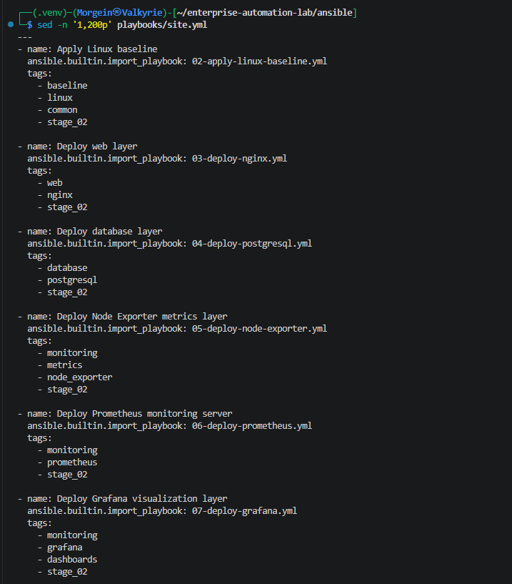
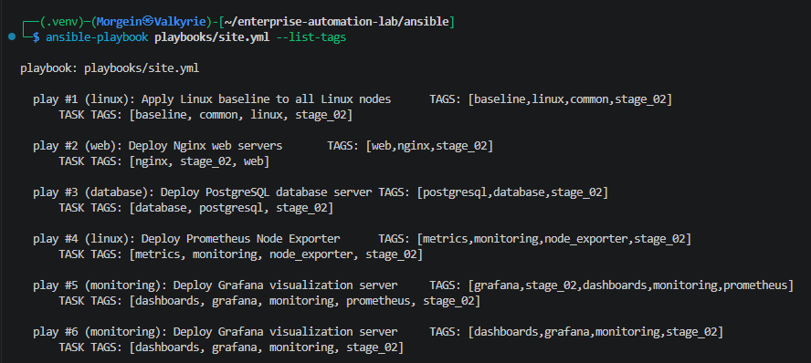
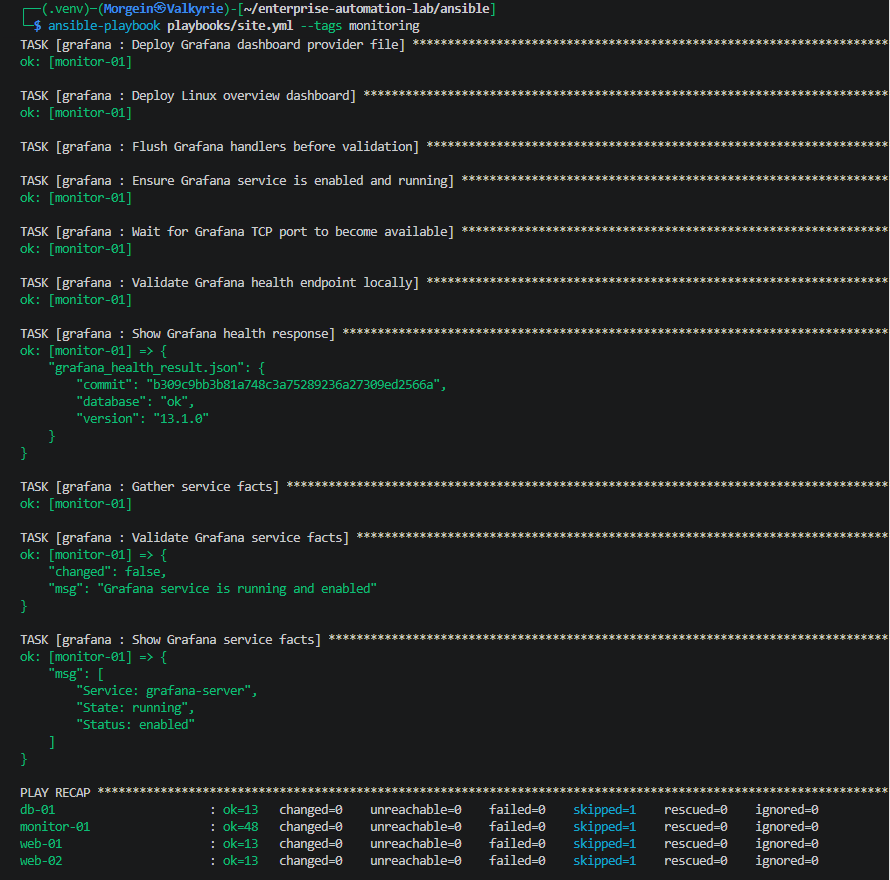
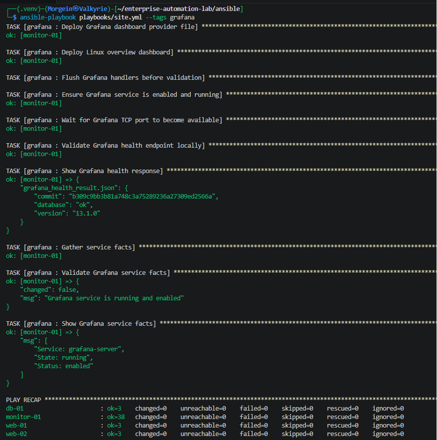
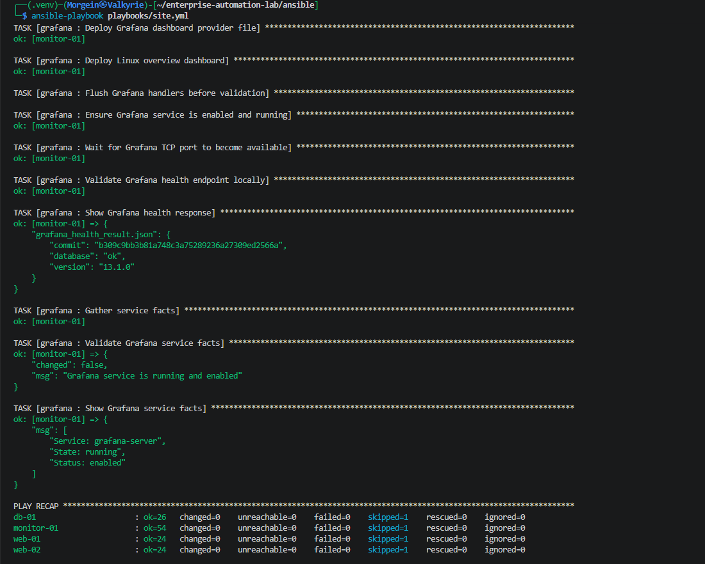
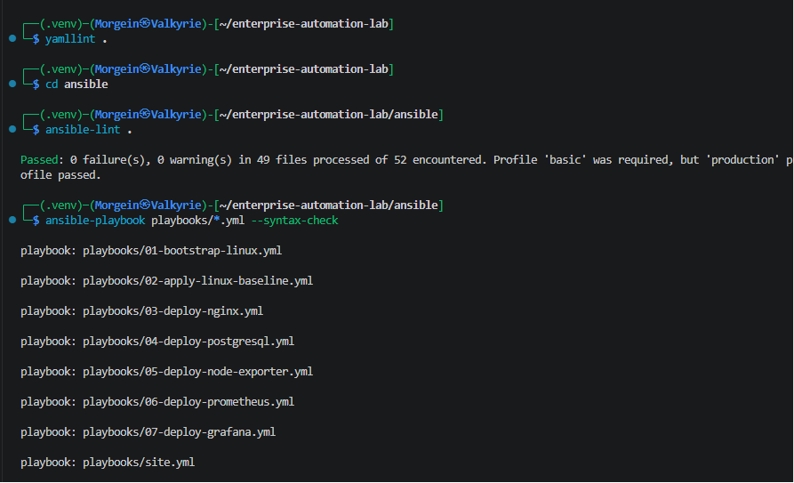

# Stage 3.1 - Site Playbook and Operational Tags

## 1. Purpose

This document describes Stage 3.1 of the Enterprise Automation Lab.

The goal of this stage is to introduce a main Ansible site playbook and operational tags.

Before this stage, every infrastructure layer was deployed through a separate playbook:

```text
02-apply-linux-baseline.yml
03-deploy-nginx.yml
04-deploy-postgresql.yml
05-deploy-node-exporter.yml
06-deploy-prometheus.yml
07-deploy-grafana.yml
```

After this stage, the project also has one main entrypoint:

```text
ansible/playbooks/site.yml
```

This allows the full lab to be deployed with one command:

```bash
ansible-playbook playbooks/site.yml
```

It also allows specific infrastructure layers to be deployed with tags:

```bash
ansible-playbook playbooks/site.yml --tags monitoring
ansible-playbook playbooks/site.yml --tags web
ansible-playbook playbooks/site.yml --tags database
ansible-playbook playbooks/site.yml --tags grafana
```

---

## 2. Why This Stage Exists

In real infrastructure automation, teams usually do not want to remember many separate playbook names for normal operations.

A common pattern is to have a central playbook such as:

```text
site.yml
```

The site playbook becomes the main operational entrypoint.

It can deploy:

```text
all infrastructure
only web layer
only database layer
only monitoring layer
only Grafana
only baseline configuration
```

This makes the automation easier to operate and closer to production-style Ansible usage.

---

## 3. Previous Playbook Model

Before this stage, the workflow looked like this:

```text
Apply baseline:
  ansible-playbook playbooks/02-apply-linux-baseline.yml

Deploy Nginx:
  ansible-playbook playbooks/03-deploy-nginx.yml

Deploy PostgreSQL:
  ansible-playbook playbooks/04-deploy-postgresql.yml

Deploy Node Exporter:
  ansible-playbook playbooks/05-deploy-node-exporter.yml

Deploy Prometheus:
  ansible-playbook playbooks/06-deploy-prometheus.yml

Deploy Grafana:
  ansible-playbook playbooks/07-deploy-grafana.yml
```

This is clear, but it becomes less convenient as the project grows.

---

## 4. New Operational Model

After this stage, the main workflow is:

```bash
ansible-playbook playbooks/site.yml
```

This deploys the full current lab stack:

```text
Linux baseline
Nginx
PostgreSQL
Node Exporter
Prometheus
Grafana
Grafana dashboards
```

Selective execution is done with tags:

```bash
ansible-playbook playbooks/site.yml --tags monitoring
```

This deploys only the monitoring-related parts:

```text
Node Exporter
Prometheus
Grafana
Grafana dashboards
```

---

## 5. Files Created or Updated

| File | Purpose |
|---|---|
| `ansible/playbooks/site.yml` | Main Ansible site playbook |
| `ansible/playbooks/02-apply-linux-baseline.yml` | Adds play-level and role-level tags |
| `ansible/playbooks/03-deploy-nginx.yml` | Adds web and nginx tags |
| `ansible/playbooks/04-deploy-postgresql.yml` | Adds database and postgresql tags |
| `ansible/playbooks/05-deploy-node-exporter.yml` | Adds monitoring, metrics and node_exporter tags |
| `ansible/playbooks/06-deploy-prometheus.yml` | Adds monitoring and prometheus tags |
| `ansible/playbooks/07-deploy-grafana.yml` | Adds monitoring, grafana and dashboards tags |
| `.github/workflows/ansible-validation.yml` | Adds syntax check for `site.yml` |
| `docs/runbooks/stage-03-01-site-playbook-and-tags.md` | This runbook |

---

## 6. Main Site Playbook

File:

```text
ansible/playbooks/site.yml
```

Content:

```yaml
---
- name: Apply Linux baseline
  ansible.builtin.import_playbook: 02-apply-linux-baseline.yml
  tags:
    - baseline
    - linux
    - common
    - stage_02

- name: Deploy web layer
  ansible.builtin.import_playbook: 03-deploy-nginx.yml
  tags:
    - web
    - nginx
    - stage_02

- name: Deploy database layer
  ansible.builtin.import_playbook: 04-deploy-postgresql.yml
  tags:
    - database
    - postgresql
    - stage_02

- name: Deploy Node Exporter metrics layer
  ansible.builtin.import_playbook: 05-deploy-node-exporter.yml
  tags:
    - monitoring
    - metrics
    - node_exporter
    - stage_02

- name: Deploy Prometheus monitoring server
  ansible.builtin.import_playbook: 06-deploy-prometheus.yml
  tags:
    - monitoring
    - prometheus
    - stage_02

- name: Deploy Grafana visualization layer
  ansible.builtin.import_playbook: 07-deploy-grafana.yml
  tags:
    - monitoring
    - grafana
    - dashboards
    - stage_02
```

---

## 7. Site Playbook Explanation

### YAML document start

```yaml
---
```

This marks the start of the YAML document.

All Ansible playbooks in this project use this format for consistency.

---

### Importing another playbook

Example:

```yaml
- name: Apply Linux baseline
  ansible.builtin.import_playbook: 02-apply-linux-baseline.yml
```

This imports another playbook into `site.yml`.

The imported playbook is parsed by Ansible as part of the site playbook.

This means the site playbook does not duplicate role logic.

Instead, it reuses existing playbooks.

---

### Why import_playbook is used

The project already had working playbooks.

So instead of rewriting everything inside `site.yml`, the site playbook imports them:

```text
site.yml
  -> 02-apply-linux-baseline.yml
  -> 03-deploy-nginx.yml
  -> 04-deploy-postgresql.yml
  -> 05-deploy-node-exporter.yml
  -> 06-deploy-prometheus.yml
  -> 07-deploy-grafana.yml
```

This keeps the project modular.

Each separate playbook can still be run directly.

The site playbook becomes the central operational entrypoint.

---

### Tags on imported playbooks

Example:

```yaml
tags:
  - monitoring
  - prometheus
  - stage_02
```

These tags allow selective execution.

For example:

```bash
ansible-playbook playbooks/site.yml --tags prometheus
```

runs the Prometheus part of the site playbook.

Tags make operations faster and more controlled.

---

## 8. Updated Baseline Playbook

File:

```text
ansible/playbooks/02-apply-linux-baseline.yml
```

Content:

```yaml
---
- name: Apply Linux baseline to all Linux nodes
  hosts: linux
  become: true
  gather_facts: true
  tags:
    - baseline
    - linux
    - common
    - stage_02

  roles:
    - role: linux_baseline
      tags:
        - baseline
        - linux
        - common
```

---

## 9. Baseline Tags Explanation

| Tag | Meaning |
|---|---|
| `baseline` | Basic operating system configuration |
| `linux` | Applies to Linux managed nodes |
| `common` | Common configuration shared by all Linux nodes |
| `stage_02` | Part of the Stage 2 infrastructure layer |

Example command:

```bash
ansible-playbook playbooks/site.yml --tags baseline
```

This runs only the Linux baseline part.

---

## 10. Updated Nginx Playbook

File:

```text
ansible/playbooks/03-deploy-nginx.yml
```

Content:

```yaml
---
- name: Deploy Nginx web servers
  hosts: web
  become: true
  gather_facts: true
  tags:
    - web
    - nginx
    - stage_02

  roles:
    - role: nginx
      tags:
        - web
        - nginx
```

---

## 11. Nginx Tags Explanation

| Tag | Meaning |
|---|---|
| `web` | Web layer |
| `nginx` | Nginx-specific automation |
| `stage_02` | Part of the Stage 2 infrastructure layer |

Example command:

```bash
ansible-playbook playbooks/site.yml --tags web
```

This runs only the web layer.

---

## 12. Updated PostgreSQL Playbook

File:

```text
ansible/playbooks/04-deploy-postgresql.yml
```

Content:

```yaml
---
- name: Deploy PostgreSQL database server
  hosts: database
  become: true
  gather_facts: true
  tags:
    - database
    - postgresql
    - stage_02

  roles:
    - role: postgresql
      tags:
        - database
        - postgresql
```

---

## 13. PostgreSQL Tags Explanation

| Tag | Meaning |
|---|---|
| `database` | Database layer |
| `postgresql` | PostgreSQL-specific automation |
| `stage_02` | Part of the Stage 2 infrastructure layer |

Example command:

```bash
ansible-playbook playbooks/site.yml --tags database
```

This runs only the database layer.

---

## 14. Updated Node Exporter Playbook

File:

```text
ansible/playbooks/05-deploy-node-exporter.yml
```

Content:

```yaml
---
- name: Deploy Prometheus Node Exporter
  hosts: linux
  become: true
  gather_facts: true
  tags:
    - monitoring
    - metrics
    - node_exporter
    - stage_02

  roles:
    - role: node_exporter
      tags:
        - monitoring
        - metrics
        - node_exporter
```

---

## 15. Node Exporter Tags Explanation

| Tag | Meaning |
|---|---|
| `monitoring` | Part of the monitoring stack |
| `metrics` | Metrics collection layer |
| `node_exporter` | Node Exporter-specific automation |
| `stage_02` | Part of the Stage 2 infrastructure layer |

Example command:

```bash
ansible-playbook playbooks/site.yml --tags node_exporter
```

This runs only the Node Exporter role.

---

## 16. Updated Prometheus Playbook

File:

```text
ansible/playbooks/06-deploy-prometheus.yml
```

Content:

```yaml
---
- name: Deploy Prometheus monitoring server
  hosts: monitoring
  become: true
  gather_facts: true
  tags:
    - monitoring
    - prometheus
    - stage_02

  roles:
    - role: prometheus
      tags:
        - monitoring
        - prometheus
```

---

## 17. Prometheus Tags Explanation

| Tag | Meaning |
|---|---|
| `monitoring` | Part of the monitoring stack |
| `prometheus` | Prometheus-specific automation |
| `stage_02` | Part of the Stage 2 infrastructure layer |

Example command:

```bash
ansible-playbook playbooks/site.yml --tags prometheus
```

This runs only Prometheus deployment.

---

## 18. Updated Grafana Playbook

File:

```text
ansible/playbooks/07-deploy-grafana.yml
```

Content:

```yaml
---
- name: Deploy Grafana visualization server
  hosts: monitoring
  become: true
  gather_facts: true
  tags:
    - monitoring
    - grafana
    - dashboards
    - stage_02

  roles:
    - role: grafana
      tags:
        - monitoring
        - grafana
        - dashboards
```

---

## 19. Grafana Tags Explanation

| Tag | Meaning |
|---|---|
| `monitoring` | Part of the monitoring stack |
| `grafana` | Grafana-specific automation |
| `dashboards` | Grafana dashboard provisioning |
| `stage_02` | Part of the Stage 2 infrastructure layer |

Example command:

```bash
ansible-playbook playbooks/site.yml --tags grafana
```

This runs only Grafana deployment and dashboard provisioning.

---

## 20. Available Tags

Command:

```bash
cd ~/enterprise-automation-lab/ansible
ansible-playbook playbooks/site.yml --list-tags
```

Expected tags include:

```text
baseline
common
dashboards
database
grafana
linux
metrics
monitoring
nginx
node_exporter
postgresql
stage_02
web
```

Meaning:

```text
Ansible can now list and operate specific automation areas through tags.
```

---

## 21. Operational Commands

### Deploy full current lab stack

```bash
ansible-playbook playbooks/site.yml
```

This runs:

```text
baseline
nginx
postgresql
node_exporter
prometheus
grafana
```

---

### Deploy only monitoring stack

```bash
ansible-playbook playbooks/site.yml --tags monitoring
```

This runs:

```text
node_exporter
prometheus
grafana
dashboards
```

---

### Deploy only Grafana

```bash
ansible-playbook playbooks/site.yml --tags grafana
```

This runs:

```text
grafana
dashboard provisioning
datasource provisioning
```

---

### Deploy only web layer

```bash
ansible-playbook playbooks/site.yml --tags web
```

This runs:

```text
nginx role on web servers
```

---

### Deploy only database layer

```bash
ansible-playbook playbooks/site.yml --tags database
```

This runs:

```text
postgresql role on db-01
```

---

### Deploy everything except database

```bash
ansible-playbook playbooks/site.yml --skip-tags database
```

This runs the site playbook but skips PostgreSQL/database-related automation.

---

## 22. GitHub Actions Update

The GitHub Actions workflow now validates the site playbook.

Workflow file:

```text
.github/workflows/ansible-validation.yml
```

Added validation step:

```yaml
- name: Syntax check site playbook
  working-directory: ansible
  run: ansible-playbook playbooks/site.yml --syntax-check
```

This ensures that the main operational playbook is checked automatically in CI.

---

## 23. Local Validation

Run from repository root:

```bash
cd ~/enterprise-automation-lab
yamllint .
```

Run from Ansible directory:

```bash
cd ~/enterprise-automation-lab/ansible

ansible-lint .
ansible-playbook playbooks/site.yml --syntax-check
ansible-playbook playbooks/02-apply-linux-baseline.yml --syntax-check
ansible-playbook playbooks/03-deploy-nginx.yml --syntax-check
ansible-playbook playbooks/04-deploy-postgresql.yml --syntax-check
ansible-playbook playbooks/05-deploy-node-exporter.yml --syntax-check
ansible-playbook playbooks/06-deploy-prometheus.yml --syntax-check
ansible-playbook playbooks/07-deploy-grafana.yml --syntax-check
```

Expected result:

```text
yamllint passes
ansible-lint passes
site.yml syntax check passes
all individual playbook syntax checks pass
```

---

## 24. Runtime Validation

### List tags

```bash
ansible-playbook playbooks/site.yml --list-tags
```

Expected result:

```text
Ansible displays all operational tags.
```

---

### Run monitoring tag

```bash
ansible-playbook playbooks/site.yml --tags monitoring
```

Expected result:

```text
Node Exporter, Prometheus and Grafana automation runs successfully.
```

---

### Run Grafana tag

```bash
ansible-playbook playbooks/site.yml --tags grafana
```

Expected result:

```text
Only Grafana-related automation runs successfully.
```

---

### Run web tag

```bash
ansible-playbook playbooks/site.yml --tags web
```

Expected result:

```text
Only Nginx web layer automation runs successfully.
```

---

### Run full site playbook

```bash
ansible-playbook playbooks/site.yml
```

Expected result on repeated run:

```text
changed=0
failed=0
unreachable=0
```

Meaning:

```text
The site playbook is idempotent.
The full infrastructure stack can be safely re-applied.
```

---

## 25. Validation Evidence

Validation screenshots for this stage are stored in:

```text
docs/screenshots/stage-03-site-playbook-and-tags/
```

### Site Playbook File

Shows the new `site.yml` playbook.



### List Tags

Shows the output of:

```bash
ansible-playbook playbooks/site.yml --list-tags
```



### Monitoring Tag Run

Shows successful selective run:

```bash
ansible-playbook playbooks/site.yml --tags monitoring
```



### Grafana Tag Run

Shows successful selective run:

```bash
ansible-playbook playbooks/site.yml --tags grafana
```



### Site Playbook Full Run

Shows successful full site playbook run.



### Lint and Syntax Validation

Shows successful `yamllint`, `ansible-lint` and syntax checks.



---

## 26. Troubleshooting

### site.yml syntax check fails

Run:

```bash
ansible-playbook playbooks/site.yml --syntax-check
```

Common causes:

```text
wrong imported playbook filename
incorrect indentation
missing YAML document start
wrong module name
```

Verify that imported files exist:

```bash
ls -la playbooks/
```

---

### Tag does not run expected playbook

Check available tags:

```bash
ansible-playbook playbooks/site.yml --list-tags
```

Check that the tag exists both on the imported playbook block and inside the imported playbook or role.

Example:

```yaml
tags:
  - monitoring
```

---

### A tagged run skips too much

Use:

```bash
ansible-playbook playbooks/site.yml --list-tasks --tags monitoring
```

This shows which tasks will run for that tag.

---

### A tagged run executes too much

Check if a broad tag is used.

For example:

```text
monitoring
```

intentionally includes:

```text
node_exporter
prometheus
grafana
```

For a narrower run, use:

```bash
ansible-playbook playbooks/site.yml --tags grafana
```

or:

```bash
ansible-playbook playbooks/site.yml --tags prometheus
```

---

## 27. Stage Result

At the end of this stage:

```text
site.yml created
all main infrastructure playbooks imported into site.yml
operational tags added to playbooks
role-level tags added
site.yml syntax check passes
individual playbook syntax checks pass
tags can be listed
selective tag runs work
full site playbook run works
GitHub Actions validates site.yml
```

---

## 28. Current Project Status

Current completed stage:

```text
Stage 3.1 - Site Playbook and Operational Tags
```

The project now supports both styles:

```text
individual playbook execution
central site.yml execution with tags
```

This is an important step toward more advanced Ansible operations.
