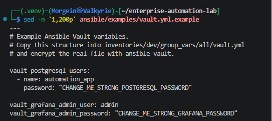
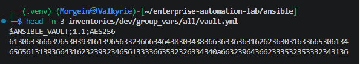
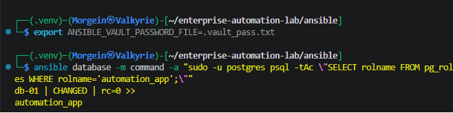
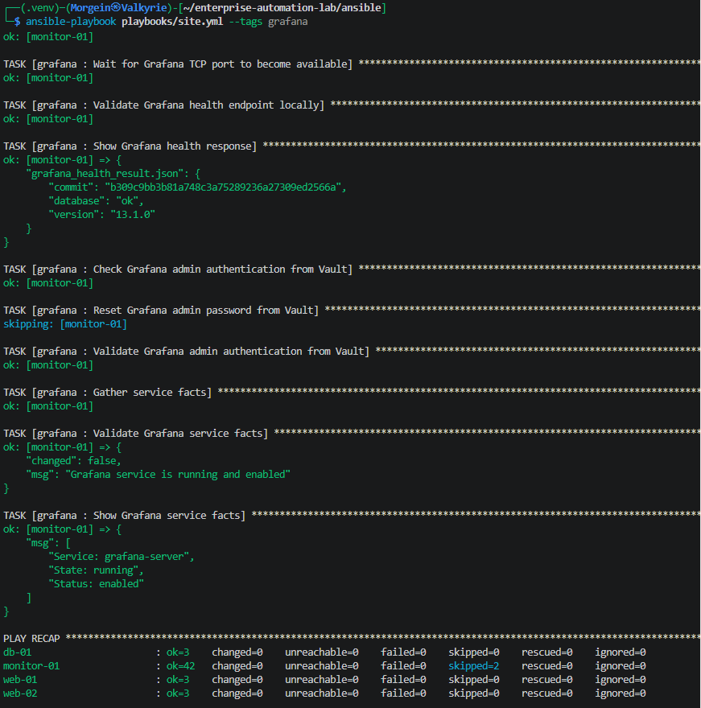
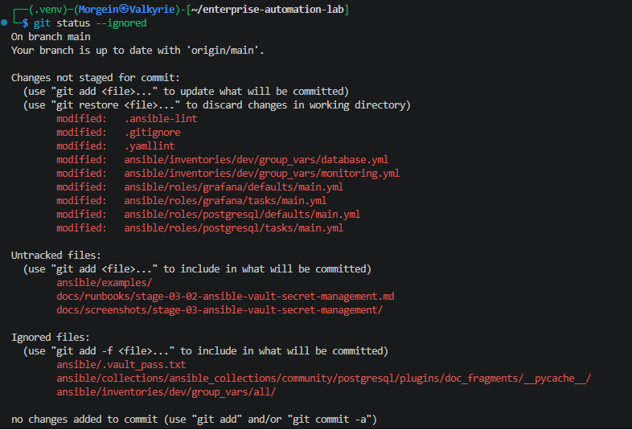
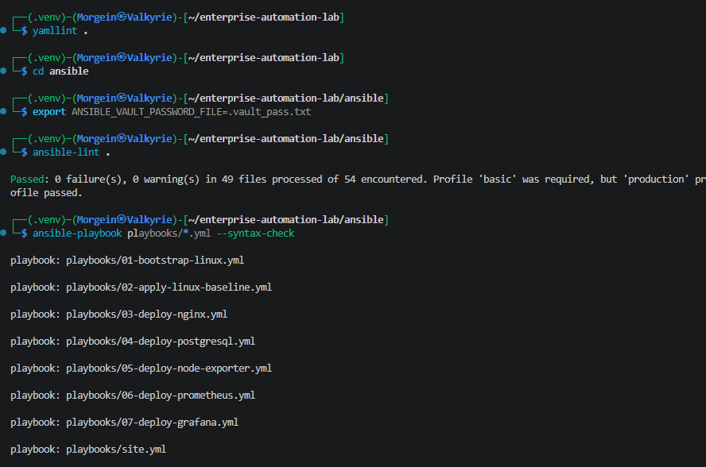

# Stage 3.2 - Ansible Vault Secret Management

## 1. Purpose

This document describes Stage 3.2 of the Enterprise Automation Lab.

The goal of this stage is to introduce Ansible Vault for local secret management.

Before this stage, the project did not have a dedicated secret management workflow.

After this stage, sensitive values can be stored in an encrypted Ansible Vault file and used by roles without exposing secrets in Git, terminal output, README files or screenshots.

---

## 2. Why This Stage Exists

Infrastructure automation often needs secrets.

Examples:

```text
database passwords
application user passwords
admin passwords
API tokens
private keys
service credentials
```

Storing secrets directly in normal YAML files is unsafe.

Bad practice:

```yaml
grafana_admin_password: "real-password-here"
postgresql_password: "real-password-here"
```

Good practice:

```text
store real secrets in encrypted Ansible Vault files
commit only safe examples
exclude real vault files from Git
hide secret values from Ansible output with no_log
```

This stage introduces that workflow.

---

## 3. Secret Management Design

This project uses the following approach:

```text
ansible/examples/vault.yml.example
  -> safe example file committed to Git

ansible/inventories/dev/group_vars/all/vault.yml
  -> real encrypted local Vault file
  -> ignored by Git

ansible/.vault_pass.txt
  -> local Vault password file
  -> ignored by Git
```

The real secrets stay local.

The repository contains only the example structure.

---

## 4. Files Created or Updated

| File | Purpose |
|---|---|
| `.gitignore` | Excludes local Vault password file and real encrypted Vault file |
| `.yamllint` | Excludes encrypted Vault file from YAML linting |
| `.ansible-lint` | Excludes encrypted Vault file from Ansible lint scanning |
| `ansible/examples/vault.yml.example` | Safe example of required Vault variables |
| `ansible/inventories/dev/group_vars/database.yml` | Maps PostgreSQL users to Vault variables |
| `ansible/inventories/dev/group_vars/monitoring.yml` | Maps Grafana admin variables to Vault variables |
| `ansible/roles/postgresql/defaults/main.yml` | Adds default empty PostgreSQL users list |
| `ansible/roles/postgresql/tasks/main.yml` | Creates PostgreSQL users from Vault |
| `ansible/roles/grafana/defaults/main.yml` | Adds Grafana admin password management variables |
| `ansible/roles/grafana/tasks/main.yml` | Validates and resets Grafana admin password from Vault |
| `docs/runbooks/stage-03-02-ansible-vault-secret-management.md` | This runbook |

Local-only files:

| File | Purpose | Committed |
|---|---|---|
| `ansible/.vault_pass.txt` | Vault password file | No |
| `ansible/inventories/dev/group_vars/all/vault.yml` | Real encrypted secrets | No |

---

## 5. Git Ignore Configuration

File:

```text
.gitignore
```

Vault-related entries:

```gitignore
# Ansible Vault local secrets
ansible/.vault_pass.txt
ansible/inventories/dev/group_vars/all/vault.yml
```

Meaning:

```text
The Vault password file must not be committed.
The real encrypted Vault file must not be committed.
```

For this local lab phase, the encrypted file is also kept out of Git to keep the repository simple and to avoid CI dependency on Vault credentials.

---

## 6. yamllint Configuration

File:

```text
.yamllint
```

Vault-related ignore entry:

```yaml
ansible/inventories/dev/group_vars/all/vault.yml
```

Reason:

```text
An encrypted Ansible Vault file is not normal YAML content.
yamllint should not try to parse it as regular YAML.
```

---

## 7. ansible-lint Configuration

File:

```text
.ansible-lint
```

Vault-related exclude paths:

```yaml
exclude_paths:
  - ansible/inventories/dev/group_vars/all/vault.yml
  - inventories/dev/group_vars/all/vault.yml
```

Reason:

```text
ansible-lint can scan files from different working directories.
The first path applies when running from the repository root.
The second path applies when running from the ansible directory.
```

This prevents warnings such as:

```text
Decryption failed (no vault secrets were found that could decrypt)
```

---

## 8. Vault Example File

File:

```text
ansible/examples/vault.yml.example
```

Content:

```yaml
---
# Example Ansible Vault variables.
# Copy this structure into inventories/dev/group_vars/all/vault.yml
# and encrypt the real file with ansible-vault.

vault_postgresql_users:
  - name: automation_app
    password: "CHANGE_ME_STRONG_POSTGRESQL_PASSWORD"

vault_grafana_admin_user: admin
vault_grafana_admin_password: "CHANGE_ME_STRONG_GRAFANA_PASSWORD"
```

This file is safe to commit because it contains placeholders only.

It documents which variables are required in the real Vault file.

---

## 9. Local Vault Password File

Local file:

```text
ansible/.vault_pass.txt
```

This file contains the password used to decrypt the local Vault file.

It must be protected with restrictive permissions:

```bash
chmod 600 .vault_pass.txt
```

Meaning:

```text
Only the file owner can read and write this file.
Other users cannot read it.
```

This file is ignored by Git.

---

## 10. Real Vault File

Local encrypted file:

```text
ansible/inventories/dev/group_vars/all/vault.yml
```

Before encryption, the file follows the same structure as the example file:

```yaml
---
vault_postgresql_users:
  - name: automation_app
    password: "REAL_LOCAL_PASSWORD"

vault_grafana_admin_user: admin
vault_grafana_admin_password: "REAL_LOCAL_PASSWORD"
```

The file is encrypted with:

```bash
cd ~/enterprise-automation-lab/ansible

ansible-vault encrypt inventories/dev/group_vars/all/vault.yml --vault-password-file .vault_pass.txt
```

After encryption, the file starts with:

```text
$ANSIBLE_VAULT;1.1;AES256
```

This means the file is encrypted.

---

## 11. Viewing Vault Content Locally

To view the encrypted Vault file:

```bash
cd ~/enterprise-automation-lab/ansible

ansible-vault view inventories/dev/group_vars/all/vault.yml --vault-password-file .vault_pass.txt
```

This command decrypts and prints the file locally.

Do not include this output in screenshots if it contains real secrets.

---

## 12. Editing Vault Content Locally

To edit encrypted secrets:

```bash
cd ~/enterprise-automation-lab/ansible

ansible-vault edit inventories/dev/group_vars/all/vault.yml --vault-password-file .vault_pass.txt
```

This opens the decrypted content temporarily in an editor.

After saving, Ansible Vault writes it back encrypted.

---

## 13. PostgreSQL Vault Integration

File:

```text
ansible/inventories/dev/group_vars/database.yml
```

Content:

```yaml
---
# Variables for database hosts in the development inventory.

postgresql_databases:
  - automation_lab

postgresql_users: "{{ vault_postgresql_users | default([]) }}"
```

Explanation:

```yaml
postgresql_databases:
  - automation_lab
```

Defines the database created by the PostgreSQL role.

```yaml
postgresql_users: "{{ vault_postgresql_users | default([]) }}"
```

Maps PostgreSQL users to the Vault variable.

If the Vault variable exists, PostgreSQL users are created.

If the Vault variable does not exist, the value becomes an empty list.

This allows CI syntax checks to work even without the local Vault file.

---

## 14. PostgreSQL Role Defaults

File:

```text
ansible/roles/postgresql/defaults/main.yml
```

Vault-related default:

```yaml
postgresql_users: []
```

Meaning:

```text
By default, the PostgreSQL role does not create extra users.
If inventory or Vault provides postgresql_users, the role creates them.
```

---

## 15. PostgreSQL User Creation Task

File:

```text
ansible/roles/postgresql/tasks/main.yml
```

Vault-related task:

```yaml
- name: Create PostgreSQL users from Vault
  community.postgresql.postgresql_user:
    name: "{{ item.name }}"
    password: "{{ item.password }}"
    state: present
  become: true
  become_user: postgres
  loop: "{{ postgresql_users }}"
  no_log: true
  when: postgresql_users | length > 0
```

Explanation:

```yaml
community.postgresql.postgresql_user:
```

Uses the PostgreSQL Ansible collection to manage PostgreSQL roles/users.

```yaml
name: "{{ item.name }}"
```

Uses the username from the Vault-provided list.

```yaml
password: "{{ item.password }}"
```

Uses the password from Vault.

```yaml
become: true
become_user: postgres
```

Runs the task as the local PostgreSQL administrative Linux user.

This avoids needing to know a plaintext password for the PostgreSQL `postgres` role.

```yaml
loop: "{{ postgresql_users }}"
```

Creates every user defined in the list.

```yaml
no_log: true
```

Hides sensitive values from Ansible output.

```yaml
when: postgresql_users | length > 0
```

Runs only when users are defined.

---

## 16. PostgreSQL User Validation

Run:

```bash
cd ~/enterprise-automation-lab/ansible

export ANSIBLE_VAULT_PASSWORD_FILE=.vault_pass.txt

ansible-playbook playbooks/site.yml --tags database
```

Run again for idempotency:

```bash
ansible-playbook playbooks/site.yml --tags database
```

Expected repeated run:

```text
changed=0
failed=0
unreachable=0
```

Validate the PostgreSQL user exists:

```bash
ansible database -m command -a "sudo -u postgres psql -tAc \"SELECT rolname FROM pg_roles WHERE rolname='automation_app';\""
```

Expected result:

```text
automation_app
```

---

## 17. Grafana Vault Integration

File:

```text
ansible/inventories/dev/group_vars/monitoring.yml
```

Vault-related variables:

```yaml
grafana_manage_admin_password: "{{ vault_grafana_admin_password is defined }}"

grafana_admin_user: "{{ vault_grafana_admin_user | default('admin') }}"

grafana_admin_password: "{{ vault_grafana_admin_password | default('') }}"
```

Explanation:

```yaml
grafana_manage_admin_password: "{{ vault_grafana_admin_password is defined }}"
```

Enables password management only if the Vault password variable exists.

```yaml
grafana_admin_user: "{{ vault_grafana_admin_user | default('admin') }}"
```

Uses the Vault admin username if defined.

Otherwise, it defaults to:

```text
admin
```

```yaml
grafana_admin_password: "{{ vault_grafana_admin_password | default('') }}"
```

Uses the Vault password if defined.

Otherwise, it becomes an empty string.

---

## 18. Grafana Role Defaults

File:

```text
ansible/roles/grafana/defaults/main.yml
```

Vault-related defaults:

```yaml
grafana_manage_admin_password: false

grafana_admin_user: admin

grafana_admin_password: ""

grafana_admin_api_url: "http://127.0.0.1:{{ grafana_http_port }}/api/org"
```

Meaning:

```text
By default, the Grafana role does not manage the admin password.
If Vault variables are available, group_vars enables admin password management.
```

---

## 19. Grafana Admin Password Tasks

File:

```text
ansible/roles/grafana/tasks/main.yml
```

Vault-related tasks:

```yaml
- name: Check Grafana admin authentication from Vault
  ansible.builtin.uri:
    url: "{{ grafana_admin_api_url }}"
    user: "{{ grafana_admin_user }}"
    password: "{{ grafana_admin_password }}"
    force_basic_auth: true
    status_code:
      - 200
      - 401
      - 403
    return_content: false
  register: grafana_admin_auth_check
  changed_when: false
  failed_when: false
  no_log: true
  when: grafana_manage_admin_password | bool

- name: Reset Grafana admin password from Vault
  ansible.builtin.command:
    cmd: "grafana-cli admin reset-admin-password {{ grafana_admin_password }}"
  changed_when: true
  no_log: true
  when:
    - grafana_manage_admin_password | bool
    - grafana_admin_auth_check.status != 200

- name: Validate Grafana admin authentication from Vault
  ansible.builtin.uri:
    url: "{{ grafana_admin_api_url }}"
    user: "{{ grafana_admin_user }}"
    password: "{{ grafana_admin_password }}"
    force_basic_auth: true
    status_code: 200
    return_content: false
  changed_when: false
  no_log: true
  when: grafana_manage_admin_password | bool
```

---

## 20. Grafana Tasks Explanation

### Check Grafana admin authentication from Vault

This checks whether the password stored in Vault already works.

The task accepts:

```text
200
401
403
```

because the first check should not fail the playbook if the current password is still different.

---

### Reset Grafana admin password from Vault

This task runs:

```bash
grafana-cli admin reset-admin-password
```

only when the Vault password does not currently authenticate.

This keeps the role idempotent.

If the Vault password already works, the reset task is skipped.

---

### Validate Grafana admin authentication from Vault

This task confirms that the Vault-managed credentials work after the reset.

It expects:

```text
HTTP 200
```

The task uses:

```yaml
no_log: true
```

so credentials are not printed in output.

---

## 21. Grafana Runtime Validation

Run:

```bash
cd ~/enterprise-automation-lab/ansible

export ANSIBLE_VAULT_PASSWORD_FILE=.vault_pass.txt

ansible-playbook playbooks/site.yml --tags grafana
```

Run again:

```bash
ansible-playbook playbooks/site.yml --tags grafana
```

Expected repeated run:

```text
changed=0
failed=0
unreachable=0
```

Validate login manually in browser:

```text
http://192.168.100.31:3000
```

Use the admin username and password stored in the local Vault file.

Do not document the real password.

---

## 22. Local Vault Environment Variable

For convenience, the Vault password file can be exported for the current shell session:

```bash
cd ~/enterprise-automation-lab/ansible

export ANSIBLE_VAULT_PASSWORD_FILE=.vault_pass.txt
```

Check:

```bash
echo $ANSIBLE_VAULT_PASSWORD_FILE
```

Expected output:

```text
.vault_pass.txt
```

After this, Ansible can decrypt Vault automatically during playbook runs.

---

## 23. Static Validation

Run from repository root:

```bash
cd ~/enterprise-automation-lab
yamllint .
```

Run from Ansible directory:

```bash
cd ~/enterprise-automation-lab/ansible

export ANSIBLE_VAULT_PASSWORD_FILE=.vault_pass.txt

ansible-lint .
ansible-playbook playbooks/site.yml --syntax-check
ansible-playbook playbooks/04-deploy-postgresql.yml --syntax-check
ansible-playbook playbooks/07-deploy-grafana.yml --syntax-check
```

Expected result:

```text
yamllint passes
ansible-lint passes
syntax checks pass
```

---

## 24. Git Safety Validation

Check normal Git status:

```bash
cd ~/enterprise-automation-lab
git status
```

The following files must not appear as files to be committed:

```text
ansible/.vault_pass.txt
ansible/inventories/dev/group_vars/all/vault.yml
```

Check ignored files:

```bash
git status --ignored
```

It is acceptable if these files appear as ignored:

```text
ansible/.vault_pass.txt
ansible/inventories/dev/group_vars/all/vault.yml
```

Meaning:

```text
The real secret files exist locally.
Git correctly ignores them.
They will not be pushed to GitHub.
```

---

## 25. Validation Evidence

Validation screenshots for this stage are stored in:

```text
docs/screenshots/stage-03-ansible-vault-secret-management/
```

### Vault Example File

Shows the safe Vault example file without real secrets.



### Encrypted Vault Header

Shows the encrypted Vault file header:

```text
$ANSIBLE_VAULT;1.1;AES256
```



### PostgreSQL Vault User Validation

Shows the Vault-managed PostgreSQL user exists.



### Grafana Vault Password Run

Shows Grafana playbook execution with Vault-managed password tasks hidden by `no_log`.



### Vault Git Ignore Validation

Shows that real Vault files are ignored by Git.



### Vault Lint and Syntax Validation

Shows successful linting and syntax validation.



---

## 26. Troubleshooting

### ansible-lint warns about Vault decryption

Example:

```text
Decryption failed (no vault secrets were found that could decrypt)
```

Cause:

```text
ansible-lint tried to inspect the encrypted vault.yml file.
```

Fix:

Exclude the Vault file in `.ansible-lint`:

```yaml
exclude_paths:
  - ansible/inventories/dev/group_vars/all/vault.yml
  - inventories/dev/group_vars/all/vault.yml
```

---

### Vault cannot be decrypted

Error:

```text
Decryption failed
```

Cause:

```text
The password in .vault_pass.txt is not the password used to encrypt the Vault file.
```

Fix options:

```text
Use the correct Vault password file.
Recreate the local Vault file if this is only a lab environment.
```

---

### Playbook cannot find Vault variables

Check that the Vault file is in the correct location:

```text
ansible/inventories/dev/group_vars/all/vault.yml
```

Check that the `all` directory exists under:

```text
ansible/inventories/dev/group_vars/
```

Check Vault content:

```bash
ansible-vault view inventories/dev/group_vars/all/vault.yml --vault-password-file .vault_pass.txt
```

---

### PostgreSQL user is not created

Run:

```bash
ansible-playbook playbooks/site.yml --tags database
```

Check that `postgresql_users` is populated through:

```text
vault_postgresql_users
```

Validate user:

```bash
ansible database -m command -a "sudo -u postgres psql -tAc \"SELECT rolname FROM pg_roles WHERE rolname='automation_app';\""
```

---

### Grafana admin password does not work

Run:

```bash
ansible-playbook playbooks/site.yml --tags grafana
```

Check that Vault variables are defined:

```text
vault_grafana_admin_user
vault_grafana_admin_password
```

Check Grafana service:

```bash
ansible monitoring -m command -a "systemctl is-active grafana-server"
```

---

## 27. Stage Result

At the end of this stage:

```text
Ansible Vault introduced
Vault password file created locally
Real Vault file created locally
Real Vault file encrypted
Vault example file added
Vault files excluded from Git
Vault file excluded from yamllint
Vault file excluded from ansible-lint
PostgreSQL user managed from Vault
Grafana admin password managed from Vault
Sensitive tasks protected with no_log
Vault-based playbook runs validated
Git status validated to prevent secret leakage
```

---

## 28. Current Project Status

Current completed stage:

```text
Stage 3.2 - Ansible Vault Secret Management
```

The project now has a safe local secret management workflow.

Real secrets remain local and encrypted.

The repository contains only safe examples and automation logic.
