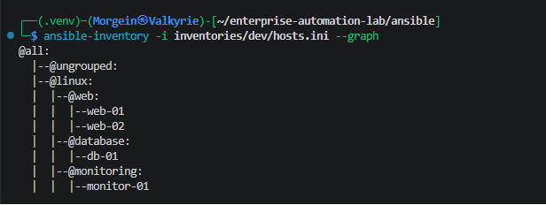
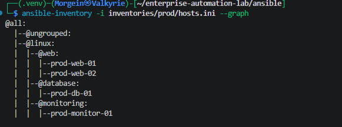
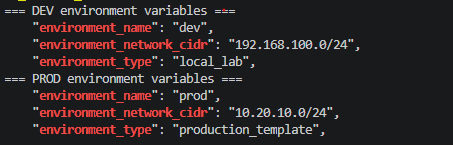
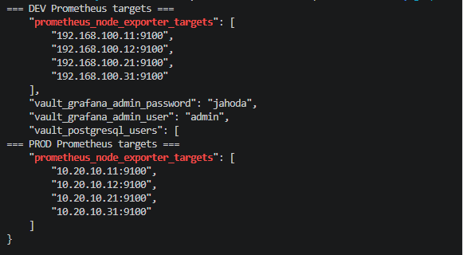
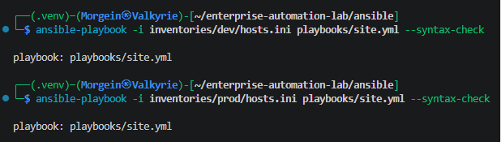
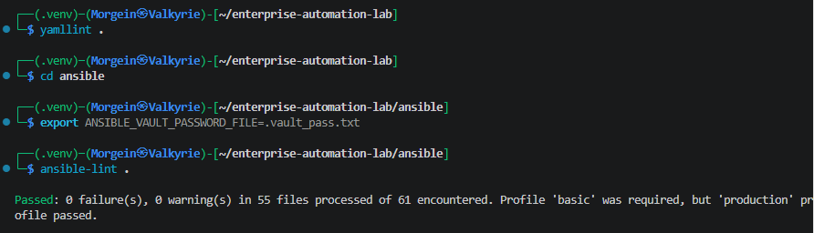

# Stage 3.3 - Environment Separation for Dev and Prod Inventories

## 1. Purpose

This document describes Stage 3.3 of the Enterprise Automation Lab.

The goal of this stage is to introduce environment separation in the Ansible inventory structure.

Before this stage, the project had one main inventory:

```text
ansible/inventories/dev/
```

This inventory represented the local Hyper-V development lab.

After this stage, the project supports two inventory environments:

```text
ansible/inventories/dev/
ansible/inventories/prod/
```

The same Ansible roles and playbooks can now be validated against different inventories and different environment-specific variables.

---

## 2. Why This Stage Exists

Real infrastructure automation usually has more than one environment.

Common examples:

```text
dev
test
staging
prod
```

The correct approach is not to duplicate all playbooks for every environment.

Bad approach:

```text
deploy-dev.yml
deploy-prod.yml
deploy-prod-fixed.yml
deploy-prod-final.yml
```

Better approach:

```text
same roles
same playbooks
different inventories
different group_vars
different secrets
different host addresses
```

This stage introduces that better approach.

The project now separates automation logic from environment-specific configuration.

---

## 3. Main Design Idea

The project now follows this model:

```text
Ansible roles and playbooks
  -> shared automation logic

inventories/dev/
  -> local Hyper-V lab configuration

inventories/prod/
  -> production-like inventory template
```

The same site playbook can be checked against both environments:

```bash
ansible-playbook -i inventories/dev/hosts.ini playbooks/site.yml --syntax-check
ansible-playbook -i inventories/prod/hosts.ini playbooks/site.yml --syntax-check
```

The production inventory is currently a template.

It is not connected to real production servers.

---

## 4. Environment Structure

Current inventory structure:

```text
ansible/inventories/
├── dev/
│   ├── hosts.ini
│   └── group_vars/
│       ├── all/
│       │   ├── main.yml
│       │   └── vault.yml
│       ├── database.yml
│       ├── linux.yml
│       └── monitoring.yml
└── prod/
    ├── hosts.ini
    └── group_vars/
        ├── all/
        │   └── main.yml
        ├── database.yml
        ├── linux.yml
        └── monitoring.yml
```

The real encrypted Vault files are local-only and ignored by Git.

---

## 5. Files Created or Updated

| File | Purpose |
|---|---|
| `ansible/inventories/prod/hosts.ini` | Production-like inventory template |
| `ansible/inventories/dev/group_vars/all/main.yml` | Development environment variables |
| `ansible/inventories/prod/group_vars/all/main.yml` | Production-like environment variables |
| `ansible/inventories/prod/group_vars/database.yml` | Production-like database variables |
| `ansible/inventories/prod/group_vars/linux.yml` | Production-like Linux baseline variables |
| `ansible/inventories/prod/group_vars/monitoring.yml` | Production-like monitoring variables |
| `.gitignore` | Excludes prod Vault secret file |
| `.yamllint` | Excludes prod Vault secret file from YAML linting |
| `.ansible-lint` | Excludes prod Vault secret file from ansible-lint scanning |
| `docs/runbooks/stage-03-03-environment-separation.md` | This runbook |
| `README.md` | Project status and documentation update |
| `.github/workflows/ansible-validation.yml` | CI syntax checks for dev and prod inventories |

---

## 6. Development Inventory

Development inventory path:

```text
ansible/inventories/dev/hosts.ini
```

Current development hosts:

```ini
[web]
web-01 ansible_host=192.168.100.11
web-02 ansible_host=192.168.100.12

[database]
db-01 ansible_host=192.168.100.21

[monitoring]
monitor-01 ansible_host=192.168.100.31

[linux:children]
web
database
monitoring

[linux:vars]
ansible_user=automation
ansible_ssh_private_key_file=~/.ssh/enterprise_automation_lab
```

This inventory represents the real local Hyper-V lab.

---

## 7. Production-like Inventory

Production-like inventory path:

```text
ansible/inventories/prod/hosts.ini
```

Content:

```ini
[web]
prod-web-01 ansible_host=10.20.10.11
prod-web-02 ansible_host=10.20.10.12

[database]
prod-db-01 ansible_host=10.20.10.21

[monitoring]
prod-monitor-01 ansible_host=10.20.10.31

[linux:children]
web
database
monitoring

[linux:vars]
ansible_user=automation
ansible_ssh_private_key_file=~/.ssh/enterprise_automation_lab_prod
```

This inventory is a production-like template.

It is used for:

```text
inventory structure validation
environment variable validation
syntax checks
documentation
future production-style expansion
```

It is not currently used for runtime deployment.

---

## 8. Why Prod Runtime Is Not Executed

The production inventory currently contains template IP addresses:

```text
10.20.10.11
10.20.10.12
10.20.10.21
10.20.10.31
```

These are not real servers in the current lab.

Therefore, this command should not be executed yet:

```bash
ansible-playbook -i inventories/prod/hosts.ini playbooks/site.yml
```

Allowed prod checks:

```bash
ansible-inventory -i inventories/prod/hosts.ini --graph
ansible-inventory -i inventories/prod/hosts.ini --host prod-monitor-01
ansible-playbook -i inventories/prod/hosts.ini playbooks/site.yml --syntax-check
```

These commands validate structure and syntax without connecting to real servers.

---

## 9. Development Environment Variables

File:

```text
ansible/inventories/dev/group_vars/all/main.yml
```

Content:

```yaml
---
# Common variables for the development environment.

environment_name: dev

environment_description: Local Hyper-V development lab

environment_network_cidr: 192.168.100.0/24

environment_type: local_lab
```

Meaning:

```text
environment_name identifies the environment as dev.
environment_description describes the local lab.
environment_network_cidr documents the dev network.
environment_type marks this as a local lab environment.
```

---

## 10. Production-like Environment Variables

File:

```text
ansible/inventories/prod/group_vars/all/main.yml
```

Content:

```yaml
---
# Common variables for the production-like environment.

environment_name: prod

environment_description: Production-like inventory template

environment_network_cidr: 10.20.10.0/24

environment_type: production_template
```

Meaning:

```text
environment_name identifies the environment as prod.
environment_description describes the inventory as a production-like template.
environment_network_cidr documents the prod template network.
environment_type marks this as a production template.
```

---

## 11. Development Monitoring Variables

File:

```text
ansible/inventories/dev/group_vars/monitoring.yml
```

Development Prometheus targets:

```yaml
prometheus_node_exporter_targets:
  - "192.168.100.11:9100"
  - "192.168.100.12:9100"
  - "192.168.100.21:9100"
  - "192.168.100.31:9100"
```

These are the real Node Exporter endpoints in the Hyper-V lab.

---

## 12. Production-like Monitoring Variables

File:

```text
ansible/inventories/prod/group_vars/monitoring.yml
```

Production-like Prometheus targets:

```yaml
prometheus_node_exporter_targets:
  - "10.20.10.11:9100"
  - "10.20.10.12:9100"
  - "10.20.10.21:9100"
  - "10.20.10.31:9100"
```

These are template targets for the production-like inventory.

This demonstrates that the Prometheus role does not hardcode IP addresses.

Instead, it reads environment-specific targets from inventory variables.

---

## 13. Database Variables

Development and production-like inventories both define database variables.

Example:

```yaml
---
# Variables for database hosts.

postgresql_databases:
  - automation_lab

postgresql_users: "{{ vault_postgresql_users | default([]) }}"
```

This allows the same PostgreSQL role to work with both environments.

Vault-provided users are used if available.

If Vault variables are not available, the user list defaults to an empty list.

---

## 14. Linux Variables

The production-like inventory reuses the same Linux baseline variables as the development inventory.

File:

```text
ansible/inventories/prod/group_vars/linux.yml
```

This means the same baseline role can be validated against both dev and prod inventories.

---

## 15. Vault Separation

The project supports separate Vault files per environment.

Development Vault path:

```text
ansible/inventories/dev/group_vars/all/vault.yml
```

Production-like Vault path:

```text
ansible/inventories/prod/group_vars/all/vault.yml
```

Both files are ignored by Git.

`.gitignore` includes:

```gitignore
ansible/.vault_pass.txt
ansible/inventories/dev/group_vars/all/vault.yml
ansible/inventories/prod/group_vars/all/vault.yml
```

This prevents real secrets from being committed.

---

## 16. Lint Exclusions for Vault Files

Encrypted Vault files are excluded from static linting.

`.yamllint` excludes:

```text
ansible/inventories/dev/group_vars/all/vault.yml
ansible/inventories/prod/group_vars/all/vault.yml
```

`.ansible-lint` excludes both root-relative and ansible-directory-relative paths:

```yaml
exclude_paths:
  - ansible/inventories/dev/group_vars/all/vault.yml
  - inventories/dev/group_vars/all/vault.yml
  - ansible/inventories/prod/group_vars/all/vault.yml
  - inventories/prod/group_vars/all/vault.yml
```

This avoids decryption warnings during linting.

---

## 17. Inventory Graph Validation

Run from the Ansible directory:

```bash
cd ~/enterprise-automation-lab/ansible
```

Validate dev inventory graph:

```bash
ansible-inventory -i inventories/dev/hosts.ini --graph
```

Expected dev groups:

```text
@web
@database
@monitoring
@linux
```

Expected dev hosts:

```text
web-01
web-02
db-01
monitor-01
```

Validate prod inventory graph:

```bash
ansible-inventory -i inventories/prod/hosts.ini --graph
```

Expected prod groups:

```text
@web
@database
@monitoring
@linux
```

Expected prod hosts:

```text
prod-web-01
prod-web-02
prod-db-01
prod-monitor-01
```

---

## 18. Environment Variable Validation

Validate dev environment variables:

```bash
ansible-inventory -i inventories/dev/hosts.ini --host monitor-01 | grep -E "environment_name|environment_type|environment_network_cidr"
```

Expected result:

```text
"environment_name": "dev"
"environment_network_cidr": "192.168.100.0/24"
"environment_type": "local_lab"
```

Validate prod environment variables:

```bash
ansible-inventory -i inventories/prod/hosts.ini --host prod-monitor-01 | grep -E "environment_name|environment_type|environment_network_cidr"
```

Expected result:

```text
"environment_name": "prod"
"environment_network_cidr": "10.20.10.0/24"
"environment_type": "production_template"
```

This proves that environment-specific variables are loaded from the selected inventory.

---

## 19. Prometheus Target Variable Validation

Validate dev Prometheus targets:

```bash
ansible-inventory -i inventories/dev/hosts.ini --host monitor-01 | grep -A 8 "prometheus_node_exporter_targets"
```

Expected dev targets:

```text
192.168.100.11:9100
192.168.100.12:9100
192.168.100.21:9100
192.168.100.31:9100
```

Validate prod Prometheus targets:

```bash
ansible-inventory -i inventories/prod/hosts.ini --host prod-monitor-01 | grep -A 8 "prometheus_node_exporter_targets"
```

Expected prod targets:

```text
10.20.10.11:9100
10.20.10.12:9100
10.20.10.21:9100
10.20.10.31:9100
```

This proves that monitoring configuration is environment-specific.

---

## 20. Syntax Validation Against Dev and Prod

Run:

```bash
ansible-playbook -i inventories/dev/hosts.ini playbooks/site.yml --syntax-check
```

Expected result:

```text
playbook: playbooks/site.yml
```

Run:

```bash
ansible-playbook -i inventories/prod/hosts.ini playbooks/site.yml --syntax-check
```

Expected result:

```text
playbook: playbooks/site.yml
```

This proves that the central site playbook is syntactically valid against both inventories.

---

## 21. Static Validation

Run from repository root:

```bash
cd ~/enterprise-automation-lab
yamllint .
```

Run from Ansible directory:

```bash
cd ~/enterprise-automation-lab/ansible

export ANSIBLE_VAULT_PASSWORD_FILE=.vault_pass.txt

ansible-lint .
ansible-playbook -i inventories/dev/hosts.ini playbooks/site.yml --syntax-check
ansible-playbook -i inventories/prod/hosts.ini playbooks/site.yml --syntax-check
```

Expected result:

```text
yamllint passes
ansible-lint passes
dev inventory syntax check passes
prod inventory syntax check passes
```

---

## 22. Operational Usage

Deploy against dev:

```bash
ansible-playbook -i inventories/dev/hosts.ini playbooks/site.yml
```

Deploy only monitoring against dev:

```bash
ansible-playbook -i inventories/dev/hosts.ini playbooks/site.yml --tags monitoring
```

Check prod syntax only:

```bash
ansible-playbook -i inventories/prod/hosts.ini playbooks/site.yml --syntax-check
```

Do not run prod runtime until real prod hosts exist.

---

## 23. Validation Evidence

Validation screenshots for this stage are stored in:

```text
docs/screenshots/stage-03-environment-separation/
```

### Dev Inventory Graph

Shows the development inventory groups and hosts.



### Prod Inventory Graph

Shows the production-like inventory groups and hosts.



### Environment Variables Validation

Shows different environment variables for dev and prod.



### Prometheus Targets Validation

Shows different Prometheus targets for dev and prod.



### Dev and Prod Syntax Validation

Shows successful syntax checks against dev and prod inventories.



### Lint Validation

Shows successful `yamllint` and `ansible-lint`.



---

## 24. Troubleshooting

### Dev environment variables do not appear

Check that this file exists:

```text
ansible/inventories/dev/group_vars/all/main.yml
```

Correct location from inside the `ansible` directory:

```text
inventories/dev/group_vars/all/main.yml
```

Validate:

```bash
ansible-inventory -i inventories/dev/hosts.ini --host monitor-01
```

---

### Prod environment variables do not appear

Check that this file exists:

```text
ansible/inventories/prod/group_vars/all/main.yml
```

Validate:

```bash
ansible-inventory -i inventories/prod/hosts.ini --host prod-monitor-01
```

---

### Prod runtime fails

This is expected if real prod hosts do not exist.

The prod inventory is currently a template.

Use only:

```bash
ansible-inventory -i inventories/prod/hosts.ini --graph
ansible-playbook -i inventories/prod/hosts.ini playbooks/site.yml --syntax-check
```

---

### Prometheus targets are wrong

Check the selected inventory.

Dev targets live in:

```text
ansible/inventories/dev/group_vars/monitoring.yml
```

Prod targets live in:

```text
ansible/inventories/prod/group_vars/monitoring.yml
```

---

## 25. Stage Result

At the end of this stage:

```text
prod inventory structure created
prod group_vars structure created
dev environment variables added
prod environment variables added
prod database variables added
prod monitoring variables added
prod Linux variables added
dev and prod Vault paths separated
Vault files excluded from Git
Vault files excluded from yamllint and ansible-lint
dev inventory graph validated
prod inventory graph validated
dev environment variables validated
prod environment variables validated
dev Prometheus targets validated
prod Prometheus targets validated
site.yml syntax checked against dev inventory
site.yml syntax checked against prod inventory
```

---

## 26. Current Project Status

Current completed stage:

```text
Stage 3.3 - Environment Separation for Dev and Prod Inventories
```

The project now supports:

```text
same automation code
different inventories
different environment variables
different monitoring targets
different Vault secret paths
```

This is an important step toward production-style Ansible project organization.
