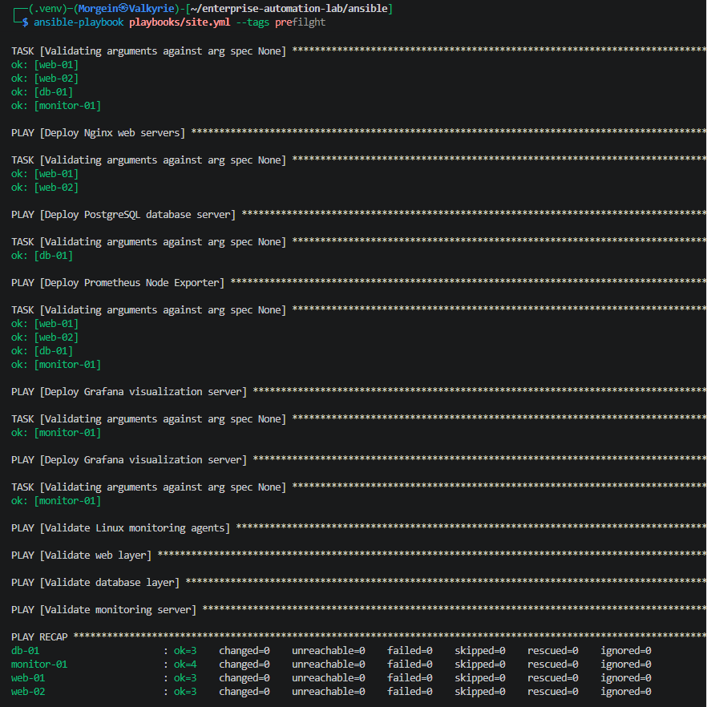
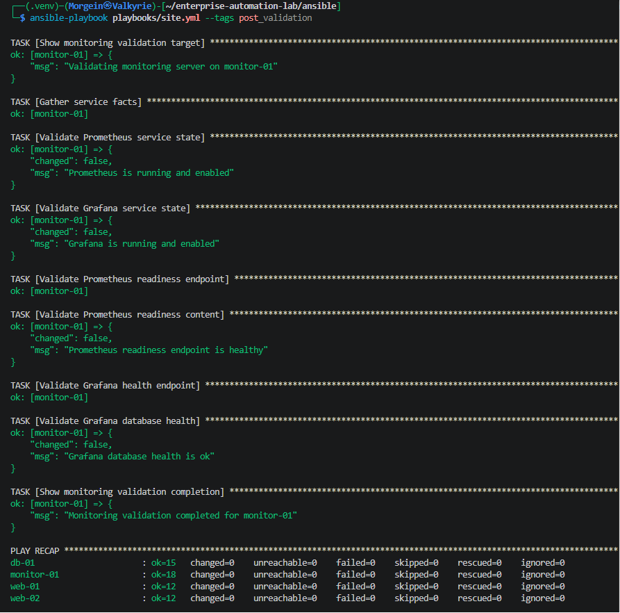
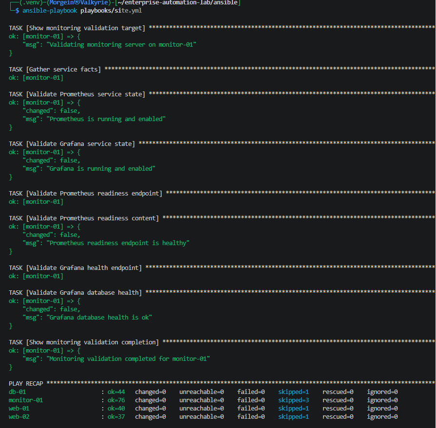
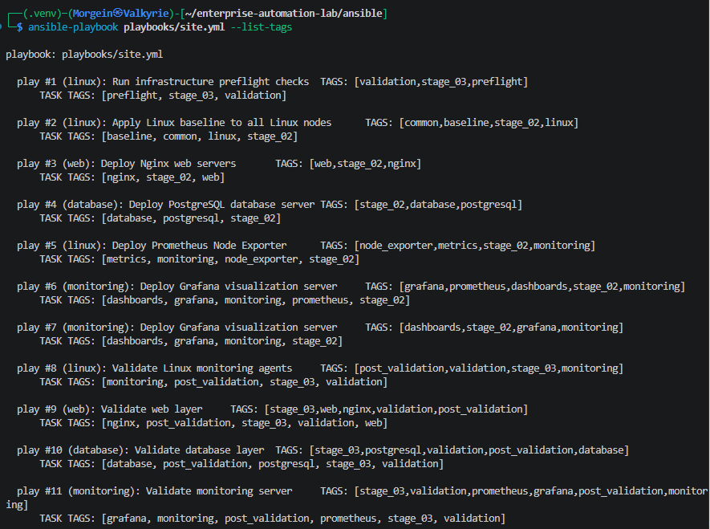

# Stage 3.4 - Preflight and Post-deployment Validation

## 1. Purpose

This document describes Stage 3.4 of the Enterprise Automation Lab.

The goal of this stage is to improve the operational Ansible workflow by adding:

```text
preflight checks
deployment
post-deployment validation
```

Before this stage, the main `site.yml` playbook could deploy the infrastructure stack.

After this stage, the main site workflow validates the environment before deployment and validates services after deployment.

Final workflow:

```text
preflight -> deployment -> post-deployment validation
```

This makes the automation safer, more predictable and closer to production-style infrastructure operations.

---

## 2. Why This Stage Exists

In real infrastructure automation, it is not enough to only install packages and start services.

A good operational workflow should verify that the environment is ready before deployment and that the services work correctly after deployment.

This stage validates:

```text
inventory structure
environment variables
SSH connectivity
passwordless sudo
Node Exporter service and metrics endpoint
Nginx HTTP response
PostgreSQL database availability
Prometheus readiness
Grafana health
```

The goal is to make the project more reliable and easier to troubleshoot.

---

## 3. Updated Site Workflow

The main operational playbook is:

```text
ansible/playbooks/site.yml
```

After this stage, the site workflow imports:

```text
00-preflight.yml
02-apply-linux-baseline.yml
03-deploy-nginx.yml
04-deploy-postgresql.yml
05-deploy-node-exporter.yml
06-deploy-prometheus.yml
07-deploy-grafana.yml
08-post-deployment-validation.yml
```

The execution flow is:

```text
00-preflight.yml
    ↓
02-apply-linux-baseline.yml
    ↓
03-deploy-nginx.yml
    ↓
04-deploy-postgresql.yml
    ↓
05-deploy-node-exporter.yml
    ↓
06-deploy-prometheus.yml
    ↓
07-deploy-grafana.yml
    ↓
08-post-deployment-validation.yml
```

Simple meaning:

```text
check before deployment
deploy infrastructure
check after deployment
```

---

## 4. Files Created or Updated

| File | Purpose |
|---|---|
| `ansible/playbooks/00-preflight.yml` | Runs environment, inventory, SSH and sudo checks before deployment |
| `ansible/playbooks/08-post-deployment-validation.yml` | Validates services and endpoints after deployment |
| `ansible/playbooks/site.yml` | Imports preflight, deployment and post-validation playbooks |
| `.github/workflows/ansible-validation.yml` | Adds syntax checks for the new validation playbooks |
| `docs/runbooks/stage-03-04-preflight-post-deployment-validation.md` | This runbook |
| `docs/screenshots/stage-03-preflight-post-validation/` | Validation evidence screenshots |
| `README.md` | Project status and documentation update |

---

## 5. Preflight Playbook

File:

```text
ansible/playbooks/00-preflight.yml
```

Purpose:

```text
Validate that the selected inventory and environment are ready before deployment.
```

The preflight playbook checks:

```text
selected environment variables
required inventory groups
SSH connectivity to Linux hosts
ansible_user variable
passwordless sudo access
```

Target group:

```text
linux
```

This means the preflight checks run against all Linux managed nodes.

In the current dev environment, that includes:

```text
web-01
web-02
db-01
monitor-01
```

---

## 6. Preflight Checks Explained

### Environment Variables

The preflight playbook validates that these variables exist:

```text
environment_name
environment_type
environment_network_cidr
```

These variables are defined per inventory environment.

Development environment example:

```yaml
environment_name: dev
environment_description: Local Hyper-V development lab
environment_network_cidr: 192.168.100.0/24
environment_type: local_lab
```

Production-like template example:

```yaml
environment_name: prod
environment_description: Production-like inventory template
environment_network_cidr: 10.20.10.0/24
environment_type: production_template
```

This proves that the selected inventory has environment metadata.

---

### Required Inventory Groups

The playbook validates that these groups exist:

```text
web
database
monitoring
linux
```

These groups are required by the project.

Group purpose:

| Group | Purpose |
|---|---|
| `web` | Nginx web servers |
| `database` | PostgreSQL database server |
| `monitoring` | Prometheus and Grafana monitoring server |
| `linux` | Parent group containing all Linux nodes |

If one of these groups is missing, the deployment should not continue.

---

### SSH Connectivity

The playbook validates SSH connectivity with:

```yaml
ansible.builtin.ping
```

This does not use ICMP ping.

It checks that Ansible can connect to the remote host and execute a simple Python-based module.

Successful result means:

```text
Ansible can connect to the host
SSH authentication works
remote Python execution works
```

---

### Ansible User Variable

The playbook validates that:

```text
ansible_user
```

is defined.

In this project, the automation user is:

```text
automation
```

This variable is defined in the inventory under:

```ini
[linux:vars]
ansible_user=automation
```

---

### Passwordless Sudo

The playbook validates passwordless sudo with:

```bash
sudo -n true
```

Meaning:

```text
sudo must work without asking for an interactive password
```

This is required because the roles install packages, manage services and write files into privileged system paths.

Examples of privileged operations:

```text
APT package installation
systemd service management
writing files under /etc
writing files under /usr/local/bin
writing files under /var/lib
```

---

## 7. Post-deployment Validation Playbook

File:

```text
ansible/playbooks/08-post-deployment-validation.yml
```

Purpose:

```text
Validate that deployed services are actually working after deployment.
```

The playbook validates four layers:

```text
Linux monitoring agents
Web layer
Database layer
Monitoring server
```

This proves that the infrastructure is not only installed, but operational.

---

## 8. Linux Monitoring Agent Validation

Target group:

```text
linux
```

Validated service:

```text
Node Exporter
```

Checks:

```text
node_exporter service is running
node_exporter service is enabled
Node Exporter local metrics endpoint returns HTTP 200
```

Local endpoint checked on every Linux node:

```text
http://127.0.0.1:9100/metrics
```

Why local endpoint is used:

```text
The check runs directly on each managed host.
127.0.0.1 confirms that the service is responding locally.
Prometheus later scrapes the same service through the node IP address.
```

This validates that every Linux node exposes Prometheus-compatible metrics.

---

## 9. Web Layer Validation

Target group:

```text
web
```

Validated service:

```text
Nginx
```

Checks:

```text
local HTTP endpoint returns HTTP 200
Nginx page contains expected lab content
```

Local endpoint:

```text
http://127.0.0.1
```

Expected page content:

```text
Enterprise Automation Lab
```

This confirms that:

```text
Nginx is running
Nginx is serving HTTP traffic
the Ansible-managed index page is deployed
```

---

## 10. Database Layer Validation

Target group:

```text
database
```

Validated service:

```text
PostgreSQL
```

Checks:

```text
PostgreSQL systemd service unit exists
PostgreSQL service unit is enabled
PostgreSQL accepts SQL queries
automation_lab database exists
```

Important note:

On Ubuntu/Debian, PostgreSQL may use wrapper and cluster-specific services.

Because of this, checking only the `running` state of `postgresql.service` through `service_facts` can be unreliable.

The final validation logic uses:

```text
service_facts
community.postgresql.postgresql_query
```

This is cleaner and works with `ansible-lint`.

---

### PostgreSQL Service Unit Validation

The post-validation playbook gathers service facts:

```yaml
- name: Gather service facts
  ansible.builtin.service_facts:
```

Then it validates:

```yaml
- name: Validate PostgreSQL service unit is enabled
  ansible.builtin.assert:
    that:
      - "'postgresql.service' in ansible_facts.services"
      - "ansible_facts.services['postgresql.service'].status == 'enabled'"
    success_msg: "PostgreSQL service unit is enabled"
    fail_msg: "PostgreSQL service unit is not enabled"
```

Meaning:

```text
postgresql.service exists
PostgreSQL is enabled for automatic startup
```

---

### PostgreSQL SQL Query Validation

The playbook validates PostgreSQL with a real SQL query:

```yaml
- name: Validate PostgreSQL database query
  community.postgresql.postgresql_query:
    login_db: postgres
    query: "SELECT datname FROM pg_database WHERE datname='automation_lab';"
  become: true
  become_user: postgres
  register: postgresql_validation_result
  changed_when: false
```

This checks that PostgreSQL actually accepts queries.

The task runs as:

```text
postgres
```

using:

```yaml
become: true
become_user: postgres
```

This avoids needing a plaintext PostgreSQL admin password.

---

### automation_lab Database Validation

The playbook then validates that the expected database exists:

```yaml
- name: Validate automation_lab database exists
  ansible.builtin.assert:
    that:
      - >-
        postgresql_validation_result.query_result
        | selectattr('datname', 'equalto', 'automation_lab')
        | list
        | length > 0
    success_msg: "automation_lab database exists and PostgreSQL accepts queries"
    fail_msg: "automation_lab database was not found"
```

This proves:

```text
PostgreSQL is reachable
SQL query works
automation_lab database exists
```

This is stronger than only checking whether a systemd service is active.

---

## 11. Monitoring Server Validation

Target group:

```text
monitoring
```

Validated services:

```text
Prometheus
Grafana
```

Checks:

```text
Prometheus service is running
Prometheus service is enabled
Grafana service is running
Grafana service is enabled
Prometheus readiness endpoint returns expected content
Grafana health endpoint returns database = ok
```

---

### Prometheus Service Validation

The playbook checks Prometheus through `service_facts`:

```text
prometheus.service state = running
prometheus.service status = enabled
```

This confirms that Prometheus is running and enabled on boot.

---

### Grafana Service Validation

The playbook checks Grafana through `service_facts`:

```text
grafana-server.service state = running
grafana-server.service status = enabled
```

This confirms that Grafana is running and enabled on boot.

---

### Prometheus Readiness Endpoint

Local endpoint:

```text
http://127.0.0.1:9090/-/ready
```

Expected content:

```text
Prometheus Server is Ready
```

This validates that Prometheus has loaded its configuration and is ready to serve requests.

---

### Grafana Health Endpoint

Local endpoint:

```text
http://127.0.0.1:3000/api/health
```

Expected JSON value:

```text
database = ok
```

This validates that Grafana is reachable and its internal database is healthy.

---

## 12. Updated Site Playbook

File:

```text
ansible/playbooks/site.yml
```

The site playbook now imports the full operational workflow:

```yaml
---
- name: Run infrastructure preflight checks
  ansible.builtin.import_playbook: 00-preflight.yml
  tags:
    - preflight
    - validation
    - stage_03

- name: Apply Linux baseline
  ansible.builtin.import_playbook: 02-apply-linux-baseline.yml
  tags:
    - baseline
    - linux
    - common
    - stage_02

- name: Deploy web layer
  ansible.builtin.import_playbook: 03-deploy-nginx.yml
  tags:
    - web
    - nginx
    - stage_02

- name: Deploy database layer
  ansible.builtin.import_playbook: 04-deploy-postgresql.yml
  tags:
    - database
    - postgresql
    - stage_02

- name: Deploy Node Exporter metrics layer
  ansible.builtin.import_playbook: 05-deploy-node-exporter.yml
  tags:
    - monitoring
    - metrics
    - node_exporter
    - stage_02

- name: Deploy Prometheus monitoring server
  ansible.builtin.import_playbook: 06-deploy-prometheus.yml
  tags:
    - monitoring
    - prometheus
    - stage_02

- name: Deploy Grafana visualization layer
  ansible.builtin.import_playbook: 07-deploy-grafana.yml
  tags:
    - monitoring
    - grafana
    - dashboards
    - stage_02

- name: Run post-deployment validation
  ansible.builtin.import_playbook: 08-post-deployment-validation.yml
  tags:
    - post_validation
    - validation
    - stage_03
```

This makes `site.yml` the central operational workflow.

---

## 13. Operational Tags

This stage adds new validation-related tags:

```text
preflight
post_validation
validation
stage_03
```

Existing tags remain available:

```text
baseline
linux
common
web
nginx
database
postgresql
monitoring
metrics
node_exporter
prometheus
grafana
dashboards
stage_02
```

Useful commands:

```bash
ansible-playbook playbooks/site.yml --tags preflight
```

```bash
ansible-playbook playbooks/site.yml --tags post_validation
```

```bash
ansible-playbook playbooks/site.yml --tags validation
```

```bash
ansible-playbook playbooks/site.yml --tags monitoring
```

---

## 14. Preflight Runtime Validation

Run:

```bash
cd ~/enterprise-automation-lab/ansible

export ANSIBLE_VAULT_PASSWORD_FILE=.vault_pass.txt

ansible-playbook playbooks/site.yml --tags preflight
```

Expected result:

```text
environment variables are defined
required inventory groups are present
SSH connectivity works
ansible_user is defined
passwordless sudo works
failed=0
unreachable=0
```

This validates that the environment is ready before deployment.

---

## 15. Post-deployment Runtime Validation

Run:

```bash
cd ~/enterprise-automation-lab/ansible

export ANSIBLE_VAULT_PASSWORD_FILE=.vault_pass.txt

ansible-playbook playbooks/site.yml --tags post_validation
```

Expected result:

```text
Node Exporter validation passed
Nginx validation passed
PostgreSQL validation passed
Prometheus validation passed
Grafana validation passed
failed=0
unreachable=0
```

This validates that the services are operational after deployment.

---

## 16. Full Site Runtime Validation

Run:

```bash
cd ~/enterprise-automation-lab/ansible

export ANSIBLE_VAULT_PASSWORD_FILE=.vault_pass.txt

ansible-playbook playbooks/site.yml
```

Expected workflow:

```text
preflight
baseline
nginx
postgresql
node_exporter
prometheus
grafana
post-deployment validation
```

Expected repeated run:

```text
changed=0
failed=0
unreachable=0
```

This validates the full operational workflow.

---

## 17. Dev and Prod Syntax Validation

Development syntax check:

```bash
ansible-playbook -i inventories/dev/hosts.ini playbooks/site.yml --syntax-check
```

Expected result:

```text
playbook: playbooks/site.yml
```

Production-like syntax check:

```bash
ansible-playbook -i inventories/prod/hosts.ini playbooks/site.yml --syntax-check
```

Expected result:

```text
playbook: playbooks/site.yml
```

Important:

```text
The prod inventory is currently a template.
Do not run prod runtime deployment until real prod hosts exist.
```

---

## 18. Static Validation

Run from repository root:

```bash
cd ~/enterprise-automation-lab

yamllint .
```

Run from Ansible directory:

```bash
cd ~/enterprise-automation-lab/ansible

export ANSIBLE_VAULT_PASSWORD_FILE=.vault_pass.txt

ansible-lint .
ansible-playbook playbooks/00-preflight.yml --syntax-check
ansible-playbook playbooks/08-post-deployment-validation.yml --syntax-check
ansible-playbook playbooks/site.yml --syntax-check
ansible-playbook -i inventories/dev/hosts.ini playbooks/site.yml --syntax-check
ansible-playbook -i inventories/prod/hosts.ini playbooks/site.yml --syntax-check
```

Expected result:

```text
yamllint passes
ansible-lint passes
preflight syntax check passes
post-validation syntax check passes
site syntax check passes
dev inventory syntax check passes
prod inventory syntax check passes
```

---

## 19. GitHub Actions Update

The CI workflow now validates the new playbooks:

```text
00-preflight.yml
08-post-deployment-validation.yml
site.yml
```

It also validates `site.yml` against:

```text
default configured inventory
explicit dev inventory
prod inventory template
```

This ensures that the central operational workflow remains syntactically correct.

---

## 20. Validation Evidence

Validation screenshots for this stage are stored in:

```text
docs/screenshots/stage-03-preflight-post-validation/
```

Only runtime and validation screenshots are stored.

Code screenshots are not required because the code is already available in the GitHub repository.

### Preflight Runtime

Shows successful preflight execution.



### Post-deployment Validation Runtime

Shows successful post-deployment validation.



### Full Site Runtime

Shows full site workflow execution.



### Tags Validation

Shows available operational tags including `preflight`, `post_validation` and `validation`.



### Lint and Syntax Validation

Shows successful lint and syntax validation.


---

## 21. Screenshot List

Expected screenshot files:

```text
docs/screenshots/stage-03-preflight-post-validation/
├── 01-preflight-runtime.png
├── 02-post-validation-runtime.png
├── 03-full-site-runtime.png
├── 04-tags-validation.png
└── 05-lint-syntax-validation.png
```

These screenshots prove that the workflow actually runs and validates successfully.

---

## 22. Troubleshooting

### Preflight fails because environment variables are missing

Check the selected inventory.

For dev:

```text
ansible/inventories/dev/group_vars/all/main.yml
```

For prod:

```text
ansible/inventories/prod/group_vars/all/main.yml
```

Required variables:

```text
environment_name
environment_type
environment_network_cidr
```

Validate host variables:

```bash
ansible-inventory -i inventories/dev/hosts.ini --host monitor-01
```

---

### Preflight fails because required inventory groups are missing

Check the inventory graph:

```bash
ansible-inventory -i inventories/dev/hosts.ini --graph
```

Required groups:

```text
web
database
monitoring
linux
```

---

### Preflight fails because SSH does not work

Check Ansible ping:

```bash
ansible linux -m ping
```

Check SSH key and inventory variables:

```text
ansible_user
ansible_ssh_private_key_file
```

---

### Preflight fails because sudo requires password

Check passwordless sudo manually on the affected host:

```bash
sudo -n true
```

If it asks for a password, passwordless sudo is not configured correctly for the automation user.

---

### Post-validation fails on Node Exporter

Check Node Exporter service:

```bash
ansible linux -m command -a "systemctl status node_exporter --no-pager"
```

Check local metrics endpoint from the affected host:

```bash
curl -s http://127.0.0.1:9100/metrics | head
```

---

### Post-validation fails on Nginx

Check Nginx service on web hosts:

```bash
ansible web -m command -a "systemctl status nginx --no-pager"
```

Check HTTP content:

```bash
curl -s http://192.168.100.11
curl -s http://192.168.100.12
```

Expected content contains:

```text
Enterprise Automation Lab
```

---

### Post-validation fails on PostgreSQL

Check PostgreSQL service:

```bash
ansible database -m command -a "systemctl status postgresql --no-pager"
```

Check database query:

```bash
ansible database -m command -a "sudo -u postgres psql -tAc \"SELECT datname FROM pg_database WHERE datname='automation_lab';\""
```

Expected result:

```text
automation_lab
```

---

### Post-validation fails on Prometheus

Check Prometheus service:

```bash
ansible monitoring -m command -a "systemctl status prometheus --no-pager"
```

Check readiness endpoint:

```bash
curl -s http://192.168.100.31:9090/-/ready
```

Expected result:

```text
Prometheus Server is Ready.
```

---

### Post-validation fails on Grafana

Check Grafana service:

```bash
ansible monitoring -m command -a "systemctl status grafana-server --no-pager"
```

Check Grafana health endpoint:

```bash
curl -s http://192.168.100.31:3000/api/health
```

Expected result contains:

```text
"database":"ok"
```

---

## 23. Stage Result

At the end of this stage:

```text
preflight playbook created
post-deployment validation playbook created
site.yml updated with preflight and post-validation workflow
environment variables validated before deployment
required inventory groups validated before deployment
SSH connectivity validated before deployment
passwordless sudo validated before deployment
Node Exporter validated after deployment
Nginx validated after deployment
PostgreSQL validated after deployment using SQL query
Prometheus validated after deployment
Grafana validated after deployment
new operational validation tags added
CI syntax checks updated
lint and syntax validation passed
runtime validation screenshots collected
```

---

## 24. Current Project Status

Current completed stage:

```text
Stage 3.4 - Preflight and Post-deployment Validation
```

The project now has a safer operational workflow:

```text
preflight -> deployment -> post-deployment validation
```

This is closer to production-style infrastructure automation because the project validates both readiness before deployment and service health after deployment.