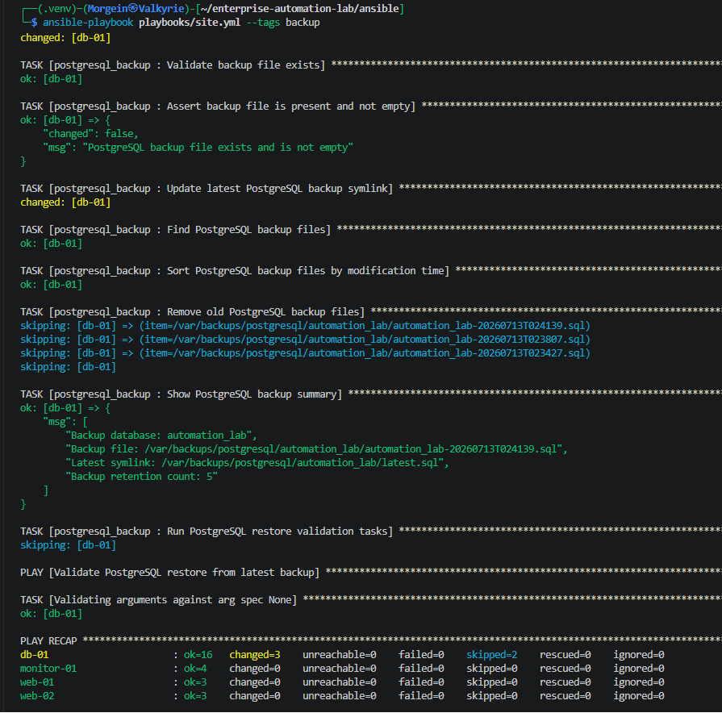
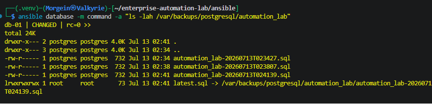
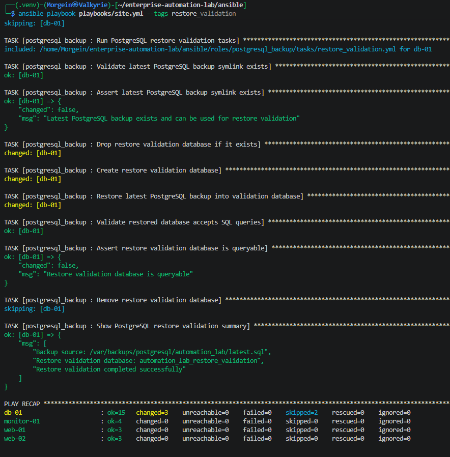
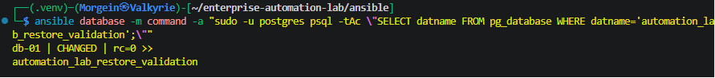
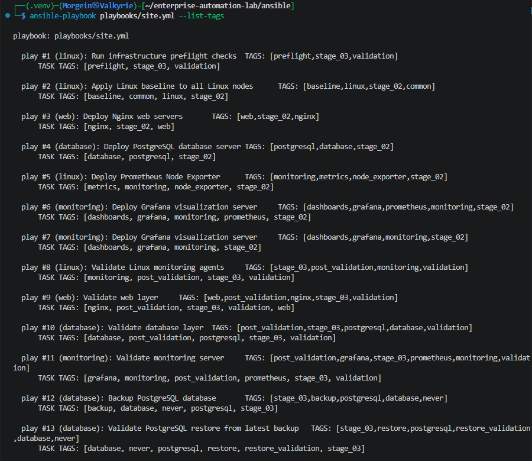
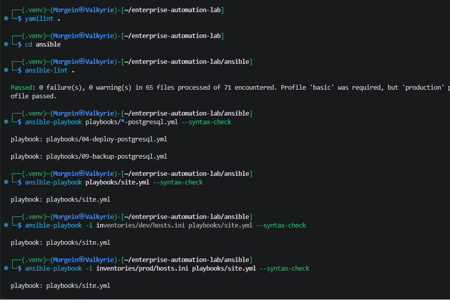

# Stage 3.5 - PostgreSQL Backup and Restore Automation

## 1. Purpose

This document describes Stage 3.5 of the Enterprise Automation Lab.

The goal of this stage is to add operational PostgreSQL backup and restore validation automation using Ansible.

This stage adds:

```text
PostgreSQL backup automation
timestamped SQL dump files
latest.sql symlink
backup file validation
backup retention cleanup
restore validation into a separate database
SQL query validation after restore
manual backup and restore tags
```

This stage represents a real infrastructure administration task.

Backups are not useful unless they can be restored. Because of that, this stage does not stop at creating a backup file. It also validates that the backup can be restored successfully.

---

## 2. Why This Stage Exists

In real infrastructure operations, backup and restore are critical responsibilities.

A system administrator or infrastructure engineer must be able to answer these questions:

```text
Can I create a database backup?
Is the backup file actually created?
Is the backup file non-empty?
Where is the latest backup?
Can I restore the backup?
Does the restored database accept SQL queries?
Can I keep only the required number of backups?
```

This stage answers those questions with Ansible automation.

The final workflow is:

```text
create PostgreSQL backup
validate backup file
update latest.sql symlink
clean old backups
restore latest backup into validation database
validate restored database with SQL query
```

---

## 3. Important Design Decision

Backup and restore validation are not executed during a normal site deployment.

The normal deployment command is:

```bash
ansible-playbook playbooks/site.yml
```

This command should deploy and validate the infrastructure stack, but it should not create a new database backup every time.

Because of that, backup and restore playbooks are added to `site.yml` with the special Ansible tag:

```text
never
```

This means they run only when explicitly requested.

Backup is executed with:

```bash
ansible-playbook playbooks/site.yml --tags backup
```

Restore validation is executed with:

```bash
ansible-playbook playbooks/site.yml --tags restore_validation
```

This is safer and more production-like.

---

## 4. Files Created or Updated

| File | Purpose |
|---|---|
| `ansible/roles/postgresql_backup/defaults/main.yml` | Default variables for PostgreSQL backup and restore validation |
| `ansible/roles/postgresql_backup/tasks/main.yml` | Selects backup or restore validation operation |
| `ansible/roles/postgresql_backup/tasks/backup.yml` | Creates backup, validates file, updates latest symlink and applies retention |
| `ansible/roles/postgresql_backup/tasks/restore_validation.yml` | Restores latest backup into validation database and verifies SQL access |
| `ansible/roles/postgresql_backup/meta/main.yml` | Role metadata |
| `ansible/playbooks/09-backup-postgresql.yml` | Manual PostgreSQL backup playbook |
| `ansible/playbooks/10-restore-postgresql-validation.yml` | Manual restore validation playbook |
| `ansible/playbooks/site.yml` | Imports backup and restore validation playbooks with `never` tag |
| `ansible/inventories/dev/group_vars/database.yml` | Dev backup variables |
| `ansible/inventories/prod/group_vars/database.yml` | Prod-like backup variables |
| `.github/workflows/ansible-validation.yml` | Adds syntax checks for backup and restore validation playbooks |
| `docs/screenshots/stage-03-postgresql-backup-restore/` | Runtime validation screenshots |
| `README.md` | Project status and documentation update |

---

## 5. PostgreSQL Backup Role

Role path:

```text
ansible/roles/postgresql_backup/
```

Role structure:

```text
ansible/roles/postgresql_backup/
├── defaults/
│   └── main.yml
├── meta/
│   └── main.yml
└── tasks/
    ├── backup.yml
    ├── main.yml
    └── restore_validation.yml
```

This role supports two operations:

```text
backup
restore_validation
```

The operation is controlled by:

```yaml
postgresql_backup_operation
```

Allowed values:

```text
backup
restore_validation
```

---

## 6. Role Defaults

File:

```text
ansible/roles/postgresql_backup/defaults/main.yml
```

Main variables:

```yaml
postgresql_backup_operation: backup

postgresql_backup_database: automation_lab

postgresql_backup_dir: /var/backups/postgresql/automation_lab

postgresql_backup_owner: postgres

postgresql_backup_group: postgres

postgresql_backup_mode: "0750"

postgresql_backup_file_mode: "0640"

postgresql_backup_timestamp: "{{ ansible_facts['date_time']['iso8601_basic_short'] }}"

postgresql_backup_file: "{{ postgresql_backup_dir }}/{{ postgresql_backup_database }}-{{ postgresql_backup_timestamp }}.sql"

postgresql_backup_latest_symlink: "{{ postgresql_backup_dir }}/latest.sql"

postgresql_backup_retention_count: 5

postgresql_backup_restore_validation_database: automation_lab_restore_validation

postgresql_backup_keep_restore_validation_database: true
```

---

## 7. Backup Variables Explained

### Backup Operation

```yaml
postgresql_backup_operation: backup
```

This defines the default role operation.

Default operation:

```text
backup
```

---

### Backup Database

```yaml
postgresql_backup_database: automation_lab
```

This is the PostgreSQL database that will be backed up.

Current project database:

```text
automation_lab
```

---

### Backup Directory

```yaml
postgresql_backup_dir: /var/backups/postgresql/automation_lab
```

This is the directory where SQL dump files are stored on the database server.

The directory is created by Ansible if it does not exist.

---

### Backup Owner and Group

```yaml
postgresql_backup_owner: postgres
postgresql_backup_group: postgres
```

Backup files are owned by the `postgres` system user and group.

This is appropriate because PostgreSQL backup and restore operations are executed as the `postgres` user.

---

### Directory Permissions

```yaml
postgresql_backup_mode: "0750"
```

Meaning:

```text
owner: read, write, execute
group: read, execute
others: no access
```

This protects backup files from being readable by normal users.

---

### Backup File Permissions

```yaml
postgresql_backup_file_mode: "0640"
```

Meaning:

```text
owner: read and write
group: read
others: no access
```

Database backups may contain sensitive data, so they should not be world-readable.

---

### Backup Timestamp

```yaml
postgresql_backup_timestamp: "{{ ansible_facts['date_time']['iso8601_basic_short'] }}"
```

The timestamp is generated from Ansible facts.

Example format:

```text
20260713T014530
```

This avoids deprecated injected fact variables like:

```text
ansible_date_time
```

and uses the modern form:

```text
ansible_facts['date_time']
```

---

### Backup File Path

```yaml
postgresql_backup_file: "{{ postgresql_backup_dir }}/{{ postgresql_backup_database }}-{{ postgresql_backup_timestamp }}.sql"
```

Example result:

```text
/var/backups/postgresql/automation_lab/automation_lab-20260713T014530.sql
```

This gives every backup file a unique timestamped name.

---

### Latest Backup Symlink

```yaml
postgresql_backup_latest_symlink: "{{ postgresql_backup_dir }}/latest.sql"
```

This symlink always points to the latest backup.

Example:

```text
latest.sql -> /var/backups/postgresql/automation_lab/automation_lab-20260713T014530.sql
```

This makes restore validation simpler because the restore process can always use:

```text
latest.sql
```

---

### Retention Count

```yaml
postgresql_backup_retention_count: 5
```

This keeps only the newest backup files.

In the dev environment:

```text
5 backups are kept
```

In the prod-like inventory template:

```text
7 backups are kept
```

This demonstrates environment-specific configuration.

---

### Restore Validation Database

```yaml
postgresql_backup_restore_validation_database: automation_lab_restore_validation
```

This is a separate database used only for restore validation.

The original database is not overwritten.

Main database:

```text
automation_lab
```

Restore validation database:

```text
automation_lab_restore_validation
```

This is safer than restoring directly over the main database.

---

## 8. Main Task File

File:

```text
ansible/roles/postgresql_backup/tasks/main.yml
```

Purpose:

```text
Select whether the role runs backup tasks or restore validation tasks.
```

Logic:

```text
if postgresql_backup_operation == backup
    run backup.yml

if postgresql_backup_operation == restore_validation
    run restore_validation.yml
```

The role validates that only supported operations are allowed.

Supported operations:

```text
backup
restore_validation
```

This prevents accidental execution with an invalid operation name.

---

## 9. Backup Task Workflow

File:

```text
ansible/roles/postgresql_backup/tasks/backup.yml
```

The backup workflow performs these steps:

```text
create backup directory
run pg_dump
set backup file ownership and permissions
validate that backup file exists
validate that backup file is not empty
update latest.sql symlink
find backup files
sort backup files by modification time
remove old backup files according to retention count
show backup summary
```

---

## 10. Backup Directory Creation

The role creates the backup directory:

```text
/var/backups/postgresql/automation_lab
```

with secure ownership and permissions:

```text
owner: postgres
group: postgres
mode: 0750
```

This ensures that backup files are stored in a controlled location.

---

## 11. Backup Creation with pg_dump

The role creates a PostgreSQL backup using:

```text
pg_dump
```

The command is executed with Ansible `command` module using `argv`.

This avoids shell quoting issues.

Backup command logic:

```text
pg_dump
--format=plain
--clean
--if-exists
--dbname=automation_lab
--file=/var/backups/postgresql/automation_lab/automation_lab-TIMESTAMP.sql
```

The task runs as:

```text
postgres
```

using:

```yaml
become: true
become_user: postgres
```

This allows PostgreSQL peer authentication without storing an admin password.

---

## 12. Backup File Validation

After backup creation, Ansible validates that the file:

```text
exists
is not empty
```

This is done with:

```text
stat
assert
```

This protects against a false-success situation where a task completes but the backup file is missing or empty.

---

## 13. latest.sql Symlink

The role updates:

```text
latest.sql
```

to point to the newest backup file.

Example:

```text
latest.sql -> /var/backups/postgresql/automation_lab/automation_lab-20260713T014530.sql
```

This is useful because restore validation can always use the same path:

```text
/var/backups/postgresql/automation_lab/latest.sql
```

instead of needing to know the exact timestamped filename.

---

## 14. Backup Retention

The role finds backup files matching:

```text
automation_lab-*.sql
```

Then it sorts them by modification time.

Newest files are kept.

Old files are removed when their index is greater than or equal to:

```text
postgresql_backup_retention_count
```

For example, with:

```text
postgresql_backup_retention_count = 5
```

the role keeps the newest 5 backup files and removes older ones.

This prevents unlimited backup growth.

---

## 15. Restore Validation Task Workflow

File:

```text
ansible/roles/postgresql_backup/tasks/restore_validation.yml
```

The restore validation workflow performs these steps:

```text
validate latest.sql exists
validate latest.sql is not empty
drop restore validation database if it exists
create restore validation database
restore latest backup into validation database
run SQL query against restored database
assert restored database is queryable
optionally remove restore validation database
show restore validation summary
```

This proves that the backup is usable.

---

## 16. Restore Validation Safety

The backup is not restored into the main database.

Main database:

```text
automation_lab
```

Validation database:

```text
automation_lab_restore_validation
```

This design protects the real database from accidental overwrite.

The restore validation database can be kept for inspection.

Current setting:

```yaml
postgresql_backup_keep_restore_validation_database: true
```

Because this value is true, the validation database remains after restore validation.

This allows manual verification.

---

## 17. Restore Process

The restore task uses:

```text
psql
```

with:

```text
--dbname=automation_lab_restore_validation
--file=/var/backups/postgresql/automation_lab/latest.sql
```

The command runs as:

```text
postgres
```

This restores the latest SQL dump into the validation database.

---

## 18. Restore SQL Validation

After restore, Ansible runs:

```sql
SELECT current_database() AS restored_database;
```

against:

```text
automation_lab_restore_validation
```

Expected result:

```text
automation_lab_restore_validation
```

This proves that:

```text
restore completed
database exists
PostgreSQL accepts SQL queries
restored database is accessible
```

---

## 19. Dev Environment Variables

File:

```text
ansible/inventories/dev/group_vars/database.yml
```

Dev backup configuration:

```yaml
postgresql_backup_database: automation_lab

postgresql_backup_retention_count: 5

postgresql_backup_restore_validation_database: automation_lab_restore_validation

postgresql_backup_keep_restore_validation_database: true
```

Meaning:

```text
backup automation_lab
keep 5 backups
restore into automation_lab_restore_validation
keep validation database after restore
```

---

## 20. Prod-like Environment Variables

File:

```text
ansible/inventories/prod/group_vars/database.yml
```

Prod-like backup configuration:

```yaml
postgresql_backup_database: automation_lab

postgresql_backup_retention_count: 7

postgresql_backup_restore_validation_database: automation_lab_restore_validation

postgresql_backup_keep_restore_validation_database: true
```

Difference from dev:

```text
dev keeps 5 backups
prod-like template keeps 7 backups
```

This demonstrates that the same role can behave differently per environment.

---

## 21. Backup Playbook

File:

```text
ansible/playbooks/09-backup-postgresql.yml
```

Purpose:

```text
Run PostgreSQL backup operation on database hosts.
```

Target group:

```text
database
```

Operation variable:

```yaml
postgresql_backup_operation: backup
```

Manual execution:

```bash
ansible-playbook playbooks/site.yml --tags backup
```

Direct playbook execution:

```bash
ansible-playbook playbooks/09-backup-postgresql.yml
```

---

## 22. Restore Validation Playbook

File:

```text
ansible/playbooks/10-restore-postgresql-validation.yml
```

Purpose:

```text
Restore latest PostgreSQL backup into a validation database and verify that it works.
```

Target group:

```text
database
```

Operation variable:

```yaml
postgresql_backup_operation: restore_validation
```

Manual execution through site workflow:

```bash
ansible-playbook playbooks/site.yml --tags restore_validation
```

Direct playbook execution:

```bash
ansible-playbook playbooks/10-restore-postgresql-validation.yml
```

---

## 23. Site Playbook Integration

File:

```text
ansible/playbooks/site.yml
```

The backup playbook is imported into `site.yml`:

```yaml
- name: Backup PostgreSQL database
  ansible.builtin.import_playbook: 09-backup-postgresql.yml
  tags:
    - never
    - backup
    - database
    - postgresql
    - stage_03
```

The restore validation playbook is also imported:

```yaml
- name: Validate PostgreSQL restore from latest backup
  ansible.builtin.import_playbook: 10-restore-postgresql-validation.yml
  tags:
    - never
    - restore
    - restore_validation
    - database
    - postgresql
    - stage_03
```

The important tag is:

```text
never
```

This prevents backup and restore validation from running during normal site deployment.

---

## 24. Operational Tags

New tags added in this stage:

```text
backup
restore
restore_validation
never
```

Backup command:

```bash
ansible-playbook playbooks/site.yml --tags backup
```

Restore validation command:

```bash
ansible-playbook playbooks/site.yml --tags restore_validation
```

List all available tags:

```bash
ansible-playbook playbooks/site.yml --list-tags
```

Expected tags include:

```text
backup
restore
restore_validation
never
```

---

## 25. Runtime Validation - Backup

Run:

```bash
cd ~/enterprise-automation-lab/ansible

export ANSIBLE_VAULT_PASSWORD_FILE=.vault_pass.txt

ansible-playbook playbooks/site.yml --tags backup
```

Expected result:

```text
backup directory created
pg_dump executed
backup file exists
backup file is not empty
latest.sql symlink updated
old backups cleaned according to retention policy
failed=0
unreachable=0
```

---

## 26. Runtime Validation - Backup Files

Run:

```bash
cd ~/enterprise-automation-lab/ansible

ansible database -m command -a "ls -lah /var/backups/postgresql/automation_lab"
```

Expected result:

```text
automation_lab-YYYYMMDDTHHMMSS.sql
latest.sql -> /var/backups/postgresql/automation_lab/automation_lab-YYYYMMDDTHHMMSS.sql
```

This proves that backup files exist on the database host.

---

## 27. Runtime Validation - Restore

Run:

```bash
cd ~/enterprise-automation-lab/ansible

export ANSIBLE_VAULT_PASSWORD_FILE=.vault_pass.txt

ansible-playbook playbooks/site.yml --tags restore_validation
```

Expected result:

```text
latest.sql exists
restore validation database dropped if it already exists
restore validation database created
latest.sql restored into validation database
restored database accepts SQL queries
restore validation completed successfully
failed=0
unreachable=0
```

---

## 28. Runtime Validation - Restore Database

Run:

```bash
cd ~/enterprise-automation-lab/ansible

ansible database -m command -a "sudo -u postgres psql -tAc \"SELECT datname FROM pg_database WHERE datname='automation_lab_restore_validation';\""
```

Expected result:

```text
automation_lab_restore_validation
```

This proves that the restore validation database exists.

---

## 29. Static Validation

Run from repository root:

```bash
cd ~/enterprise-automation-lab

yamllint .
```

Run from the Ansible directory:

```bash
cd ~/enterprise-automation-lab/ansible

export ANSIBLE_VAULT_PASSWORD_FILE=.vault_pass.txt

ansible-lint .
ansible-playbook playbooks/09-backup-postgresql.yml --syntax-check
ansible-playbook playbooks/10-restore-postgresql-validation.yml --syntax-check
ansible-playbook playbooks/site.yml --syntax-check
ansible-playbook -i inventories/dev/hosts.ini playbooks/site.yml --syntax-check
ansible-playbook -i inventories/prod/hosts.ini playbooks/site.yml --syntax-check
```

Expected result:

```text
yamllint passes
ansible-lint passes
backup playbook syntax check passes
restore validation playbook syntax check passes
site playbook syntax check passes
dev inventory syntax check passes
prod inventory syntax check passes
```

---

## 30. GitHub Actions Update

The CI workflow now validates the new playbooks:

```text
09-backup-postgresql.yml
10-restore-postgresql-validation.yml
site.yml
```

The CI workflow validates syntax only.

It does not run real backups or restores because GitHub Actions does not have access to the Hyper-V lab VMs.

---

## 31. Validation Evidence

Validation screenshots for this stage are stored in:

```text
docs/screenshots/stage-03-postgresql-backup-restore/
```

Only runtime and validation screenshots are stored.

Code screenshots are not required because the code is already available in the GitHub repository.

### Backup Runtime

Shows successful PostgreSQL backup execution.



### Backup Files

Shows backup files and the `latest.sql` symlink on the database host.



### Restore Validation Runtime

Shows successful restore validation from the latest backup.



### Restore Validation Database

Shows that the restore validation database exists.



### Site Tags

Shows that backup and restore validation tags are available in `site.yml`.



### Lint and Syntax Validation

Shows successful lint and syntax validation.



---

## 32. Screenshot List

Expected screenshot files:

```text
docs/screenshots/stage-03-postgresql-backup-restore/
├── 01-backup-runtime.png
├── 02-backup-files.png
├── 03-restore-validation-runtime.png
├── 04-restore-validation-database.png
├── 05-site-tags.png
└── 06-lint-syntax-validation.png
```

These screenshots prove that backup and restore validation actually work.

---

## 33. Troubleshooting

### Backup fails because pg_dump is not found

Check that PostgreSQL client tools are installed:

```bash
ansible database -m command -a "which pg_dump"
```

If missing, check the PostgreSQL role package list.

Expected packages include:

```text
postgresql
postgresql-contrib
python3-psycopg2
```

---

### Backup file is missing or empty

Check backup directory:

```bash
ansible database -m command -a "ls -lah /var/backups/postgresql/automation_lab"
```

Check PostgreSQL database exists:

```bash
ansible database -m command -a "sudo -u postgres psql -tAc \"SELECT datname FROM pg_database WHERE datname='automation_lab';\""
```

Expected result:

```text
automation_lab
```

---

### latest.sql symlink is missing

Run backup again:

```bash
ansible-playbook playbooks/site.yml --tags backup
```

Then check:

```bash
ansible database -m command -a "ls -lah /var/backups/postgresql/automation_lab"
```

Expected:

```text
latest.sql -> /var/backups/postgresql/automation_lab/automation_lab-YYYYMMDDTHHMMSS.sql
```

---

### Restore validation fails because latest backup does not exist

Run backup first:

```bash
ansible-playbook playbooks/site.yml --tags backup
```

Then run restore validation:

```bash
ansible-playbook playbooks/site.yml --tags restore_validation
```

---

### Restore validation database already exists

This is expected.

The restore validation workflow drops the validation database first:

```text
automation_lab_restore_validation
```

Then it recreates it and restores the latest backup.

---

### Restore validation database remains after validation

This is expected because:

```yaml
postgresql_backup_keep_restore_validation_database: true
```

To remove it after validation, set:

```yaml
postgresql_backup_keep_restore_validation_database: false
```

Then run restore validation again.

---

### Backup/restore runs during normal site deployment

This should not happen.

Check that both backup and restore imports in `site.yml` include:

```text
never
```

Normal deployment:

```bash
ansible-playbook playbooks/site.yml
```

should not run backup or restore validation.

Backup and restore should run only with explicit tags:

```bash
ansible-playbook playbooks/site.yml --tags backup
ansible-playbook playbooks/site.yml --tags restore_validation
```

---

## 34. Stage Result

At the end of this stage:

```text
PostgreSQL backup role created
backup operation implemented
restore validation operation implemented
timestamped SQL dumps created
latest.sql symlink created
backup file existence validated
backup file size validated
backup retention cleanup implemented
restore validation database created
latest backup restored into validation database
restored database validated with SQL query
backup and restore playbooks created
backup and restore integrated into site.yml with never tag
dev and prod-like backup variables added
GitHub Actions syntax checks updated
lint and syntax validation passed
runtime backup validation screenshots collected
runtime restore validation screenshots collected
```

---

## 35. Current Project Status

Current completed stage:

```text
Stage 3.5 - PostgreSQL Backup and Restore Automation
```

The project now includes real operational database backup and restore validation.

The Ansible workflow now covers:

```text
deployment
monitoring
secret management
environment separation
preflight checks
post-deployment validation
backup
restore validation
```

This makes the Ansible part of the project significantly closer to real infrastructure operations.
