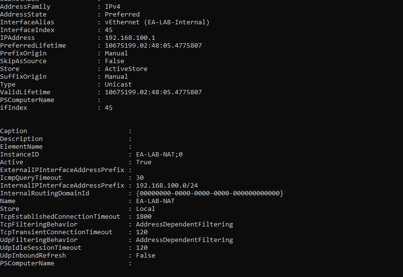
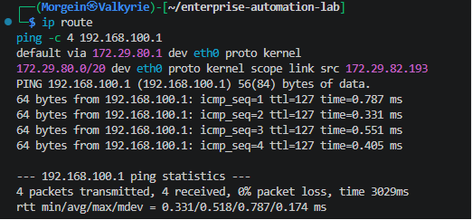
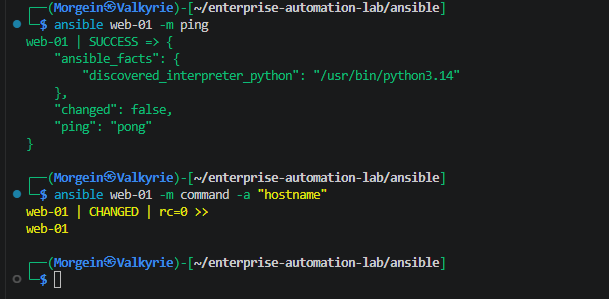

# WSL to Hyper-V Connectivity Troubleshooting

## 1. Purpose

This document describes how connectivity between **Kali Linux WSL** and **Hyper-V virtual machines** was troubleshooted and fixed in the Enterprise Automation Lab.

The goal was to allow the WSL-based automation control workstation to connect to Linux virtual machines located in a dedicated Hyper-V internal NAT network.

Final validated connection flow:

```text
Kali Linux WSL
    |
    | SSH / Ansible
    v
Windows Host Routing
    |
    v
Hyper-V Internal NAT Network
    |
    v
web-01
```

---

## 2. Lab Network Overview

The lab uses separate virtual networks.

### WSL Network

Kali WSL runs inside a WSL virtual network.

Example observed WSL configuration:

```text
WSL IP Address: 172.29.82.193/20
WSL Gateway:    172.29.80.1
Interface:      eth0
```

### Hyper-V Lab Network

Hyper-V uses a dedicated internal NAT network.

```text
Network:     192.168.100.0/24
Gateway:     192.168.100.1
Switch Name: EA-LAB-Internal
NAT Name:    EA-LAB-NAT
```

### First Managed Node

```text
Hostname: web-01
IP:       192.168.100.11
User:     automation
```

---

## 3. Problem Description

After creating the Hyper-V internal NAT network and the first Ubuntu VM, Kali WSL could not initially connect to the Hyper-V lab network.

### Symptoms

From Kali WSL:

```bash
ping 192.168.100.1
ssh automation@192.168.100.11
```

The connection failed or timed out.

Example error:

```text
ssh: connect to host 192.168.100.11 port 22: Connection timed out
```

This meant that the WSL control node could not reliably reach the Hyper-V managed node.

---

## 4. Important Note About 192.168.100.0

The address below should not be used for testing host connectivity:

```text
192.168.100.0
```

It is the **network address**, not a host address.

Correct test targets are:

```text
192.168.100.1   Windows gateway for the Hyper-V lab network
192.168.100.11  web-01
192.168.100.12  web-02
192.168.100.21  db-01
192.168.100.31  monitor-01
```

---

## 5. Root Cause

WSL and Hyper-V internal NAT use different virtual networks.

```text
Kali WSL network:       172.29.80.0/20
Hyper-V lab network:    192.168.100.0/24
```

Windows had access to both networks, but forwarding between the WSL virtual adapter and the Hyper-V internal adapter was not enabled.

Additionally, Windows Firewall can block ICMP Echo Request traffic, which is used by `ping`.

The issue was not caused by Ansible.  
It was a Windows virtual networking and forwarding issue.

---

## 6. Diagnostic Commands

### 6.1 Check WSL IP Configuration

Run inside Kali WSL:

```bash
ip addr
ip route
```

Example result:

```text
default via 172.29.80.1 dev eth0
172.29.80.0/20 dev eth0 proto kernel scope link src 172.29.82.193
```

This confirms that WSL is using its own NAT network.

---

### 6.2 Check Windows Network Configuration

Run in Windows PowerShell:

```powershell
ipconfig
```

Expected Hyper-V adapter:

```text
Ethernet adapter vEthernet (EA-LAB-Internal):

IPv4 Address . . . . . . . . . . . : 192.168.100.1
Subnet Mask  . . . . . . . . . . . : 255.255.255.0
```

---

### 6.3 Check Hyper-V Switch

Run in PowerShell as Administrator:

```powershell
Get-VMSwitch
```

Expected switch:

```text
EA-LAB-Internal    Internal
```

---

### 6.4 Check NAT Configuration

Run in PowerShell as Administrator:

```powershell
Get-NetNat
```

Expected NAT:

```text
Name                             : EA-LAB-NAT
InternalIPInterfaceAddressPrefix : 192.168.100.0/24
Active                           : True
```

---

### 6.5 Test SSH Port From Windows

Run in PowerShell:

```powershell
Test-NetConnection 192.168.100.11 -Port 22
```

If Windows can reach the VM but WSL cannot, the issue is likely between WSL and the Hyper-V internal network.

---

## 7. Fix 1 - Enable IPv4 Forwarding

### 7.1 List Virtual Ethernet Adapters

Run PowerShell as Administrator:

```powershell
Get-NetAdapter | Where-Object {$_.Name -like "vEthernet*"} | Format-Table Name,Status,ifIndex
```

Look for adapters similar to:

```text
vEthernet (EA-LAB-Internal)
vEthernet (WSL (Hyper-V firewall))
```

The exact WSL adapter name can vary, so always verify it first.

---

### 7.2 Enable Forwarding on the Hyper-V Lab Adapter

Run PowerShell as Administrator:

```powershell
Set-NetIPInterface `
  -InterfaceAlias "vEthernet (EA-LAB-Internal)" `
  -AddressFamily IPv4 `
  -Forwarding Enabled
```

---

### 7.3 Enable Forwarding on the WSL Adapter

Run PowerShell as Administrator:

```powershell
Set-NetIPInterface `
  -InterfaceAlias "vEthernet (WSL (Hyper-V firewall))" `
  -AddressFamily IPv4 `
  -Forwarding Enabled
```

If the WSL adapter has a different name, replace the interface alias with the correct one from `Get-NetAdapter`.

---

### 7.4 Verify Forwarding

Run:

```powershell
Get-NetIPInterface | Where-Object {$_.InterfaceAlias -like "vEthernet*"} | Format-Table InterfaceAlias,AddressFamily,Forwarding
```

Expected result:

```text
InterfaceAlias                         AddressFamily Forwarding
--------------                         ------------- ----------
vEthernet (EA-LAB-Internal)            IPv4          Enabled
vEthernet (WSL (Hyper-V firewall))     IPv4          Enabled
```

---

## 8. Fix 2 - Allow ICMP Echo Request

Ping uses ICMP, not TCP.

SSH can work even if ping is blocked, but allowing ICMP is useful for troubleshooting.

Run PowerShell as Administrator:

```powershell
New-NetFirewallRule `
  -DisplayName "EA-LAB Allow ICMPv4 Echo Request" `
  -Direction Inbound `
  -Protocol ICMPv4 `
  -IcmpType 8 `
  -Action Allow `
  -Profile Any
```

This allows ICMP Echo Request traffic, which makes `ping` work for diagnostics.

---

## 9. Optional Route Check From WSL

After forwarding is enabled, check route resolution from Kali WSL:

```bash
ip route get 192.168.100.1
ip route get 192.168.100.11
```

Expected idea:

```text
traffic should go through the WSL default gateway
```

If needed, a temporary explicit route can be added:

```bash
sudo ip route replace 192.168.100.0/24 via 172.29.80.1 dev eth0
```

In this lab, enabling Windows forwarding was enough.

---

## 10. Validation After Network Fix

### 10.1 Ping Hyper-V Gateway From WSL

Run inside Kali WSL:

```bash
ping 192.168.100.1
```

Expected result:

```text
64 bytes from 192.168.100.1
```

### 10.2 SSH to web-01 From WSL

Run:

```bash
ssh automation@192.168.100.11
```

Expected result:

```text
Welcome to Ubuntu
automation@web-01:~$
```

This confirms that WSL can reach the Hyper-V VM.

---

## 11. SSH Key Authentication Configuration

After basic SSH connectivity was restored, SSH key authentication was configured for Ansible.

### 11.1 SSH Server Configuration

On `web-01`, the SSH server configuration was checked:

```bash
sudo nano /etc/ssh/sshd_config
```

The following setting was enabled:

```text
PubkeyAuthentication yes
```

This allows SSH login using public/private key pairs.

After editing SSH configuration, restart SSH:

```bash
sudo systemctl restart ssh
```

Validate SSH service status:

```bash
systemctl status ssh --no-pager
```

Expected result:

```text
active (running)
```

---

## 12. SSH Key Creation on Kali WSL

On Kali WSL, create a dedicated SSH key for this project:

```bash
mkdir -p ~/.ssh
chmod 700 ~/.ssh

ssh-keygen -t ed25519 -f ~/.ssh/enterprise_automation_lab -C "enterprise-automation-lab"
```

This creates two files:

```text
~/.ssh/enterprise_automation_lab      private key
~/.ssh/enterprise_automation_lab.pub  public key
```

The private key must stay on the control node and must not be committed to Git.

Set correct permissions:

```bash
chmod 600 ~/.ssh/enterprise_automation_lab
chmod 644 ~/.ssh/enterprise_automation_lab.pub
```

---

## 13. Copy Public Key to web-01

From Kali WSL:

```bash
ssh-copy-id -i ~/.ssh/enterprise_automation_lab.pub automation@192.168.100.11
```

Alternative manual method:

```bash
cat ~/.ssh/enterprise_automation_lab.pub | ssh automation@192.168.100.11 'mkdir -p ~/.ssh && chmod 700 ~/.ssh && cat >> ~/.ssh/authorized_keys && chmod 600 ~/.ssh/authorized_keys'
```

This adds the public key to:

```text
/home/automation/.ssh/authorized_keys
```

---

## 14. Validate SSH Key Login

From Kali WSL:

```bash
ssh -i ~/.ssh/enterprise_automation_lab automation@192.168.100.11
```

Expected result:

```text
Welcome to Ubuntu
automation@web-01:~$
```

Validate identity:

```bash
hostname
whoami
```

Expected result:

```text
web-01
automation
```

---

## 15. Configure Passwordless Sudo for Ansible

Ansible needs elevated privileges for many tasks, such as installing packages, managing services and editing files in `/etc`.

On `web-01`:

```bash
echo "automation ALL=(ALL) NOPASSWD:ALL" | sudo tee /etc/sudoers.d/automation
sudo chmod 440 /etc/sudoers.d/automation
sudo visudo -cf /etc/sudoers.d/automation
```

Expected result:

```text
/etc/sudoers.d/automation: parsed OK
```

This allows Ansible to use `sudo` without interactive password prompts.

---

## 16. Ansible Inventory Configuration

The development inventory file is located at:

```text
ansible/inventories/dev/hosts.ini
```

Relevant host entry:

```ini
[web]
web-01 ansible_host=192.168.100.11

[linux:children]
web

[linux:vars]
ansible_user=automation
ansible_ssh_private_key_file=~/.ssh/enterprise_automation_lab
```

This tells Ansible:

```text
connect to web-01 using IP 192.168.100.11
use Linux user automation
use the dedicated project SSH private key
```

---

## 17. Ansible Validation

From the Ansible project directory:

```bash
cd ~/enterprise-automation-lab/ansible
```

Run Ansible ping:

```bash
ansible web-01 -m ping
```

Expected result:

```text
web-01 | SUCCESS => {
    "changed": false,
    "ping": "pong"
}
```

This confirms that Ansible can connect to the managed node successfully.

---

## 18. Validate Remote Command Execution

Run:

```bash
ansible web-01 -m command -a "hostname"
```

Expected result:

```text
web-01 | CHANGED | rc=0 >>
web-01
```

This confirms that Ansible can execute commands on the managed node.

---

## 19. Final Working State

The final validated state:

```text
Kali WSL can ping 192.168.100.1
Kali WSL can SSH into web-01
SSH key authentication works
Ansible inventory resolves web-01
Ansible ping returns pong
Ansible command module works
```

Validated connection flow:

```text
Kali WSL
  |
  | SSH key authentication
  v
web-01
  |
  | Python interpreter discovered
  v
Ansible module execution successful
```

---

## 20. Lessons Learned

### WSL and Hyper-V can use separate networks

WSL2 usually runs in its own NAT network, while Hyper-V internal switches use separate virtual networks.

Because of this, traffic between WSL and Hyper-V may require Windows forwarding.

### Ping and SSH are different

Ping uses ICMP.

SSH uses TCP port 22.

A failed ping does not always mean SSH cannot work, but ping is useful for network diagnostics.

### Ansible requires working SSH

Before running Ansible, always validate plain SSH first:

```bash
ssh automation@192.168.100.11
```

Then validate SSH key login:

```bash
ssh -i ~/.ssh/enterprise_automation_lab automation@192.168.100.11
```

Only after that, run:

```bash
ansible web-01 -m ping
```

### SSH key permissions matter

Incorrect permissions on private keys or `authorized_keys` can break SSH key login.

Recommended permissions:

```text
~/.ssh                              700
~/.ssh/enterprise_automation_lab    600
~/.ssh/enterprise_automation_lab.pub 644
~/.ssh/authorized_keys              600
```

### Documentation matters

This issue is now documented so the same connectivity problem can be fixed faster in the future.

---

## 21. Troubleshooting Checklist

If WSL cannot connect to a Hyper-V VM:

### On Windows

```powershell
Get-VMSwitch
Get-NetNat
Get-NetIPAddress -InterfaceAlias "vEthernet (EA-LAB-Internal)"
Get-NetAdapter | Where-Object {$_.Name -like "vEthernet*"} | Format-Table Name,Status,ifIndex
Get-NetIPInterface | Where-Object {$_.InterfaceAlias -like "vEthernet*"} | Format-Table InterfaceAlias,AddressFamily,Forwarding
Test-NetConnection 192.168.100.11 -Port 22
```

### On Kali WSL

```bash
ip addr
ip route
ping 192.168.100.1
ping 192.168.100.11
ssh -i ~/.ssh/enterprise_automation_lab automation@192.168.100.11
```

### On web-01

```bash
hostname
ip addr
ip route
systemctl status ssh --no-pager
python3 --version
sudo ufw status
```

---

## 22. Current Result

The issue was successfully resolved.

Validated results:

```text
ping 192.168.100.1 works
SSH to web-01 works
SSH key authentication works
Ansible ping returns pong
Ansible command module executes hostname successfully
```

The lab is ready for the next stage:

```text
Stage 1 - Junior Ansible Basics
```
---

## 23. Validation Screenshots

### Hyper-V Internal NAT Network Validation

The Hyper-V internal NAT network was validated successfully.  

The screenshot confirms that the `EA-LAB-Internal` adapter has 
the gateway IP `192.168.100.1/24` and that the `EA-LAB-NAT` network is active for the `192.168.100.0/24` subnet.



### WSL to Hyper-V Gateway Connectivity

Kali WSL can reach the Hyper-V lab gateway.



### SSH Key Login to web-01

SSH key authentication from Kali WSL to `web-01` works successfully.


### Ansible Connectivity Validation

Ansible can connect to `web-01`, discover Python and execute commands.


